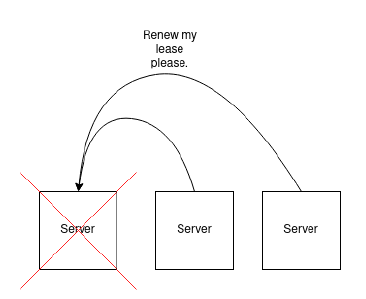
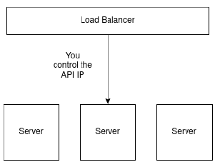
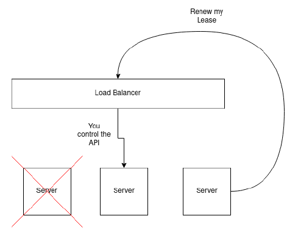

<PageHeader/>

# The Kubernetes Control Plane

When you deploy a Kubernetes cluster, the machines in the cluster are often (but not always) separated with some notion of a “worker” vs. a “controller”.
Sometimes, your controllers may act as both a controller and a worker, and other times, they will be completely separated.
The nodes in the cluster that are designated as “controller” nodes are used to perform cluster-critical functionality that keep the cluster alive.
This functionality is know as the Kubernetes "Control Plane".

The control-plane gets deployed as pods to a Kubernetes cluster just like anything else.
However, these pods are system critical to the functionality of the cluster.
Control Plane pods are generally the pods that are deployed to the kube-system namespace.
The control plane consists of the following components:

<table>
    <tr>
        <th>Service Name</th>
        <th>Description</th>
    </tr>
    <tr>
        <td>kube-apiserver</td>
        <td>
            

            The API server is how external clients are able to communicate with the cluster.
            Commands like <code>kubectl</code> or <code>helm</code> commands will all interact with the kubernetes API.
            Under the hood, every kubectl is a REST request to the kubernetes API server. The API server allows clients to communicate with and control the kubernetes cluster.
            

        </td>
    </tr>
    <tr>
        <td>etcd</td>
        <td>
            

            Etcd is a key-value store that Kubernetes uses to store the cluster state and share it with all machines in the cluster.
            Etcd is an essential part of Kubernetes. Information like what pods are deployed, what manifests are live, Configmap data, and more are all stored in etcd.
            

        </td>
    </tr>
    <tr>
        <td>kube-scheduler</td>
        <td>
            

            This component watches for newly created pods from the kubernetes api server. Pods with no assigned nodes will get assign to a node based on resource requests, taints, and tolerations.
            

        </td>
    </tr>
    <tr>
        <td>kube-controller-manager</td>
        <td>
            

            This component runs the controller processes which report which nodes are healthy, if jobs are running, and manages services on each node.
            

        </td>
    </tr>
    <tr>
        <td>kubelet</td>
        <td>
            

            The kubelet is a daemon process that runs on every node in the cluster which facilitates the coordination of the cluster services for the node. The kubelet ensures ethat etcd is up, a container runtime exists, the kube-api is reachable, etc. The kubelet manages and coordinates most of a node’s lifecycle and functionality.
            

        </td>
    </tr>
    <tr>
        <td>kube-proxy</td>
        <td>
            

            A networking proxy that runs on each node to maintain networking rules for the kubernetes cluster within each node.
            

        </td>
    </tr>
    <tr>
        <td>Container Runtime</td>
        <td>
            

            The container runtime. For example, docker or containerd. The container runtime spawns containers that have been requested, mounts volumes, exposes ports, etc.
            

        </td>
    </tr>
</table>

<PageHeader/>

# Why do I need my Control Plane Highly Available?

The main benefit of using Kubernetes is to be able to deploy software across multiple machines, and, ideally, to be able to tolerate a failure if one of those machines fails.We want our docker containers to be moved to a machine that is alive and well in order to ensure that we continue to operate normally.

If we deploy our Kubernetes cluster without a highly available control plane, then the system-critical functionality is all dependent on one machine.
If that single machine fails, then the rest of the cluster is non-functional!

Luckily, by design, all of the components of the control-plane can manage high-availability on their own except for one: the Kubernetes API server.
The API server is what all clients to the cluster use in order to perform operations against the cluster.
One critical operation that the API server provides is the ability to provide a Lease.
When a server joins the kubernetes cluster, it requests a Lease.
Leases are very similar to real world Leases; we ask to rent a space, and there is a recurring bill that we need to pay otherwise we get kicked out.
In a Kubernetes context, each server in the cluster takes out a Lease, and must renew it’s lease to prove that it is still alive.

Without high availability, each machine in the cluster will talk to the Kubernetes API by sending requests to a single IP address.
However, if that machine happens to fail, the entire cluster is no longer able to communicate, as the two remaining servers are configured to talk to an offline machine.
What a nightmare!

[So how do we make our Kubernetes API highly available](https://kubernetes.io/docs/setup/production-environment/tools/kubeadm/ha-topology/)?
We need to use a load balancer so that incoming requests to the Kubernetes API are forwarded on to healthy machines.

# What is a Load Balancer?

A load balancer is a type of software application that takes incoming requests for a particular service, and then performs some type of “balancing” to ensure that traffic is going to the right place.
What the “right place” is depends on your definition.
Traditionally, load balancers are for, well, “load balancing” traffic so that a service is not overloaded.
Generally a Load Balancer will round-robin incoming requests out to a number of listening servers in order to “balance” the throughput to each server.

A load balancer can work on many different network layers and you can find Layer 7, Layer 4, and Layer 2 load balancers.
A Layer 2 load balancer works at the MAC address level, and Layer 2 load balancers will tell a machine (MAC) that it controls a particular IP address, or that a particular MAC address should be routed to another one.
Traffic at the L2 layer is generally IP or MAC based and nothing more.
Layer 4 load balancers puts routing information in the packet itself, but this means you can’t make routing decisions based on packet content, meaning L4 load balancers can generally only do some form of round-robin routing.
Finally, a Layer 7 load balancer works at the application level and this can use information like HTTO protocols, message content types, headers, and more to determine where it’s packets should go.

In our case, we need a load balancer that will control and manage a floating virtual IP address for the entire cluster, and this is achievable with a Layer 2 load balancer.
With a Load Balancer in place, the load balancer can accept traffic for the Kubernetes API server, and forward the traffic to the machines that are online.

Now, with a load balancer in front, we can tell each of the servers that they are going to connect to the load balancer’s managed IP address when they try to join the cluster or talk to the Kubernetes API. As a result, if any of the servers fail, the load balancer still provides the IP to a server that is online within the cluster.

# How to setup a Load Balancer

There are a few ways that you can configure this within your own Kubernetes cluster.
I recommend using a load balancer that supports Layer 2 Load balancing, which allows the machines in your cluster to be assigned to a floating IP address on the network interface.

I have had success with the following two Load Balancers:

### Kube-vip

[Kube-vip](https://kube-vip.io/) is able to managing a single floating IP address for both the control plane and your Kubernetes Services.
This is extremely beneficial because you only have to deploy one load-balancer.
At the time of writing, there are not any other load balancers that exist that can balance both the Kubernetes control plane as well as manage your LoadBalancer Services.

The only downside to kube-vip that I have come across is that it does not (yet) support managing multiple network interfaces.
Therefore, if you are trying to expose your cluster traffic to two different network interfaces, kube-vip does not yet support this.
However, [it is on their roadmap](https://github.com/kube-vip/kube-vip/issues/504)!

To get started edeploying kube-vip, follow alog with their [DaemonSet installation guide](https://kube-vip.io/docs/installation/daemonset/) and you should be up and running in no time!

### KeepaliveD and HAProxy

Unfotunately, without using kube-vip, your cluster requires two virtual IP addresses.
One IP for the kubernetes API, and one IP for your cluster LoadBalancer Services.

To make your control-plane highly available, [the recommended approach by Kubernetes](https://github.com/kubernetes/kubeadm/blob/main/docs/ha-considerations.md) standard is to use either kube-vip (as mentioned above), or [KeepaliveD](https://www.keepalived.org/) with [HAProxy](https://www.haproxy.org/).

The official [Kubernetes documentation](https://github.com/kubernetes/kubeadm/blob/main/docs/ha-considerations.md#keepalived-and-haproxy) does an extremely good job at outlining how to deploy this configuration, and instead of potentially misleading you with outdated steps in this blog post, I will leave it to you to click the link above to learn more about how to configure these tools.

Hopefully this guide helped you to understand why we need a Highly available control plane and what you can do to deploy one!