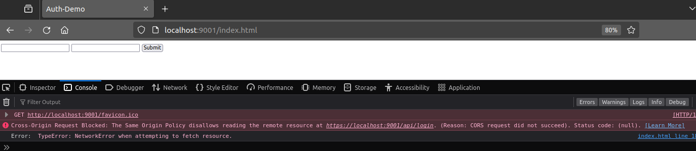
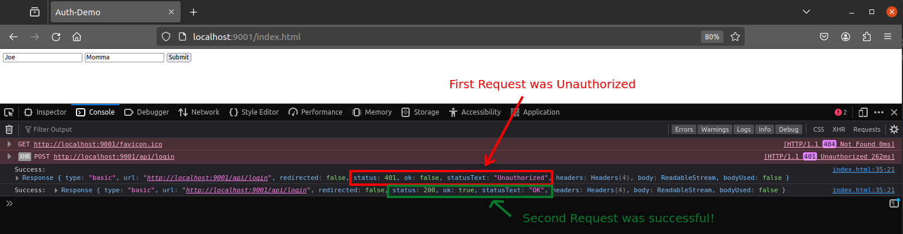

# Authentication Basics

When we start learning about application security, there are a large number of topics that we need to understand.  
There are a ton of security standards, protocols, and best practices that we need to be aware of, but where do we even
start?

The good answer to this question is that most of the time, you usually don't need to worry about anything... unless you
are trying to do it yourself.  
In that case, you should question everything and get crippling anxiety over the fact that a bad actor could find their
way into your system!

But, for the most part, you can rely on the security features provided by the frameworks and libraries that you are
using.  
But enough about that, let's get into the basics of authentication!

## What is Authentication?

Authentication is a very common requirement for most applications in the modern digital age.  
This is typically done by asking the user for a username and password.  
The server then checks the username and password against a database of users and passwords to determine who is accessing
the application.  
If the username and password match, the user is authenticated and is allowed to access the system.

## Why Authenticate?

Authentication is like locking your front door.  
It keeps out unwanted visitors and ensures that only approved guests can access your system.  
Without authentication, anyone could access your system and potentially cause harm.

A good example of this is your credit/debit card.  
When you use your card to make a purchase, you are required to enter a PIN number to authenticate yourself.  
This ensures that only you can access your account in order to make a purchase with your card.  
If someone else were to get a hold of your card, they could not make a purchase without knowing your PIN number.

Let's take a look at the history of Authentication.

### Passwordless Login

At first, the world had no need for Authentication.  
People could join a chat room, play a game, or browse the internet without needing to log in.  
Some apps would ask the user for a username, but it was never stored and just a temporary identifier for the user's
current session.  
You could login as "Bobby Tables" one day, and "Alice" the next day, and the system would never know the difference.

As the digital age evolved, the need for Authentication became more apparent.

### Username and password

The first type of Authentication was to challenge the user to provide something only they knew.  
This ended up being in the form of a username and password.

This is the most common form of Authentication and is widely used today.  
When a user signs up, they create a password which is typically a combination of letters, numbers, and special
characters.  
The user's password is then stored into a database and on future attempts to the system, the user must provide the
password that matches the one in the database.

Unfortunately, because this method is so commonly used, it is also the most vulnerable to attacks.  
A brute-force attack can crack weak passwords, a phishing attack can trick someone into giving up their password, and
cyberattacks may breach the database, revealing all user and password combinations.

### Challenge-Based Authentication

Because passwords are so vulnerable and weak passwords are easy to crack, many systems have implemented challenge-based
Authentication.  
In this method, the user is asked to provide additional information to prove their identity.

How many people know their mother's maiden name, the name of their first pet, or the city they were born in?

These are all examples of challenge-based Authentication.  
In the early days of the internet, social engineering wasn't as prevalent, and these questions were a good way to ensure
that it truly was the account owner accessing an account.

Challenge-based questions are still used today, but care needs to be taken about your online digital presence and not
giving out too much information.  
For example, maybe don't select "Mother's maiden name" as a challenge if your mom still has her maiden name on Facebook.

### Token-Based Authentication

The next evolution was token-based Authentication.

In token-based authentication, the user logs in as normal, and after logging in, they are provided with a generated
token with a limited lifespan.  
The token is then used on subsequent requests to the system within the provided lifespan.  
As long as the user has the token, they can access the system without having to provide their username and password
again.  
A good real-world example of token-based authentication is when you go to an amusement park and are given a wristband
that allows you to access all the rides.  
The wristband grants you access to the rides without having to pay for each ride individually and expires once the
festival (or day) is over.

### Biometric Authentication

Biometric authentication took a while to establish itself as a reliable form of Authentication, but it started to gain
traction in the early 2000s.

Biometric authentication is a method of Authentication that scans a user's physical characteristics to verify their
identity.  
Biometric authentication is much more secure and requires the user to be physically present to access the system.  
As a result, biometric authentication is typically used to grant physical access to a device or system like bank vaults,
smartphones, and laptops.

Some examples of biometric authentication today include fingerprints, facial recognition, voice recognition, and iris
scans.

### Multi-Factor Authentication

Finally, the most prevalent form of Authentication today is multi-factor authentication.  
While Challenge-based Authentication is a form of multi-factor authentication, it was not as good of MFA as Time-based
One Time Passwords (TOTP) like we have today.

Multi-factor authentication (MFA) is a method of Authentication that requires the user to provide two or more pieces of
information to verify their identity.  
Only after the user has provided all the required information will they be granted access to the system.  
MFA is more secure than just using a password because it requires the user to provide additional information to ensure
the account is theirs.  
Some common forms of MFA include:

- SMS-based authentication
- Email-based authentication
- App-based authentication
- Hardware-based authentication

### Certificate Based Authentication

Certificate-based authentication is a method of Authentication that uses digital certificates to verify a user's
identity.  
A digital certificate is a file that contains information about the user, such as their name, email address, and public
key.  
When a user tries to access a system, they must provide their digital certificate to prove their identity.  
The system then checks the digital certificate against a list of trusted certificates to verify the user's identity.

## Authentication vs. Authorization

Authentication and Authorization are two related but distinct concepts in the world of security.  
They are often used together to control access to a system, but they serve different purposes.

- **Authentication** - the process of verifying the identity of a user.
- **Authorization** - the process of determining what a user is allowed to do.

While Authentication allows a user to login to a system, Authorization determines what the user can do once they are
logged in.  
For example, a user may be authenticated to access a system, but they may not be authorized to view certain pages or
perform certain actions.  
Typically the user is authenticated first, and then the system checks the user's permissions to determine what they are
allowed to do.

Permissions can be provided through a number of different methods, such as:

- Role-based access control
- Attribute-based access control
- Rule-based access control

## Encryption

The process of Authenticating a user contains highly sensitive information.  
The user is inputting usernames, passwords, tokens, MFA codes, and other sensitive information that should not be
exposed to the public.  
To protect this information, it is important to encrypt any sensitive data at all times.

### Data in transit

Logging into a system requires sending sensitive information over the internet.  
This information can be intercepted by attackers and used to gain unauthorized access to the system.  
To protect this information, it is important to encrypt it before sending it over the internet.

Typically, this is done using a secure communication protocol like HTTPS, which encrypts the data before sending it over
the internet so that even if there is a man-in-the middle, your data cannot be read.

### Data at rest

While using TLS can protect data in transit, data at rest is also vulnerable to attacks.

Once the user's information is received by the system, it is stored in a database, file, or other digital form.  
This information could be passwords, addresses, phone numbers, bank card numbers, or other personally identifiable
information.  
If this information is not encrypted, it can be seen by any administrator or attacker who has access to the database.

IMPORTANT: It is extremely important to encrypt sensitive information before storing it in a database.

Encrypting information like passwords or personal identifying information ensures that even if an attacker gains access
to the database, they will not be able to read the sensitive information.

## Demo: Creating a basic Authentication system

*How many of you have ever written code to implement an Authentication system yourself?*

I imagine a fair number of people have written code to implement an Authentication system at some point in their career.
It is a common requirement for many applications, and it is a good exercise to understand how Authentication works.

In this demo, we will create a basic Authentication system using Kotlin and ktor.
This demo will evolve over the course, and we will continuously add more features to it as we go along.

In this lesson, we will create a simple web application that allows users to login using usernames and passwords from a
hard-coded list.

### Setting up the project

This repository has two different demo projects that you can follow along with.
A Kotlin app [is located here](../kotlin-demo/), while a [C# ASP.NET app can be found here](../csharp-demo).

Throughout this guide, the concepts we will learn can apply to any language.
However, for hands-on material, you will find snippets and examples for both languages.
Click the drop-down for your language of choice to see the solutions in your language.

To get started, follow along with the project setup guide for your language below.

#### Kotlin Project Setup

To get started, we will load the pre-configured demo project from the `kotlin-demo` directory.
Simply open this git repository in your favorite IDE and link the gradle project to
the [settings.gradle.kts](../kotlin-demo/settings.gradle.kts) file.

Once the gradle project has been linked, you should be able to `build` the project.
For the demo repository, there are a few things to take note of:

- The [SampleKtorServer.kt](../kotlin-demo/demo-auth-app/src/main/kotlin/com/calian/at/demoAuth/SampleKtorServer.kt)
  file gives you a basic starter ktor webserver that listens on port 9001.
- The server is serving a [static HTML file](../kotlin-demo/demo-auth-app/src/main/resources/base/index.html) from the
  resources directory.
- The server also contains a REST `/api` where we are going to implement some routes.

Once loaded, you should be able to run the server and connect to it at `http://localhost:9001/index.html` or
`http://localhost:9001/api/`.

#### C# Project Setup

To get setup in C#, open this repository in an IDE like Jetbrains Rider or Visual Studios.
Once the project is open in the IDE, it should detect the `.sln`, but if
not [open the .sln file](../csharp-demo/AuthTraining/AuthTraining.sln).

Once the solution is opened, you should be able to build and run the server by either:

1. Right clicking on the `.csproj` and clicking `Run Auth-Training: http`
2. Clicking the green play arrow at the top of the IDE to run http on IIS Express

There are a few things to take note of:

- The [launchSettings](../csharp-demo/AuthTraining/Properties/launchSettings.json) configures an IIS Express server to
  run on port 9001 to host the server.
- The server is configured in [Program.cs](../csharp-demo/AuthTraining/Program.cs) and is configured to serve
  `index.html` as a static file from [wwwroot](../csharp-demo/AuthTraining/wwwroot).
- The server also contains a REST `/api` where we are going to implement some additional routes in the future.

Once loaded, you should be able to run the server and connect to it at `http://localhost:9001/index.html` or
`http://localhost:9001/api/`.

---

> **NOTE:** For each project, you will notice a directory called `solutions`. This directory contains the final code for
> each lesson that we will go through.
> You can view the solutions for each lesson in this directory if you do not want to follow along with the demo.
> Additionally, if you are starting on a new lesson, but missed the previous one, you can copy the solution from the
> previous lesson as a starting point.

### Implementing a custom Authentication system

To implement the Authentication system, we will create a new API route in our server that allows users to login.
The REST API should accept a user's username and password, and we will also create a sort of "database" for our users.
The "database" is just going to be a hard-coded list of users and passwords that the server will check against, but for
the rest of the training, you can assume that this is some real database like Postgres, MySQL, etc.

To get started, let's create some basic data classes to represent the users and their passwords as well as the REST API
request.

#### Kotlin

Create a new file called `User.kt` and create a data class to represent our users:

```kotlin
@Serializable
data class User(val username: String, val password: String)
```

#### C#

Create a new class, `User.cs`. This will be a basic data class to hold information about each user account.

```csharp
public class User
{
    public string username { get; set; }
    public string password { get; set; }
}

// Let's also add some HTTP request data models
public record UserLoginRequest(string username, string password);
```

----

Next, let's create a fake "database" that our server will authenticate against.
The database will contain a list of `User` objects which will act as our database "table".
Let's create our new `UserDatabase` with `addUser`, `getUser`, and `verifyUser` methods.

#### Kotlin

> **NOTE:** The interface is not necessary, but it helps to ensure that if we do add a real database client in the
> future, it will be implemented correctly.

```kotlin
interface UserDatabaseInterface {
    fun getUser(username: String): User?
    fun addUser(user: User)
    fun verifyUser(username: String, password: String): Boolean
}

class UserDatabase : UserDatabaseInterface {

    // Pretend we are a database.
    private val users = mutableListOf<User>(
        User("Quinn", "Bast"),
        User("Alice", "Wonderland"),
        User("Bobby", "Tables"),
    )

    override fun getUser(username: String): User? {
        return users.find { it.username == username }
    }

    override fun addUser(user: User) {
        users.add(user)
    }

    override fun verifyUser(username: String, password: String): Boolean {
        return users.any { it.username == username && it.password == password }
    }
}
```

#### C#

> **NOTE:** The interface is not necessary, but it helps to ensure that if we do add a real database client in the
> future, it will be implemented correctly.

```csharp
public interface IUserDatabase
{
    public void AddUser(User user);
    public User GetUser(string username);
    public bool VerifyUser(string username, string password);
}

public class UserDatabase : IUserDatabase
{

    private List<User> Users { get; } = 
    new List<User> {
        new User { username = "Quinn", password = "Bast" },
        new User { username = "Alice", password = "Wonderland" },
        new User { username = "Bobby", password = "Tables" },
    };
    
    public void AddUser(User user)
    {
        Users.Add(user);
    }

    public User GetUser(string username)
    {
        return Users.Find((user) => user.username == username);
    }

    public bool VerifyUser(string username, string password)
    {
        return Users.Any((user) => user.username == username && user.password == password);
    }
}
```

---

The `UserDatabase` configures some predefined users and passwords.
Now that we have a list of users and passwords, let's start to allow users to login.
Let's modify the existing `/api` route to include a new `/login` route that accepts a POST request with a username and
password.

#### Kotlin

```kotlin
embeddedServer(Netty, port = 9001) {
    install(CallLogging)

    install(ContentNegotiation) {
        json()
    }

    val userDatabase = UserDatabase()

    routing {
        // Serve some static files from the lesson1 directory
        static("/") {
            resources("lesson1")
        }

        route("/api") {
            post("/login") {
                val login = call.receive<User>()
                val user = userDatabase.getUser(login.username)

                if (user != null && user.password == login.password) {
                    call.respond(HttpStatusCode.OK, "Login successful")
                } else {
                    call.respond(HttpStatusCode.Unauthorized, "Invalid username or password")
                }
            }
        }
    }
}.start(wait = true)
```

#### C#

```csharp
[Route("/api/lesson1")]
[ApiController]
class Lesson1Controller : Controller
{
    private UserDatabase db = new UserDatabase();
    
    [Route("login")]
    [HttpPost]
    public ActionResult<UserLoginResponse> Login(UserLoginRequest request)
    {
        if (db.VerifyUser(request.username, request.password))
        {
            Response.StatusCode = 200;
            return  new UserLoginResponse("Success!");
        }
        Response.StatusCode = 401;
        return new UserLoginResponse("Failure.");
    }
    
    [HttpGet]
    [Route("test")]
    public string Test()
    {
        return "Test!";
    }
}
```

---

We have now created an API that can handle a `/login` request and handle a POST request when a user wants to login.
A client will send us their username and password, and we will verify their credentials with our mundane database.

### Creating a Client

To test our Authentication system, we need to create a client and serve some static HTML files that allow the user to
login. To start, let's update our `index.html` file to include a form that accepts a username and password along with a
Login button.

For now, let's just create an alert when the user clicks the Login button to see if the form is working.

#### Solution

```html
<!DOCTYPE html>
<html lang="en">
<head>
    <meta charset="UTF-8">
    <title>Auth-Demo</title>
</head>

<body>
    <div>
        <label>
            Username: <input type="text" id="login_username"/>
        </label>
        <label>
            Password: <input type="text" id="login_password"/>
        </label>
        <button onclick="login()">Submit</button>
    </div>
</body>

<script>
    function login() {
        alert("Login clicked");
    }
</script>
```

Once the HTML is generated, we can run our server and view the page!

For Kotlin: `http://localhost:9001/index.html`  
For C#: `http://localhost:9001/lesson1/index.html`

#### HTML form with an alert box


Now that we have our form set up, let's update the JavaScript so that the `login` function sends a POST request to our
server with the username and password. We will use the JavaScript `fetch` API to send the request and log the response
to the console.

#### Solution

```html
<body>
    <div>
        <label>
            Username: <input type="text" id="login_username"/>
        </label>
        <label>
            Password: <input type="text" id="login_password"/>
        </label>
        <button onclick="login()">Submit</button>
    </div>
</body>

<script>
    function login() {
        var inputUsername = document.getElementById("login_username").value;
        var inputPassword = document.getElementById("login_password").value;

        // C# will have a different URL here:
        // fetch("https://localhost:9001/api/lesson1/login", {
        fetch("/api/login", {
            method: "POST",
            headers: {
                "Content-Type": "application/json",
            },
            body: JSON.stringify({
                username: inputUsername,
                password: inputPassword,
            }),
        }).then((success) => {
            console.log("Success: ", success);
        }).catch((error) => {
            console.log("Error: ", error);
        });
    }
</script>
```

Now, after clicking the button, we should get a successful response!

However, for our Kotlin users out there, we will get an error:

#### CORS Error



### CORS

CORS stands for Cross-Origin Resource Sharing. CORS is a security feature implemented by all web-browsers at an attempt
to prevent phishing and man-in-the-middle attacks. It does this by blocking requests from one domain to another domain.

Imagine you are trying to login to Facebook, but you mistyped the URL as `facebok.com`, or got to a website from a
phishing email. The website might look exactly like Facebook, but in reality it is another website that is trying to
steal your login information. The malicious website might send a POST request to facebook.com with your username and
password, and if CORS was not implemented, the request would go through and the attacker would have your login token,
allowing them to access your content.

CORS is implemented on the server-side and requires your server to send a response header that allows the client to make
requests to the server. In our case, we need to tell KTOR to allow requests from our localhost domain.

Let's update our server to allow requests from our localhost domain
using [Ktor's CORS documentation](https://ktor.io/docs/server-cors.html#overview).

For C#, ASP.NET will automatically accept requests from the same domain, so there is nothing to update here. But in
Kotlin, we need to configure a CORS exception:

#### Kotlin CORS Solution

```kotlin
install(CORS) {
    allowSameOrigin = true
}

routing {
    // routes
}
```

By configuring CORS, we tell the server that we should accept requests that come from the same origin as the server.
This will allow us to make requests from our localhost domain to the local server.

Now that we have CORS enabled, we can test the login form again. After clicking the button, you should see a response in
the console that says "Success", but the request will have a 401 Unauthorized code.

If we input one of the correct user credentials, we should see a response in the console that says "Success" and a 200
OK code.

#### Successful Authentication



## Reflection

Before we continue further, let's take a moment to analyze what we just did.
We created a basic Authentication system that allows users to login using a username and password.

Take a few minutes and try to answer the following questions:

### What are some potential security risks with this system?

- The passwords are stored in plain text in the database.
- The communication between the client and server is not encrypted.
- Brute force attacks can crack weak passwords.
- Phishing attacks can trick users into giving up their passwords.
- Cyberattacks can breach the database and reveal all user and password combinations

### How can we improve this system?

- Encrypt the passwords before storing them in the database.
- Use a secure communication protocol like HTTPS to encrypt data in transit.
- Implement a session management system to keep track of logged-in users.
- Use a secure database to store user information.
- Implement a password hashing algorithm to store passwords securely.
- Implement a token-based authentication system.
- Rate-limit login attempts to prevent brute force attacks.
- IP ban users who make too many failed login attempts.
- Implement multi-factor authentication.
- Implement a password recovery and account creation system.
- Implement a password strength checker.
- Implement a password expiration system.


### Why would you implement an Authentication system yourself?

- Because you aren't familiar with authentication systems and this is the best way you know how.

Unless you are building an Authentication service (ie. Keycloak), you should never implement an Authentication system yourself like we are currently doing.
There are many libraries and services that provide secure Authentication systems that are much more secure and reliable than anything you could build yourself.
These libraries follow security standards and best practices that have been tested and proven to be secure.

In the following lessons, we are going to see just how much work goes into building a secure Authentication system, and how, even after dumping in hours of work, it is still not secure.

## Conclusion

In this lesson, we learned about the basics of Authentication.
We learned about the different methods of Authentication and why they are important.
We also learned about the importance of encrypting sensitive information and how to protect data in transit and at rest.

Implementing our Auth server, we learned how to create a basic Authentication system for usernames and passwords using Kotlin and ktor.
However, our server has no way of knowing if a user is currently logged in or not.
Subsequent requests to the server will require the user to login again.

In the [next lesson](2_sessions.md), we will learn about how to manage user sessions on the server as well as implement Cookies and JWTs.