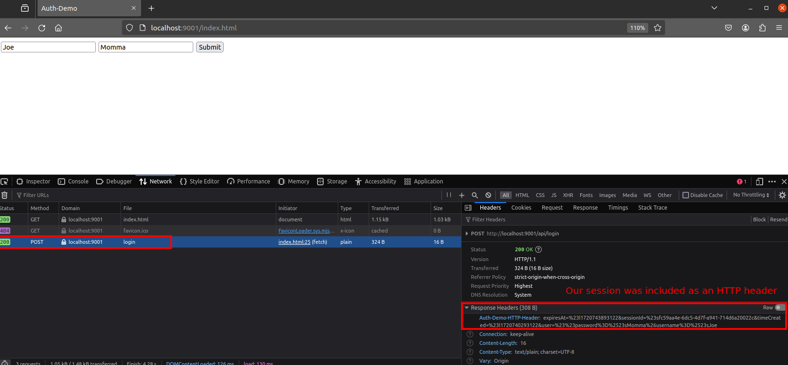
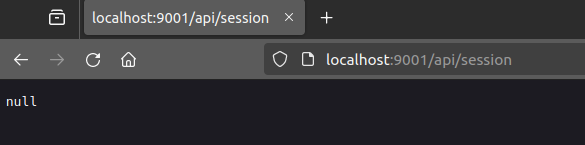
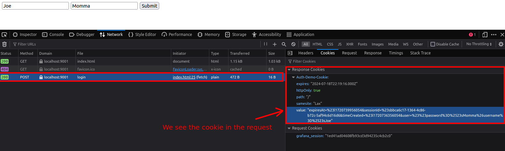
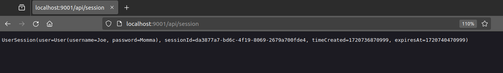
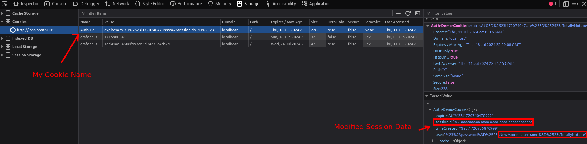
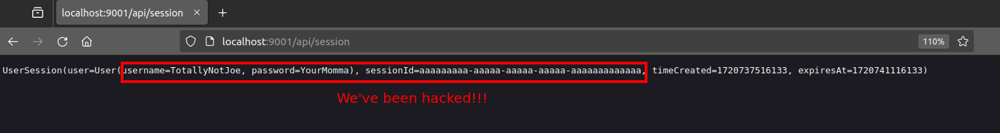
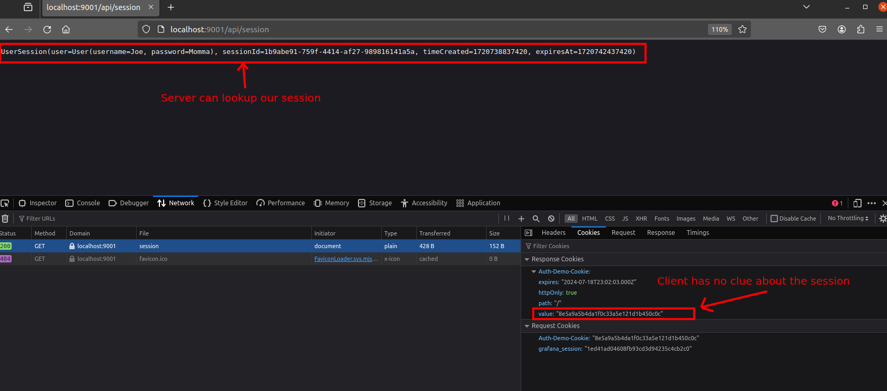
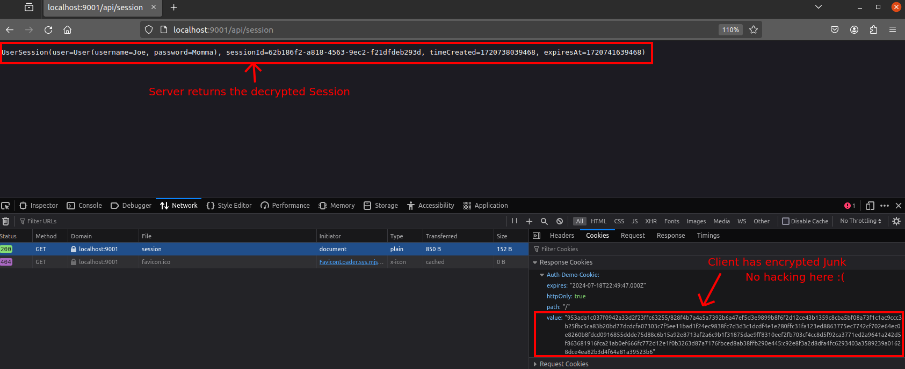

# Sessions

In the previous lesson, we learned how to authenticate a user using a basic username and password. However, we did not
talk about how future requests to the system can verify if a user is logged in. This is where sessions come in.

Sessions are a way to store information on the server about a particular browser 'session'. Each browser session has
unique session information that is stored within the browser so that the server can identify subsequent requests from
the same person.

In this lesson, we will learn how to use sessions to store information about a user's login status.

## What is a Session?

A session is a way to store information about a user's interaction with a website. When a user logs in, the server
creates a session object that contains information about the user, such as their username, email, and other information.

There are two main ways to store session information:

- HTTP Headers
- Cookies

Technically, both are the same thing, but cookies are a specific type of HTTP header that is stored on the client's
browser and automatically sent with every request. Cookies are by far the most common and easiest method to use, but we
will also show how to use raw HTTP headers to store session information.

## Preparing the Server

To prepare our server to store sessions, we need to create a class to store session information. Let's start by creating
a data class to store our session information.

### Kotlin

```kotlin
data class UserSession(
    val user: User,
    val sessionId: String,
    val timeCreated: Long,
    val expiresAt: Long
)
```

### C#

```csharp
public class UserSession
{
    public User User  { get; set; }
    public DateTime TimeCreated  { get; set; }
    public DateTime ExpiresAt { get; set; }
}
```

---

In C#, the [ASP.NET Api](https://learn.microsoft.com/en-us/aspnet/core/fundamentals/app-state?view=aspnetcore-8.0) does
not have support for manual HTTP Headers. Probably because it is a very outdated way to pass session information. So for
C# folks, read along to learn about the old way of doing things and be happy that Microsoft is pretty modern.

To use sessions in Ktor, we need to first install the Sessions feature to the server.

### Installing Ktor Sessions

This is explained in the [Ktor documentation](https://ktor.io/docs/server-sessions.html#configuration_overview).

The dependencies are already added to gradle, so we just need to add the feature to the server.

```kotlin
embeddedServer(Netty, port = 9001) {
    install(Sessions)
}
```

This allows us to store information about the user, the session ID, the time the session was created, and the time the
session expires.

---

## [Kotlin Only] Using HTTP Headers

The first (and most difficult) method to store user sessions is to use HTTP headers. HTTP headers are key-value pairs
that are sent along with a request to the server (and can be part of the response to the client). These headers are used
to send metadata about the request, such as the content type, the content length, and other information.

We can use HTTP headers to store session information by creating a custom header that contains the session information.
Then, when the user makes a request to the server, the server can read the header and determine who the user is.

To get started, let's configure KTOR to provide a custom header that contains the session information.

```kotlin
install(Sessions) {
    header<UserSession>("Auth-Demo-HTTP-Header")
}
```

This tells Ktor that we want to store our `UserSession` object in a header called `Auth-Demo-HTTP-Header`. Next, let's
update our `login` endpoint so that on a successful login a `UserSession` is created and stored as an HTTP header.

```kotlin
post("/login") {
    // Other stuff above here...
    if (user != null && user.password == login.password) {
        val session = UserSession(
            user,
            UUID.randomUUID().toString(),
            System.currentTimeMillis(),
            System.currentTimeMillis() + 1000 * 60 * 60
        )

        call.sessions.set<UserSession>(session)
        call.respond(HttpStatusCode.OK, "Login successful")
    } else {
        call.respond(HttpStatusCode.Unauthorized, "Invalid username or password")
    }
}
```

This code creates a new `UserSession` object when a user logs in, and stores it in the session.
Now when a user logs in successfully, we should see the server respond with an included HTTP header that includes the
user's session information.

Before we test this, let's create an endpoint that allows us to see the session information from the server's point of
view.
We will add a new endpoint, `/api/session`, that just prints out the session information.

### Kotlin

```kotlin
get("/session") {
    val session = call.sessions.get<UserSession>()
    call.respond(HttpStatusCode.OK, session.toString())
}
```

Great! Now we can test this by running the server and sending a login request.
Open the browser's developer tools and look at the response from the `/login` endpoint:

#### Request With a Header



We can see that the HTTP header `Auth-Demo-HTTP-Header` contains the session information that we stored in the
`UserSession` object.

**NOTE**: Make note of how human-readable this is... Hmmm....

Now let's check the `/api/session` endpoint.

#### Null Session



#### Why is our session null?

Because the client did not send the HTTP header back to the server.
In order for the server to know about our session, it is looking for a header called `Auth-Demo-HTTP-Header` to be present in every request.
If the client does not send this header, then the server will not know who the user is.

Unfortunately, this is a major drawback of using HTTP headers to store session information.
The client has to manually send the header with every request, which is not practical for most web applications.
In our case, we have no way to send the header with our requests, as calling the `/api/session` endpoint is done through
the browser, which means we have no control over the headers that are sent.

The best way we can do this is to use JavaScript to manually send the user to the `/api/session` endpoint after a
successful login with the header attached and append the content to the page...
This emulates a single-page application, where the client-side JavaScript is responsible for sending the session
information with every request.
Without a single-page application, we cannot track headers across pages, and thus we must use Cookies instead.

This is absolutely disgusting, but here goes nothing:

### HTML

```html
<body>
    <div>
        <label>
            <input type="text" id="login_username" />
        </label>
        <label>
            <input type="text" id="login_password" />
        </label>
        <button onclick="login()">Submit</button>

        <div id="sessionContent"></div>
    </div>
</body>

<script>
    var authHeader = null;

    function login() {
        var inputUsername = document.getElementById("login_username").value;
        var inputPassword = document.getElementById("login_password").value;

        fetch("http://localhost:9001/api/login", {
            method: "POST",
            headers: {
                "Content-Type": "application/json",
            },
            body: JSON.stringify({
                username: inputUsername,
                password: inputPassword,
            }),
        })
            .then((success) => {
                console.log("Success: ", success);

                // Get the header from the response.
                authHeader = success.headers.get("Auth-Demo-HTTP-Header");

                // Send the user to the next page.
                getSessionData(authHeader);
            })
            .catch((error) => {
                console.log("Error: ", error);
            });
    }

    async function getSessionData(header) {
        var sessionDiv = document.getElementById("sessionContent");

        fetch("http://localhost:9001/api/session", {
            method: "GET",
            headers: {
                "Content-Type": "application/json",
                "Auth-Demo-HTTP-Header": header,
            },
        })
            .then((success) => {
                console.log("Success: ", success);
                success.text().then((data) => {
                    sessionDiv.innerHTML = data;
                });
            })
            .catch((error) => {
                console.log("Error: ", error);
            });
    }
</script>
``` 

Here we send a request to the login endpoint.
If the login is successful, then we store the HTTP header in a variable, and then proceed to make a call to the
`/api/session` endpoint with the header attached.
We then take the response and append it to the page.

This is a very manual way to handle sessions, and is not practical for most web applications.
This is why we typically use cookies to store session information.

So... Let's revert all of that HTML back to the old stuff and move on to cookies.

### The Old Stuff

```html
<!DOCTYPE html>
<html lang="en">
<head>
    <meta charset="UTF-8">
    <title>Auth-Demo</title>
</head>

<body>
    <div>
        <label>
            <input type="text" id="login_username"/>
        </label>
        <label>
            <input type="text" id="login_password"/>
        </label>
        <button onclick="login()" >Submit</button>
    </div>
</body>

<script>
    function login() {
        var inputUsername = document.getElementById("login_username").value;
        var inputPassword = document.getElementById("login_password").value;

        fetch("http://localhost:9001/api/login", {
            method: "POST",
            headers: {
                "Content-Type": "application/json",
            },
            body: JSON.stringify({
                username: inputUsername,
                password: inputPassword,
            }),
        }).then((success) => {
            console.log("Success: ", success);
        }).catch((error) => {
            console.log("Error: ", error);
        });
    }
</script>
```

### Using Cookies

Cookies are the most common way to store session information.
When a user logs in, the server sends a cookie to the browser that contains the session information.
Cookies get stored in your browser and all cookies that are associated with a domain will automatically get sent back to
the server with every subsequent request.

**NOTE**: Cookies are HTTP Headers. They are sent in a header called `Cookie`.

**WARNING**: Cookies are not secure and can be tampered with. We will see this in a few minutes.

Let's use cookies to store our session information.

#### Kotlin

To do this, we just need to change our session from `header` to `cookie` in the Ktor configuration.

```kotlin
install(Sessions) {
    cookie<UserSession>("Auth-Demo-Cookie")
}
```

This tells Ktor that we want to store our `UserSession` object in a cookie called `Auth-Demo-Cookie` instead of an HTTP
header.

#### C#

To allow our server to use Cookies, we need to modify our top-level `Program.cs` file.

First, we add a memory cache so that our server can track the cookie information in the server and then we configure the
options for the session:

```csharp
// Configure Sessions
builder.Services.AddDistributedMemoryCache();

builder.Services.AddSession(options =>
{
    options.IdleTimeout = TimeSpan.FromSeconds(60);
    options.Cookie.IsEssential = true;
});
```

Finally, before calling `app.Run`, we enable sessions:

```csharp
app.UseSession();
```

Next, we want to try to set some session information after the user logs in.
To do this, we will update our `Login` function to call `Session.SetString` with some user session details:

```csharp
if (db.VerifyUser(request.username, request.password))
{
    HttpContext.Session.SetString(
        "UserSession",
        JsonSerializer.Serialize(new UserSession {
            User = db.GetUser(request.username),
            TimeCreated = DateTime.Now,
            ExpiresAt = DateTime.Now.AddHours(6),
        })
    );
    
    return Ok("Success!");
}
```

Now that we are setting a session, let's also create an endpoint to test if we can get our session data after a
successful login.
Let's create a new route that just reports the current session:

```csharp
[Route("session")]
[HttpGet]
public IActionResult Session()
{
    var session = HttpContext.Session.GetString("UserSession");
    if (session != null)
    {
        return Ok(session);
    }

    return Unauthorized("Not logged in.");
}
```

---

Let's try our sessions out. Run the web server and open developer tools.
Send a valid login request and look at the `/login` response.

**Request With a Cookie**


You will see that the server has sent a cookie back to the browser.
This cookie contains the session information that we stored in the `UserSession` object.

Now, we can check the `/api/session` endpoint and the Cookie is automatically sent along with the request.
This is the beauty of cookies, as they are automatically sent with every request to the server.
No need to mess around with custom HTTP headers or JavaScript client header manipulation.

## Tampering with Cookies

**NOTE**: C# users, Microsoft encrypts cookies by default! No need to worry about cookie tampering!

In order to test the security of our session, we are going to use the `/api/session` endpoint to "debug" and see what
our server sees when they read the user's session.
If we navigate to `http://localhost:9001/api/session`, we should be able to see the session information.



We mentioned before that cookies are not secure and can be modified by the client.
This means that a malicious user could potentially change the session information in the cookie and impersonate another
user.
Let's see how this works.

Open the browser's developer tools and navigate to the `Cookies` section (In Firefox it is at "Storage" -> "Cookies").
Find the cookie that was sent by the server.
Once found, we can attempt to edit the cookie. In Firefox, you can double-click the cookie field to edit it. In Chrome,
you can right-click and select "Edit".
Modify the cookie to have different information, for example, the username, password, session ID...



Once you have updated the cookie, make another request to the server's `/api/session` endpoint and see if the session
information has changed.



## Session Encryption

We've been duped! The server has accepted the modified cookie and returned the session information that was stored in
the cookie.
This is a major security flaw in our system, as any malicious actor could just modify the cookie to impersonate another
user!

There are two ways to prevent this:

- Store the session information on the server (C# does this automatically)
- Encrypt the session information

### Storing Sessions on the Server

The first method is to store the session information on the server.
Doing this, Ktor serializes the session information in memory (or a disk or database), and maps each user session to a
unique session ID.
This session ID is then sent to the client in a cookie, and the server uses this session ID to look up the session
information when the client makes a request.
This ensures that the client cannot modify any of the session data, as it is stored on the server.

However, this is not foolproof either.
If a hacker knows your session ID, they can impersonate you by sending the same session ID to the server.
This is why it is important to use HTTPS to encrypt the session ID when it is sent to the client.

To implement server-side sessions in Ktor, we
can [follow the Ktor docs](https://ktor.io/docs/server-sessions.html#storages).
For this demo, let's just use in-memory storage.

```kotlin
install(Sessions) {
    cookie<UserSession>("Auth-Demo-Cookie", SessionStorageMemory())
}
```

Once implemented, restart the server and login to our application.
After logging in, navigate to the `/api/session` endpoint.

We can see that the server returns the stored session information, however, inspecting the browser's cookie, we can only
see a session ID.
This prevents the client from modifying the session information, as it is stored on the server.



Storing the session on the server also comes with some drawbacks.
If the sessions are stored in memory, if the server crashes, all session information is lost.
If the sessions are stored in a database, then the server has to make a database call every time a request is made to
look up the session information, which can be time consuming and CPU intensive to do for every request.
Additionally, it means that the session data is taking up disk space on the server, which could be a problem if you have
a lot of users.

As a result, most web applications will typically use Cookies to get free storage on behalf of their users.

### Encrypting the Session Information

The second method to prevent cookie tampering is to encrypt the session information.
This means that the session information is encrypted before it is sent to the browser, and then decrypted when it is
received by the server.
Because the server is the only one who knows the decryption key, the client cannot modify the session information unless
they also know the encryption algorithm and encryption key.

This is a good way to prevent cookie tampering, but it is not foolproof.
If the encryption key is ever leaked, then the session information can be decrypted and modified by anyone.

To encrypt the session information in Ktor, we need to install the `Session` feature with session encryption.
[Ktor docs](https://ktor.io/docs/server-sessions.html#sign_encrypt_session) outline this fairly well.

```kotlin
install(Sessions) {
    val secretEncryptKey = hex("00112233445566778899aabbccddeeff")
    val secretSignKey = hex("6819b57a326945c1968f45236589")
    cookie<UserSession>("Auth-Demo-Cookie") {
        transform(SessionTransportTransformerEncrypt(secretEncryptKey, secretSignKey))
    }
}
```

This will encrypt the session information before it is sent to the browser, and decrypt it when it is received by the
server.
Restarting our server, and attempting to log in, we can see that the session information is now encrypted and is a bunch
of unreadable garbage.
However, accessing the `/api/session` endpoint will return the decrypted cookie as the server is able to decrypt the
session cookie to determine who the user is.



This is typically the method used to store cookies as it uses storage on the client's browser to hold the cookie.

> **NOTE**: The encryption and secret key are used to perform the encryption so it is important to keep this key secure
> and generate a good key.

### Session Expiration

One problem that you may have noticed with our application is that once a user logs in, they can continue to use the
application indefinitely.
Additionally, we currently can't support the ability for a user to log out and revoke their session.

To solve this problem, we need to implement a session timeout, as well as a way to revoke a user's session.
This will allow us to expire a user's session after a certain amount of time, and also allow a user to log out and
revoke their session.

Luckily, this is fairly easy to implement. Because we are using sessions, we can just configure KTOR to set an
expiration time on the user's session.

```kotlin
install(Sessions) {
    val secretEncryptKey = hex("00112233445566778899aabbccddeeff")
    val secretSignKey = hex("6819b57a326945c1968f45236589")
    cookie<UserSession>("Auth-Demo-Cookie") {
        cookie.maxAgeInSeconds = 30
        transform(SessionTransportTransformerEncrypt(secretEncryptKey, secretSignKey))
    }
}
```

By adding a maximum age to our cookies, we can ensure that a user's session will expire after a certain amount of time.
Let's try it out. Start our server with the new timeout and try logging in.

Immediately after logging in, attempt to access the `/api/session` route.
You should be shown your session.

Now, wait for over 30 seconds and try accessing the `/api/session` route again.
You should get a `null` response from the server, indicating that your session has expired.

### Revoking Sessions

In addition to expiring sessions, we also want to implement the ability to revoke a user's session.
This will allow a user to log out and revoke their session, which will prevent them from accessing the application until
they log back in.

To implement this, we need to add a new route to our application that will allow a user to revoke their session.
This route will simply clear the user's session, effectively logging them out.

#### Kotlin

```kotlin
get("/logout") {
    call.sessions.clear<UserSession>()
    call.respond(HttpStatusCode.OK, "Logged out")
}
```

#### C#

```csharp
[Route("logout")]
[HttpGet]
public IActionResult Logout()
{
    HttpContext.Session.Clear();
    return Ok("Logged out");
}
```

---

Now, let's try it out. Start our server with the new logout route and try logging in.
Once logged in, access the `/logout` route and then try accessing the `/api/session` route again.
You should get a `Not Authenticated` response from the server, indicating that your session has been revoked.

By adding timeouts to our sessions we have ensured that a user can be confident that they are the only person accessing
their account and that their session cannot be hijacked.

> **NOTE**: There is something called Cross-Site Request Forgery (CSRF) Tokens, however, KTOR does not support them! I
> would recommend researching them.

### Reflection

Take a few minutes and try to answer the following questions:

#### What are some potential security risks with our current system?

- If someone knows the encryption key, they can decrypt the session information and impersonate another user.
- The username and password are sent in plaintext over the network.
- Users can access every endpoint without being logged in.
- We have no MFA or rate limiting on login attempts.
- We have no password recovery system.
- We don't allow or enforce users to change their password.
- We can't determine if a login attempt was "unusual".
- The user's passwords are stored in plaintext.

#### How can we improve this system?

- Encrypt the passwords before storing them in the database.
- Use a secure communication protocol like HTTPS to encrypt data in transit.
- Use a secure database to store user information.
- Implement a password hashing algorithm to store passwords securely.
- Rate-limit login attempts to prevent brute force attacks.
- IP ban users who make too many failed login attempts.
- Implement multi-factor authentication.
- Implement a password recovery and account creation system.
- Implement a password strength checker.
- Implement a password expiration system.

#### Why would you want to implement Cookies like this yourself?

- Because we are learning!
- Because you aren't familiar with third-party authentication systems and this is the best way you know how.

Unless you are building an Authentication service (e.g., Keycloak), you should never implement an Authentication system
yourself like we are currently doing.
There are many libraries and services that provide secure Authentication systems that are much more secure and reliable
than anything you could build yourself.
These libraries follow security standards and best practices that have been tested and proven to be secure.

In the following lessons, we are going to see just how much work goes into building a secure Authentication system, and
how, even after dumping in hours of work, it is still not secure.

### Conclusion

In this lesson, we learned about sessions and how to use them to store information about a user's login status.
We learned about the two main ways to store session information: HTTP headers and Cookies.
We also learned how to prevent cookie tampering by storing session information on the server or encrypting the session
information.

[In the next lesson](./3_rbac.md), we will learn how to use the sessions we've
created to start to restrict access to certain endpoints based on a user's login status and their role.


