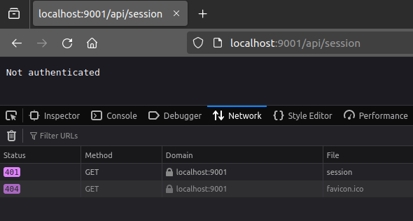
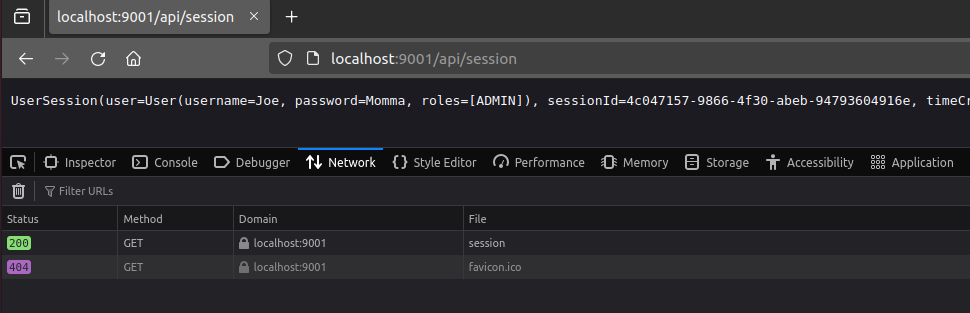
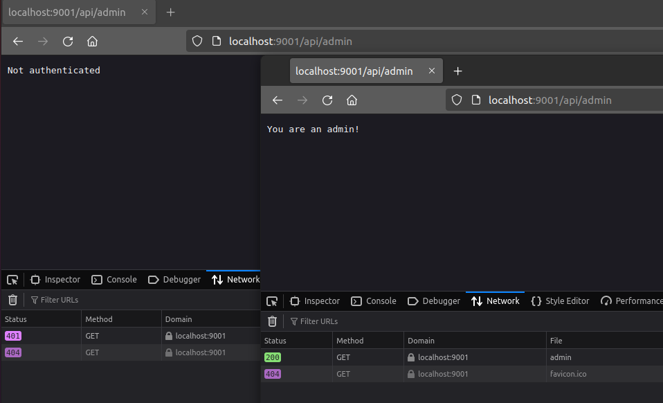
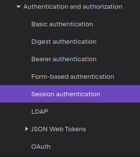

# Authorization: Role-Based User Access Control (RBAC)

In the previous sections, we covered Authentication, verifying a user's identity.  
Recall that Authentication (AuthN) and Authorization (AuthZ) are two related but distinct concepts in the world of
security.  
They are often used together to control access to a system, but they serve different purposes:

- **Authentication** - the process of verifying the identity of a user.
- **Authorization** - the process of determining what a user is allowed to do.

In this section, we will begin to look at Authorization (AuthZ) and give a user a role that will allow them to access
certain resources.

## Role-Based User Access Control (RBAC)

Role-Based User Access Control (RBAC) is a method of restricting a user's access to certain resources based on the
individual's role.  
Users get assigned to a role like "Admin", "Viewer", "Editor," etc., and that role determines what content the user is
allowed to access.

In this section, we will implement some user roles, give them to our users, and use our user's roles to control access
to various resources.

### Ways to Implement RBAC

There are two ways to implement RBAC:

- Store roles in the user's session.
- Store roles in a database and look them up when needed.

In this section, we will use the first method, storing roles along with the user's session, as this is simpler for our
case.

### Creating Roles

To start, let's create a new enum to represent the roles that our users can have.

#### Kotlin

```kotlin
data class User(
    val username: String,
    val password: String,
    val roles: List<Role> = listOf() // New
)

// New
enum class Role {
    ADMIN,
    USER,
    VIEWER
}
```

#### C#

```csharp
public class User
{
    public string username { get; set; }
    public string password { get; set; }
    public List<UserRole> Role { get; set; }
}

public enum UserRole
{
    ADMIN,
    USER,
    VIEWER
}
```

---

Next, we will assign some "sample" roles to our users in the database to simulate our users having roles:

#### Kotlin

```kotlin
// Pretend we are a database.
private val users = mutableListOf<User>(
    User("Quinn", "Bast", listOf(Role.ADMIN, Role.USER)),
    User("Alice", "Wonderland", listOf(Role.VIEWER)),
    User("Bobby", "Tables", listOf(Role.ADMIN)),
)
```

#### C#

```csharp
// In `UserDatabase`:
private List<User> Users { get; } =
[
    new User { username = "Quinn", password = "Bast", Role = [ UserRole.ADMIN, UserRole.USER ] },
    new User { username = "Alice", password = "Wonderland", Role = [ UserRole.VIEWER ] },
    new User { username = "Bobby", password = "Tables", Role = [ UserRole.ADMIN ] },
];
```


### Authorization

Implementing Authorization is done on a web-server to restrict a user's access to certain parts of our Api.
Most web frameworks will support this functionality but implement it in a slightly different way.
However, the fundamentals for how the authorization is done is the same.

Let's take a look at how to start implementing Authorization on our server.

#### Kotlin

To implement authorization in Ktor, we will use the `Authorization` feature.  
Ktor's Authorization feature allows us to determine if a user is authorized to access a resource based on their role.

Adding this is fairly simple, we will just update our Ktor server to install the module and configure it to work with
sessions.  
[The ktor docs](https://ktor.io/docs/server-session-auth.html) explain how to do this fairly easily.

The gradle imports are already added, so we can jump right in.

```kotlin
install(Authentication) {
    session<UserSession> {
        // If someone fails to validate, this is what happens.
        challenge {
            // Typically you might want to redirect them to a login page.
            call.respond(HttpStatusCode.Unauthorized, "Not authenticated")
        }
        // This is the function used to "verify" if the user is logged in.
        validate { session ->
            if (session != null) {
                session
            } else {
                null
            }
        }
    }
}
```

Unfortunately, Ktor's `validate` method expects a `Principal` object to be returned.  
We can easily make our `UserSession` class implement `Principal` to make this work:

```kotlin
data class UserSession(
    val user: User,
    val sessionId: String,
    val timeCreated: Long,
    val expiresAt: Long
) : Principal // <---------------- New here
```

Now that we have added the authentication, we need to protect some routes.  
Let's prevent the `/api/session` route from being accessed by anyone who is not logged in.  
To do this, we can simply wrap the `/session` route in an `authenticate` block:

```kotlin
routing {
    route("/api") {
        authenticate {
            get("/session") {
                val session = call.sessions.get<UserSession>()
                call.respond(HttpStatusCode.OK, session.toString())
            }
        }
    }
}
```

#### C#

To implement Authorization in ASP.NET, we need to do two things:

1. Add Microsoft Authentication
2. Which is required for us to then add Authorization

To do this, we are going to
use [the ASP.NET Authentication docs](https://learn.microsoft.com/en-us/aspnet/core/security/authentication/?view=aspnetcore-8.0)
to configure our app to provide some form of Identity Management.

First, let's add Authentication to our app in `Program.cs` and indicate we want our identity to be stored in a cookie:

```csharp
builder.Services.AddAuthentication(CookieAuthenticationDefaults.AuthenticationScheme)
            .AddCookie();
```

We will also add these lines once the app builder is created:

```csharp
app.UseAuthentication();
app.UseAuthorization();
```

**NOTE**: These need to come before `MapControllers` is called.

**IMPORTANT**: We also need to remove all of the `Session` stuff that we had setup for the last lesson.  
We are now going to be using Cookies instead of Sessions, so we need to remove the following lines from `Program.cs`:

```csharp
// // Configure Sessions
// builder.Services.AddDistributedMemoryCache();
//
// builder.Services.AddSession(options =>
// {
//     options.IdleTimeout = TimeSpan.FromSeconds(60);
//     options.Cookie.IsEssential = true;
// });
//
// app.UseSession();
```

Next, we are going to use
the [ASP.NET Authorization features](https://learn.microsoft.com/en-us/aspnet/core/security/authorization/introduction?view=aspnetcore-8.0).

In order to ensure our user's session is stored within the cookie, we need to create a `ClaimsIdentity` with our user's
information.

To do this, let's modify the `Login` method to set the user's session after they log in:

```csharp
async public Task<IActionResult> Login(UserLoginRequest request)
    {
        if (db.VerifyUser(request.username, request.password))
        {
            // Get the user after they logged in.
            var user = db.GetUser(request.username);
            
            // Create some "Claims" for ASP.NET to know about our user's information
            var claims = new List<Claim>
            {
                new Claim(ClaimTypes.Role, user.Role.ToString()),
                new Claim(ClaimTypes.Name, user.username),
            };

            // Create an identity that uses a cookie
            var claimsIdentity = new ClaimsIdentity(claims, CookieAuthenticationDefaults.AuthenticationScheme);
            
            // Register the user with ASP.NET
            await HttpContext.SignInAsync(
                CookieAuthenticationDefaults.AuthenticationScheme,
                new ClaimsPrincipal(claimsIdentity),
                new AuthenticationProperties
                {
                    IsPersistent = true,
                    ExpiresUtc = DateTime.UtcNow.AddMinutes(20)
                } 
            );
            
            return Ok("Success!");
        }
        return Unauthorized("Failure.");
    }
```

This code creates a `ClaimsPrincipal` and registers the user with ASP.NET's Identity middleware services.  
We also call `await HttpContext.SignInAsync(`, which is required to set our user's session.

**NOTE**: This is an `async` method. This requires us to change the method signature to include `async` and return a
`Task`.

Finally, let's update our `session` endpoint to grab the user's information from the cookie and just report back the
session to verify things are working:

```csharp
[Route("session")]
[HttpGet]
public IActionResult Session()
{
    var user = HttpContext.User;
    if (user != null)
    {
        return Ok(String.Join(",", user.Claims));
    }

    return Unauthorized("Not logged in.");
}
```

Finally, let's update our `session` endpoint to grab the user's information from the cookie and just report back the
session to verify things are working:

```csharp
[Route("session")]
[HttpGet]
public IActionResult Session()
{
    var user = HttpContext.User;
    if (user != null)
    {
        return Ok(String.Join(",", user.Claims));
    }

    return Unauthorized("Not logged in.");
}
```

---

Now let's start our server and give this a try.
First, try accessing `/api/session` without logging in.
Before, this endpoint would just return `null`.
However, now we can see that we are getting a 401 Unauthorized response because we are not logged in.



Now let's try logging in first and accessing the `/api/session` route.
This time we can successfully access the route and see the session information.



### Adding Role-Based Authorization

You might ask, "How is this RBAC?".

Well, it's not... yet. This was just Authentication. We are currently still only making decisions based on if our user
is logged in or not.
To add RBAC, we need to be able to check the user's role.
Checking a user's role is typically done before every route to ensure that only particular users have access to view a
certain resource.

The first way we can do this, is by simply checking `if(user.IsAdmin())` before granting our user's access.
This is not great, but it's one way of doing it. Let's take a look:

We can simply add a helper function to check if our user's session has the required role.

#### Kotlin

```kotlin
fun userHasRole(role: Role, session: UserSession?): Boolean {
    return session?.user?.roles?.contains(role) ?: false
}
```

#### C#

```csharp
private bool UserHasRole(ClaimsPrincipal pricipal, UserRole verifyRole)
{
    var hasMatchingClaim = pricipal.Claims.FirstOrDefault((claim) =>
    {
        if (claim.Type == ClaimTypes.Role)
        {
            Enum.TryParse(claim.Value, out UserRole userRole);
            return userRole == verifyRole;
        }

        return false;
    });
    return hasMatchingClaim != null;
}
```

---

Logically, from here we can just use this function at the top of every route!

### Kotlin

```kotlin
routing {
    route("/api") {
        authenticate {
            get("/admin") {
                if (userHasRole(Role.ADMIN, call.sessions.get<UserSession>())) {
                    call.respond(HttpStatusCode.OK, "You are an admin!")
                } else {
                    call.respond(HttpStatusCode.Forbidden, "You are not an admin!")
                }
            }
        }
    }
}
```

### C#

```csharp
[Route("auth")]
[HttpGet]
public IActionResult Auth()
{
    if (UserHasRole(HttpContext.User, UserRole.ADMIN))
    {
        return Ok("You are Admin.");
    }
    return Unauthorized("You are not Admin");
}
```

---

Let's try it out! Restart our server to load the new changes and first, try accessing `api/admin` without logging in.

**NOTE**: You might notice it says you are an admin. If this is the case, your browser is saving your cookies! As it
should!  
To avoid this, open an incognito tab and try again. You should see "Not Authenticated".

Great! Now, let's try logging in as our non-admin user, Alice/Wonderland, and try accessing the `/api/admin` route.  
Once again, we should be denied access and be shown with a 401 Unauthorized response.

Finally, close and re-open our private browser and let's try logging in as one of our admin users!  
This time we will find that the admin user can successfully access the `/api/admin` route and see the message "You are
an admin!".



It works! Success! Right?

Well... You would need to implement this at the start of EVERY ROUTE to ensure that your user has the correct
permissions to access each route.  
This is not ideal, as we shouldn't check this every single time we hit a route.

---

### Authorization Middleware

In REST API design and server design, there is a feature called "Middleware".  
You can think of "Middleware" as server code/components that need to get called no matter what route is hit.

Typically this includes things like call logging, session tracing, checking CORS requests, and more.  
It turns out that Authentication and Authorization is a middleware!

Using middleware eliminates the need for us to call a function for every method in our API, and instead gives us an
easier interface to manage these calls.

#### Kotlin

Unfortunately, KTOR does not have any notion of Authentication middleware at the moment.  
They may implement something like this in the future, but for the time being, it does not exist.

This means that unless you want to write your own middleware, you are stuck verifying every route manually.

Luckily, some brave soul has posted a tutorial on how you can implement a custom KTOR plugin to more easily configure
authorization.  
You
can [read about it here](https://medium.com/@JalalOkbi/role-based-authorization-with-ktor-from-the-ground-up-552f4a259d74),
but I am not going to show it in this tutorial.

However, I would recommend taking a look at it because you probably want it.

#### C#

In C# we can make use of ASP.NET's built-in `[Authorize]` annotations.

It is as simple as:

```csharp
[Route("auth")]
[HttpGet]
[Authorize]
public IActionResult Auth()
{
    return Ok("Authorized.");
}
```

And, if you want to check the user's role, just pass a role to the attribute:

```csharp
[Route("auth")]
[HttpGet]
[Authorize(Roles = "ADMIN")]
public IActionResult Auth()
{
    return Ok("Authorized.");
}
```

**NOTE**: You can, unfortunately, not use our custom enum types here... But it's not the end of the world.

Using Middleware really streamlines the process and helps make things a little bit cleaner.

## Reflection

When looking at the [Ktor documentation](https://ktor.io/docs/server-session-auth.html) for Authorization, or even
the [ASP.NET Authentication docs](https://learn.microsoft.com/en-us/aspnet/core/security/how-to-choose-identity-solution?view=aspnetcore-8.0)
you will see that there are many ways to implement authorization.



The other methods in this image are all possible ways to implement authorization. In the upcoming sections, we are going
to take a look at some of these other methods and how they can be used to implement some of the known authorization
protocols in Ktor.

### Should we use one of these other methods?

Yes, absolutely.

Using a mechanism to support third-party Auth providers provides a significant amount of benefit. Especially because we
don't have to do any of the heavy lifting ourselves and don't have to worry about as many of the security risks!

### How can we display web content based on a user's role?

The main way to do this would be to pass the user's role to the frontend somehow. This can be done through a cookie,
header, or by adding some API endpoint that the frontend can call to determine the current user's role.

Once the frontend has the user's role, it can then decide what content to display. However, it is important to remember
that the frontend should never be trusted to enforce security. The backend should always be the final authority on what
a user can and cannot access. If the frontend is hiding content based on a user's role, it means that a hacker could "
fake" their cookie, view the HTML in order to see the content that was not meant for them.

The best way to protect content is to validate access on the server.

### Are there any security flaws with RBAC itself?

Not really, but there are some concerns.

There are some potential concerns to be aware of from the administration side though:

- **Role Creep**: Over time, users may be given more roles than they need. This can lead to users having more access
  than they should.
- **Role Explosion**: As your application grows, you may need to add more roles. This can lead to a large number of
  roles that are hard to manage.
- **Role Inheritance**: Sometimes roles can inherit other roles. This can lead to a user having more access than they
  should.
- **Role Bypass**: Sometimes roles can be bypassed by other means. For example, dev feature flags or experimental routes
  could allow bypassing authorization to gain access to resources.

However, these are mainly issues with how RBAC is implemented, not with RBAC itself.

### How do we manage assigning/providing these roles?

Adding more features for user management.

As of right now, you would need database access (or in our case, file access) to manage our user's roles. But in
reality, you really don't want to rely on your Database Administrator (DBA) to do all this work for you. And the DBA
certainly doesn't want to be doing this work either!

So you would need to implement more features! Yay!!!

Adding a pane-of-glass for user management for your application will become a necessary evil if we continue going down
the road we are currently on.

This would mean making pages to:

- View all users
- Update each user's role
- Add and edit roles
- Create groups of users to apply roles
- Forcibly set a user's password
- Delete a user

You get the idea. At this rate, we might as well just make an entire user management platform. We shall call it "UMP:
User Management Platform"!

## Conclusion

In this section, we learned about Role-Based User Access Control (RBAC) and how to implement it in Ktor. We learned how
to assign roles to users, protect routes based on a user's role, and how to use the `authorize` block to protect routes
based on a user's role.

At this point, our largest security flaw in the application is our lack of a TLS connection. Anybody acting as a
man-in-the-middle could easily see the traffic that we send when a user submits their credentials!

[In the next section](./4_tls.md), we are going to take a look at packet sniffers, and
show how easy it is to see the traffic that we send over the internet. But, we will also show how easy it is to protect
against this with a TLS connection.
