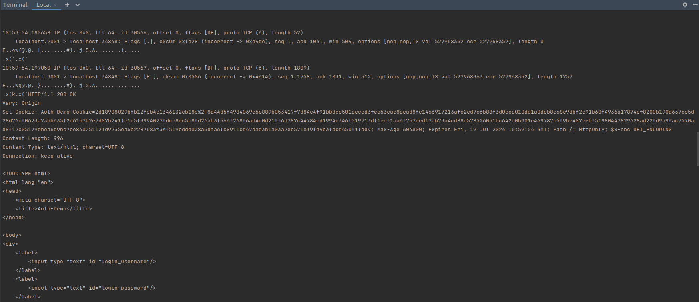
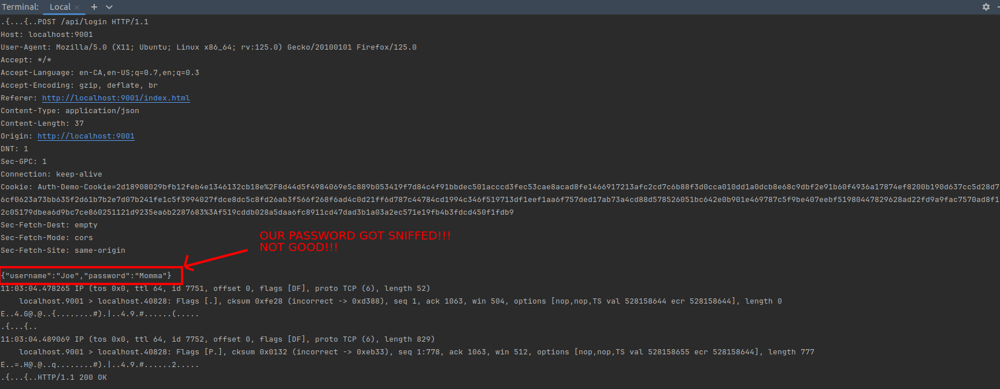
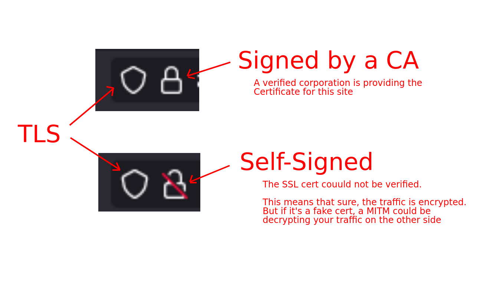
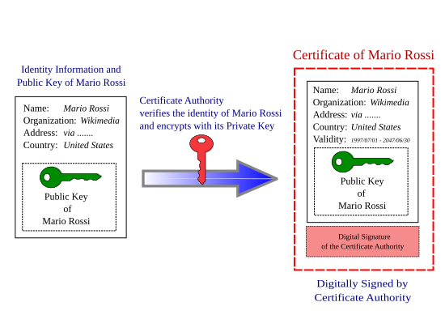
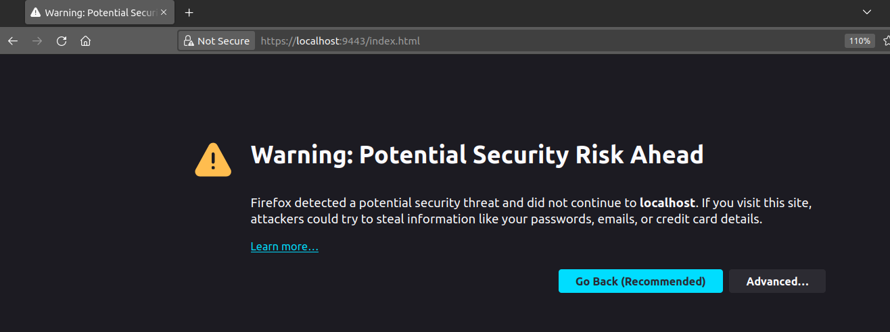
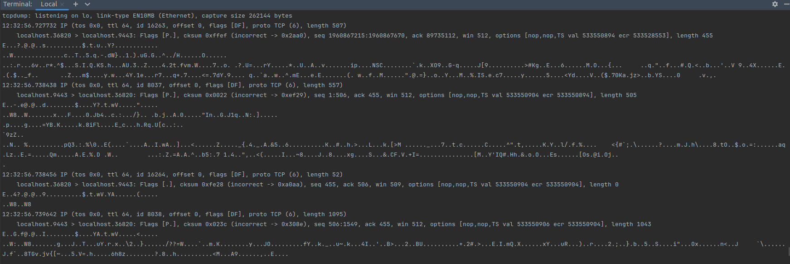
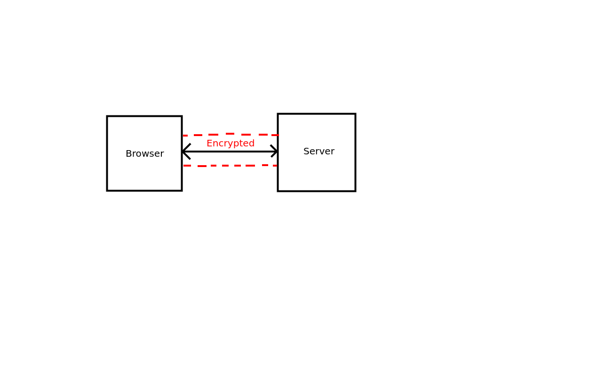
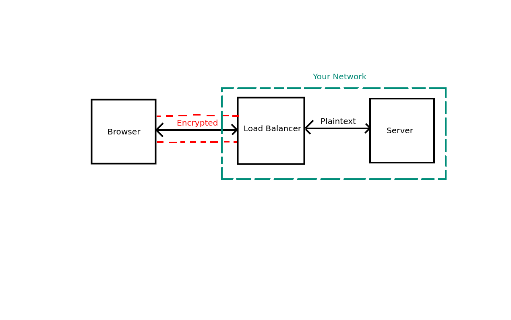

# Transport Layer Security (TLS)

In the previous sections, we created a web application that accepted user logins and implemented its own RBAC system.
However, we have been sending all of our traffic as plaintext! This is a huge security risk, as anyone can intercept the
traffic and read the contents.

In this section, we are going to show you how a man-in-the-middle attack can be performed on a plaintext connection by
using tcpdump.

In order to protect against these attacks, we are also going to add Transport Layer Security (TLS) certificates to our
application.

## Understanding TLS

TLS is a cryptographic protocol that provides end-to-end encryption for data sent between a client and a server. It is
the successor to SSL and is used to secure HTTPS connections.

TLS works by encrypting the data sent between the client and the server so that even if someone intercepts the data,
they cannot read it. Decrypting TLS data would take an attacker a very long time and is not feasible for most attackers.

### RSA

RSA is a public-key cryptosystem that is used to secure the TLS connection. It works by generating a public and private
key pair, and using the public key to encrypt data, and the private key to decrypt it.

When a client connects to a server, the server sends the client its public key. The client then generates a random
symmetric key, encrypts it with the server's public key, and sends it back to the server. The server then decrypts the
symmetric key with its private key and uses it to encrypt and decrypt data sent between the client and the server.

In more recent versions of TLS, the client and server negotiate a shared key using a variation of the Diffie-Hellman
algorithm, so that the shared key is never communicated across the network at all. This has the advantage of "
forward-security", meaning that even if an adversary gets access to a private key, they will not be able to decrypt any
communications that happened before the key was acquired! Such is the magic of math.

### The RSA Algorithm

The basic principle behind RSA is that it is very easy to find large prime numbers (using
the [Miller-Rabin Primality Test](https://en.wikipedia.org/wiki/Miller%E2%80%93Rabin_primality_test)) and multiply them
together, but very difficult to factorize the product back into its prime factors. Using the branch of math known as "
Group Theory," these facts can be used to generate a public and private key scheme to transmit data securely.

Once two large prime numbers *p*, *q* are found, they are multiplied to produce *n := p × q* (note: *a := b* means "*a*
is defined to be *b*").  
We also define *φ := (p - 1) × (q - 1)* (this is the "order of the multiplicative group of integers mod *n*" if you're
interested).  
We now choose a random number *e* with *gcd(e, φ) = 1*, and use
the [Extended Euclidian Algorithm](https://en.wikipedia.org/wiki/Extended_Euclidean_algorithm) to find another number
*d* with *e × d ≡ 1 mod φ*.  
By the way, none of this is _too_ hard and can be accomplished in about 100 lines of Python :).

Now, thanks to the magic of group theory, for any number *m* we have *m^(de) ≡ m mod n*.  
Thanks to binary encodings, text can be represented as numbers. So now, we can publish the pair *(e, n)* as our public
key, and keep *d* secret.  
Anyone wishing to send us a message *m* sends us *m^e mod n*, and we use *d* to compute:

*(m^e)^d mod n = m^(e × d) mod n = m mod n*

Any adversary sniffing our traffic can know *n* and *e*, but as far as we know, computing *d* from these numbers is
impossibly difficult.

Let's make our own RSA key-pair and encrypt some data:

The RSA algorithm begins by selecting two prime numbers, `p` and `q`.  
Let's pick `601` and `617`.

The next step is to multiply the two prime numbers together to determine our modulus, `n`:

- **n = p × q**
- **n = 601 × 617**
- **n = 370817**

Next, we calculate the "totient," *φ*, of `n`. The totient is the number of integers less than `n` that are coprime to
`n`. Coprimality is when two numbers have no common factors other than 1. For example, the numbers 8 and 15 are coprime
because the only common factor is 1, whereas 8 and 12 are not coprime because they share the common factor of 4.

So we need to:

- Determine if two numbers are coprime or not
- Calculate how many coprimes exist less than `n`

However, because we know that `n` was generated by multiplying two prime numbers, we can apply a
shortcut. [Charmichael's Totient Theorem](https://en.wikipedia.org/wiki/Carmichael_function) states:

*φ(n) = (p - 1) × (q - 1)*, if *n = p × q*.

We can apply this theorem to determine our totient:

- **φ(n) = (p - 1) × (q - 1)**
- **φ(n) = (601 - 1) × (617 - 1)**
- **φ(n) = 369600**

Now that we have `n` and *φ*, we can generate our public and private keys:

- First, we select a random number `e` coprime to *φ*. Let's pick `13` for this example.
- The public key, `d`, is the modular multiplicative inverse of *e mod φ(n)*. Multiplying *e mod φ(n)* with `d` and
  taking the result mod `n` will result in `1`.  
  For example, the modular multiplicative inverse of `5` mod `7` is `3`, because `5 × 3 = 15` and `15 ≡ 1 mod 7`.

Using the [Extended Euclidian Algorithm](https://en.wikipedia.org/wiki/Extended_Euclidean_algorithm), we determine that
`d = 255877`.  
And indeed, **e × d = 13 × 255877 = 3326401 ≡ 1 mod 369600**.

We now have our public key `(n, e) = (370817, 13)` and our private key `(d) = (255877)`. We can now encrypt and decrypt
data using these keys.

#### Encrypting Data

To encrypt data, we use the public key's `e` and `n`:

- **c = m^(e mod n)**

Where `c` is the encrypted message, and `m` is the message to encrypt.  
Let's encrypt 26729, which is the decimal representation of ASCII for "hi."

- **c = m^e mod n**
- **c = 26729^13 mod 370817**
- **c = 346261**

We can then transmit this over the network, and our "hi" is unreadable to anyone except a state-level actor with a
quantum computer!

#### Decrypting Data

To decrypt this message, we use the private key `d` along with `n` using the following formula:

- **m = c^d mod n**

Where `m` is the decrypted message, and `c` is the encrypted message:

- **m = c^d mod n**
- **m = 346261^255877 mod 370817**
- **m = 26729** ("hi")

If a hacker wanted to attempt to "hack" our message, they would need to factorize the public key `n` into its prime
factors `p` and `q`, which is very difficult to do.  
For example, determine the prime factors of the following:

```plaintext
4238215945347261286511348660016634545495256684513620817391084792521365266472617760446989471478339349167666862973786404163542008403448344995064754393779020428757536380334550846199728518200050916215301545311315958182278997245343268822590975926306581237493629731260357632116641428549673378543222117379579546271
```

---

### Are you a quantum computer?

Did you guess:

```plaintext
8524490202427516308790459163549267166476687775885264425777729484365595291830287152162672580636583595338835026021333225272204523415800638449936201836699641
```

and

```plaintext
497181162122791332088677795341508078385146806980612574047222768855946274576753936110343001029703692202404132005056239172065851546064283204409057327961431
```

RSA (and other encryption algorithms) form the basis for secure communication on the internet. If we can send all of our
data over an encrypted connection using this algorithm, it is guaranteed that no one can read the data except for the
intended recipient.

Until quantum computing comes in and breaks all of our encryption algorithms and the entire internet as we know it, but
that's a problem for another day.

- [Could Quantum Break RSA?](https://freemindtronic.com/quantum-computing-rsa-encryption-freemindtronic-nfc-technology/)
- [China used a 10-qubit computer to break a 48-bit RSA key](https://www.kaspersky.com/blog/quantum-computers-and-rsa-2023/46733/)
- [Fear not: RSA encryption won’t fall to quantum computing anytime soon](https://arstechnica.com/information-technology/2023/01/fear-not-rsa-encryption-wont-fall-to-quantum-computing-anytime-soon/)

## Sniffing Plaintext Traffic

Alright. We now understand how RSA works and how our traffic gets encrypted using TLS, but before we go and fix the
problem, let's see what the "problem" is in the first place.

We are going to use a tool called `tcpdump` to sniff the traffic between our client and server. `tcpdump` is a packet
analyzer that allows us to capture and analyze network traffic.

**NOTE:** Windows users can [download Wireshark](https://www.wireshark.org/download.html) to try this out too!

First, we need to install `tcpdump` if not installed already:

```bash
sudo apt-get install tcpdump
```

Next, we need to run `tcpdump` to capture the traffic between our client and server.

We will run `tcpdump` with the following filters:

- `-i` specifies the network interface. We will use `lo` to capture loopback traffic since our traffic is all local.
- `-A` prints our packets as ASCII.
- `-vvv` enables verbose mode.
- `port 9001` specifies that we only want to capture traffic on port 9001, which is the port our server is running on.

Putting it all together, we get:

```bash
sudo tcpdump -A -vvv -i lo port 9001
```

Now let's open our website and navigate to `http://localhost:9001/index.html` in our browser. Once the page is open,
look back at the terminal. You should see a bunch of packets being printed out.

If you look closely, you can see the data being sent between the client and the server.



Here we can see the entire HTML page, the attached cookies, and we clearly see all of the data that is being sent
between our server and our browser. Let's try logging in as one of our users.



Here we can see the username and password being sent in plaintext. Our network traffic bounces off of tons of routers
and servers that are not maintained by us, and any one of them could be sniffing our traffic.

This is a huge security risk, and we need to fix it.

**IMPORTANT:** Adding TLS to an application is the easiest and **most effective** way to secure an application. While
not foolproof, it prevents an extremely large and very preventable attack surface.

Let's stop the `tcpdump` and start fixing this security hole!!

## Adding TLS to our Application

By adding Transport Layer Security (TLS), our traffic gets encrypted before it is sent across the network. This means
that even if someone is running a packet sniffer, they will not be able to read our data. Only the destination server
will be able to decrypt the data and read it.

In order to add TLS to our application, we need to generate a certificate and key pair. We can do this using the
`openssl` command.

First, we need to generate a private key with `openssl`.

We can use the following parameters:

- `genrsa` to generate an RSA key.
- `-out` to specify the output file.
- `2048` to specify the key length as 2048 bits.

```bash
openssl genrsa -out server.key 2048
```

**NOTE:** For Windows users, you need
to [download and install OpenSSL](https://slproweb.com/products/Win32OpenSSL.html). Do not install the "Light" version.
Make note of your install destination, as you need to manually add it to your PATH. The installer does not do it for
you. Do this by going to **System Properties -> Environment Variables**. Add `C:\Program Files\OpenSSL-Win64\bin` to
your PATH.

Next, we need to generate a certificate signing request (CSR) using the private key. A CSR is a file that contains
details about your request for a certificate. Typically this includes information about the organization, the domain
name, and the public key.

You will be prompted to enter some information about the certificate. You can enter whatever you want, but make sure to
set the `Common Name` to `localhost`, as this indicates what DNS name the certificate is valid for. If you use the
certificate for a different DNS name, you will get an error when you try to connect to the server.

**NOTE:** This example uses DNS name `localhost` because we are running our server locally. It is possible to self-sign
using an IP address if necessary, but that will not be covered here.

We can generate the CSR using the following parameters on the `openssl` command:

- `req` indicates this is a CSR request.
- `-new` to generate a new CSR.
- `-key` to specify the private key.
- `-out` to specify the output file.

```bash
openssl req -new -key server.key -out server.csr
```

Once we have a CSR, we can do one of two things with this file:

1. Send it to a Certificate Authority (CA) to have a verifiable certificate.
2. Self-sign the certificate.



### Certificate Authorities (CA)

Certificate Authorities are organizations that verify the identity of the certificate holder and sign the certificate to
verify its authenticity. A digital certificate is provided with your certificate which certifies that you are truly the
owner of the public key associated with your certificate.

When you ask a CA to provide you with a certificate, they will respond to you with a certificate that includes the
digital signature of the CA. This signature is used by a browser to verify that the certificate is valid and that the CA
has also confirmed it. In essence, the certificate authority is responsible for saying "yes, this person is who they say
they are, and we, the CA, also verify that."



There are many public CA providers that will sign your certificate for you:

- IdenTrust
- DigiCert
- GlobalSign
- GoDaddy
- Let's Encrypt

These are just a few of the many CA providers that are available.

**NOTE:** Let's Encrypt is free. The others in the list require you to pay.

**NOTE:** If your deployment environment does not have internet access, you will need to self-sign your certificate
anyway. A CA will not be available to verify the certificate's validity if you cannot contact the CA.

To get a certificate from a CA, you will need to personally contact the CA and provide them with the CSR that you
generated in the previous step. This provides the CA with your public key and the information that you want to be
included in the certificate. The CA will then verify your identity and sign the certificate for you before providing you
with a signed certificate.

Most CAs require payment; however, Let's Encrypt is free and provides a free certificate that is valid for 90 days. You
can even generate Let's Encrypt certificates using the [Certbot](https://certbot.eff.org/) tool.

**NOTE:** In order for a CA to sign your certificate, you must have a domain name that you own and your web server needs
to be public-facing. This is because the CA will need to verify that you own the domain name that you are requesting a
certificate for. To verify this, the CA will usually ask you to place a file on your web server with the contents that
they provide you. The CA will scrape the website on a regular basis, and once they can see the file, they will sign your
certificate.

Because we do not have a public-facing domain name, we are going to self-sign our certificate.

---

### Self-Signing Certificates

To generate a self-signed certificate, we can use the following `openssl` command:

- `x509` to generate a certificate
- `-req` to specify that this is a certificate request
- `-days` to specify the number of days the certificate is valid for
- `-in` to specify the input request file
- `-signkey` to specify the private key
- `-out` to specify the output file

```bash
openssl x509 -req -days 365 -in server.csr -signkey server.key -out server.crt
```

This will generate a certificate that is valid for 365 days. You can change the number of days to whatever you want, but
it is recommended to rotate certificates every year. Using a CA requires you to rotate approximately every 90 days or
so. This is to prevent a compromised certificate from being used for too long.

---

### Java Keystore (JKS)

**NOTE:** C# users do not care about Java Keystores. Skip to the next section if you like.

Java uses a different format for storing certificates and keys called a Java Keystore (JKS). A JKS is just a bundle of
your certificates and keys that are going to be used by your Java application.

Unfortunately, Java does not support the `.crt` format that we generated, but it does support `.pem` and `.p12`. Thus,
we need to convert our certificate to an intermediate format before we can use it in a JKS.

**NOTE:** A JKS requires a password to be set on the `.p12`. Set a password during the conversion.

**NOTE:** A JKS also requires an alias to be set. Use `-name` to set the certificate alias.

To convert the `.crt` file to a `.p12` file, we can use the following `openssl` command:

- `pkcs12` to convert the certificate to the `.p12` format
- `-export` to export the certificate
- `-in` to specify the input certificate
- `-inkey` to specify the input private key
- `-out` to specify the `.p12` output file
- `-name` to specify the alias of the certificate

```bash
openssl pkcs12 -export -in server.crt -inkey server.key -out server.p12 -name auth-demo
```

Now that we have our `.crt` converted to a `.p12`, we can import it into a Java Keystore using the following command.
You will need to set a password for the JKS file as well as input the password for the `.p12` file you generated in the
previous step.

**NOTE:** It is important here to set the `-alias`. Ktor requires an alias to be set.

We can generate a JKS using the `keytool` command:

- `importkeystore` to import the `.p12` to the keystore
- `-srckeystore` to specify the source keystore file
- `-srcstoretype` to specify the source keystore type
- `-destkeystore` to specify the destination keystore file as the desired `.jks`
- `-alias` to specify the alias name of the certificate from the `.p12`
- `-destalias` to specify the alias to put the cert in the `.jks` keystore

```bash
keytool -importkeystore -srckeystore server.p12 -srcstoretype pkcs12 -destkeystore server.jks -alias auth-demo -destalias auth-demo
```

[Ktor has very good documentation on TLS](https://ktor.io/docs/server-ssl.html#convert-certificate) that includes all of
this information.

Once successful, we have a `.jks` ready to be used in our Java application.

### Adding TLS to our Server

Now that we have our certificates ready to be used, we can configure our server to support TLS. Enabling TLS in Kotlin
and C# are a bit different but the end result is the same.

#### Kotlin

To configure TLS in Ktor we need to take 2 steps:

- Configure the TLS environment
- Update our server to use modules

Updating the server to use modules is a bit of work, but nothing we can't do.

First, let's add the SSL environment:

```kotlin
val keystoreFile = File("server.jks")
val keyStore: KeyStore = KeyStore.getInstance(KeyStore.getDefaultType())
val keystorePassword = "123456"
keyStore.load(keystoreFile.inputStream(), keystorePassword.toCharArray())

val environment = applicationEngineEnvironment {
    // Default port
    connector {
        this.port = 9001
    }
    // SSL port
    sslConnector(
        keyStore,
        keyAlias = "auth-demo",
        { keystorePassword.toCharArray() }, // Keystore password
        { keystorePassword.toCharArray() }  // Private key password
    ) {
        port = 9443
        keyStorePath = keystoreFile
    }
    module(Application::module)
}
```

**NOTE:** The `module(Application::module)` will error for now. We are going to fix this next.

This block configures our application to use TLS using the Java keystore that we generated earlier.

Next, let's make our application use modules. To do this, create a new extension function that extends Ktor's
`Application` class:

```kotlin
class KtorServer {

}

fun Application.module() {
  // All the code that is currently inside of `embeddedServer { }`
}
```

Now, all we need to do is copy and paste everything that is inside the `embeddedServer(Netty, port = 9001) {` into the
new function. Once that is done, we update the embedded server call to be:

```kotlin
embeddedServer(Netty, environment).start(wait = true)
```

#### C#

To configure TLS in C#, let's first tell our server that all requests should use HTTPS by redirecting everything to
HTTPS:

```csharp
builder.Services.AddHttpsRedirection(options =>
{
    options.HttpsPort = 9443;
});
```

And then use the HTTPS redirection middleware:

```csharp
app.UseHttpsRedirection();
```

Next, we will configure our server itself with a TLS certificate. In this demo, we are using IIS Express which will
create and use a self-signed certificate automatically! So yes, all the previous steps we just did to make some certs
were not necessary. However, it is useful to know how to do those steps, because to set up TLS in a production system
you will need to create your own.

In a production system, you likely won't be using IIS Express, and you would be using something like IIS, Kestrel, or
something else which would let you configure TLS on it. But for IIS Express, all we need to do is configure a `sslPort`
within our `Properties/launchSettings.json`.

```json
"iisExpress": {
  "applicationUrl": "http://localhost:9001",
  "sslPort": 9443
}
```

And I also configured an "https" launch profile which will launch the web server to our TLS URL:

```json
"https": {
  "commandName": "Project",
  "dotnetRunMessages": true,
  "launchBrowser": true,
  "applicationUrl": "https://localhost:9443",
  "environmentVariables": {
    "ASPNETCORE_ENVIRONMENT": "Development"
  }
}
```

---

Once this has been done, we can start our server! If all went well, we should see the loving and inviting:



**WE HAVE DONE IT!**

This warning appears because we generated a self-signed certificate and the certificate cannot be verified by a CA. To
ignore the fact that a CA cannot verify the cert, click "Advanced" and "Accept the Risk and Continue". We are now taken
to our website!

### Sniffing TLS Packets

Now that we have added TLS, let's sniff the packets in our local network and see what they look like.

Run the `tcpdump` command from the previous section (or open Wireshark), but update the port to use our new SSL port,
9443:

```bash
sudo tcpdump -A -vvv -i lo port 9443
```

And refresh the page. We now see a ton of garbage being printed out to the console. You will also notice that we no
longer see the raw HTML and JavaScript while snooping the packets. Instead, it is encrypted as a bunch of periods and
other characters.



Now if anyone were sniffing our packets, they would be unable to see the content and be unable to see our username and
password! This is a huge improvement over our previous plaintext connection and eliminates a very large attack surface.

## TLS Termination

In the workflow we have just implemented, our TLS connection is present between the client (browser) and directly to our
server. This is shown in the diagram below.



However, in most production settings, your browser is not going to talk directly to the server. Instead, it will talk to
a load balancer or reverse proxy, which will then talk to your server.

In these scenarios, it is common to terminate the TLS connection at the load balancer or reverse proxy, and then have a
plaintext connection between the load balancer and the server. This is typically the case when you know your internal
network is secure and traffic on the network behind the load balancer *should* be secure.



This makes it easier to manage TLS certificates as only the load balancer would need to be configured with TLS and every
other application can communicate with plaintext. This eliminates the need to generate TLS certs for every server within
a private network.

However...

## Zero Trust

Zero-Trust is an emerging security philosophy which states that no network should be trusted. It should be assumed that
any network is potentially insecure, you cannot trust anyone on your internal network.

If any hacker, rogue employee, etc. gains access to your network, they could easily sniff the network traffic just like
we did and compromise everything! This is especially the case if TLS is terminated at the load balancer.

Using Zero-Trust means encrypting traffic with TLS at all times, even within your own networks. TLS should be used
between every single server in a network, and all traffic going across the wire should be TLS encrypted.

For Kubernetes users, Kubernetes has a feature called `mTLS` that allows you to encrypt all traffic between pods which
allows you to still perform TLS termination at the load balancer while having TLS encrypted traffic between pods.

How you implement Zero-Trust is up to your organization, but it is important to consider the security implications of
your network.

## Conclusion

In this section, we learned about the importance of securing our connections using TLS. We learned how to generate a
certificate and key pair, and how to add TLS to our Ktor server. We also learned how to sniff packets using `tcpdump`
and saw how easy it is to intercept plaintext traffic.

By adding TLS to our application, we have secured our connection and prevented anyone from intercepting our data.

[In the next section](./5_hashing.md), we are going to learn about our data at rest and how hashing and
salting algorithms make us more secure. We are also going to talk about transaction monitoring, access logs, and how to
detect and prevent attacks on our application.
