# Lightweight Directory Access Protocol (LDAP)

Lightweight Directory Access Protocol is a protocol for accessing and maintaining user account and access information
within a network.  
While LDAP is not the first Directory Server, it is the most widely used and most widely supported.

## Directory Servers

LDAP is an evolution of the [X.500](https://en.wikipedia.org/wiki/X.500).  
X.500 is a collection of computer networking standards specifically for Directory servers, including Directory Access
Protocol (DAP).

As implied by the name, Directory Servers were meant to provide security access controls to directories.  
This was a big deal in the 1990s when X.500 was invented because it was the first time that a standard was created for
accessing files.  
Using directory servers, you could restrict access to certain folders, files, wildcarded resources like `*.mp3`.  
This allowed multiple users to access the same resources within a network without having to worry about security.

While revolutionary at the time, X.500 was a complex protocol that was difficult to implement and required a lot of
resources to run.  
It used a large amount of bandwidth and was not practical for many organizations to implement, especially in the 1990s
where gigabit Ethernet was not a thing.  
Typically, X.500 was used by large organizations and governments who had the capacity and funding to implement it.

Because Directory servers were so useful, it was desirable for a simpler protocol to be created that didn't require as
much bandwidth and computational power.  
The creation of LDAP solved the problems of X.500 by reducing the bandwidth and overhead that was required to run a
Directory Server.  
This made Directory Servers practical for businesses of any size as a simple computer could host an LDAP directory.

Today, LDAP is still a very commonly used protocol and services like Active Directory, OpenLDAP, and Apache Directory
Server are all implementations of the LDAP protocol.

## Concepts

Not surprisingly, there is [an entire website dedicated to the LDAP protocol](https://ldap.com/).  
This website contains a wealth of information about the LDAP protocol and is a great resource for learning more about
LDAP.  
This lesson will just cover the basics, but you could learn about LDAP for months and still be learning new content.

LDAP, being an extension of a Directory Server, stores its information in a directory tree.  
This makes LDAP able to be easily applied to filesystems and other hierarchical data structures.

Typically, an LDAP directory is structured with a root node, and then branches off into different organizational units (
OUs).  
Each OU has its own resources like users, groups, printers, servers, etc., and LDAP keeps track of these resources.  
An example of an LDAP directory tree is shown below:

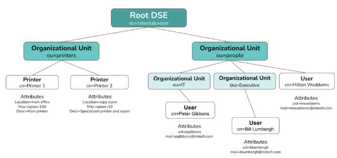

### Terminology

LDAP has a few key terms that are important to understand:

- **Directory Information Tree (DIT):** The hierarchical structure of the LDAP directory.
- **Entry:** A single object in the LDAP directory which contains multiple attributes to describe itself. Typically,
  entries are referenced by their Common Name (CN).
- **Attribute:** Attributes are attached to an entry and describe the entry. Attributes are key-value pairs, for example
  `uid: jdoe` or `email: joe@calian.com`. Attributes can be required for a particular entity type through the use of an
  `ObjectClass`. For example, a `Printer` object class is going to have different attributes than a `User`.
- **ObjectClass:** Defines a collection of required attributes for a specific type of entry.

When defining objects within an LDAP server, there are a few different types of objects (and abbreviations) that are
used:

- **Domain Component (DC):** Typically the top-level domain of the LDAP server. For example, `dc=calian,dc=com` could be
  a top-level domain component for a Calian-hosted LDAP server. Think of this as the root node of the tree.
- **Organizational Unit (OU):** A unit of the organization. This typically holds a collection of entries that are
  related to each other. For example, `ou=people` or `ou=printers`.
- **Common Name (CN):** The name of the entry. This is typically the name of the user or resource that the entry
  represents. Example: `cn=QuinnBast`.
- **Distinguished Name (DN):** A unique identifier that describes how to find an LDAP entry. The DN is the full path to
  the entry in the LDAP directory tree. For example, using the tree in the image above, one possible DN is:
  `cn=BillLumbergh,ou=Executive,ou=people,dc=Initech,dc=com`. This DN contains a full reference containing DC, OU, and
  CN entries in order to find an entry.

### Operations

LDAP has a few key operations that are used to interact with the directory server:

- **Bind:** Authenticates a user to the directory server. This is typically done using a user's DN and a password
  attribute.
- **Search:** Search the directory for entries that match specific criteria.
- **Add:** Add a new entry to the directory.
- **Modify:** Modify an existing entry in the directory.
- **Delete:** Remove an entry from the directory.

LDAP typically uses command-line tools like `ldapsearch`, `ldapadd`, `ldapmodify`, and `ldapdelete` to interact with the
directory server. However, it is recommended to use an IAM tool like Apache Directory Studio or phpLDAPadmin to interact
with the directory server.  
These tools provide a graphical interface to interact with the directory server and are much easier to use than the
command-line tools.

### Binding

In order to perform any LDAP operations, you need to first "bind" to an entry within the LDAP server.  
Binding is the process of linking you to some entry that has various attributes and permissions within the LDAP
server.  
Once you bind to an entry, you are able to perform operations based on what permissions the given entry has.

Once you are bound to an entry, you can perform a search operation.  
When performing a search, you can typically configure the "baseDN".  
The baseDN is the starting point for any search operations. For example, if you set the baseDN to `dc=example,dc=com`,
then the search will always contain these DN names and you will be searching for entries below that point.

## Deploying an LDAP Server

Let's dive right in and start up our own LDAP server using
the [OpenLDAP docker image](https://github.com/osixia/docker-openldap).

Reading the documentation, we can run the LDAP image while also configuring our root DN and admin user at the same time:

```shell
docker run \
    --env LDAP_ORGANISATION="Calian" \
    --env LDAP_DOMAIN="calian.com" \
    --env LDAP_ADMIN_PASSWORD="calian" \
    --env LDAP_LOG_LEVEL="32" \
    --env LDAP_TLS="false" \
    -p 389:389 \
    -p 636:636 \
    --name openldap \
    --detach osixia/openldap:1.5.0 \
    --loglevel debug
```

As a one-liner:

```shell
docker run --env LDAP_ORGANISATION="Calian" --env LDAP_DOMAIN="calian.com" --env LDAP_ADMIN_PASSWORD="calian" --env LDAP_LOG_LEVEL="32" --env LDAP_TLS="false" -p 389:389 -p 636:636 --name openldap --detach osixia/openldap:1.5.0 --loglevel debug
```

**NOTE**: This command does not have volume persistence. If the container stops, you will lose your data.

If you want to persist your
data, [use the following command instead](https://github.com/osixia/docker-openldap?tab=readme-ov-file#data-persistence):

```shell
docker run \
    --env LDAP_ORGANISATION="Calian" \
    --env LDAP_DOMAIN="calian.com" \
    --env LDAP_ADMIN_PASSWORD="calian" \
    --env LDAP_LOG_LEVEL="392" \
    --volume ./ldap/database:/var/lib/ldap \
    --volume ./ldap/config:/etc/ldap/slapd.d \
    -p 389:389 \
    -p 636:636 \
    --name openldap \
    --detach osixia/openldap:1.5.0 \
    --loglevel debug
```

This command adds `--volume` mounts. The data will create a directory called `ldap` at the location where you run the
command. The directory will contain the files for the LDAP database and configuration to ensure that on future runs,
previously stored data is available for use.

**NOTE**: LDAP does support TLS (`ldaps://`) to encrypt traffic, but it is not enabled by default. In this example, I am
not going to show TLS, but if you are following a zero-trust security model, you should 100% enable TLS.

Both of the commands above start up an LDAP server, with an admin password of `calian` and a base DN of
`dc=calian,dc=com`. In order to interact with the LDAP server, we need to do one of two things:

### Install an LDAP GUI

- Download [Apache Directory Studio](https://directory.apache.org/studio/downloads.html)

**NOTE**: Apache Directory Studio also requires a JRE to exist in your PATH. Windows users
may [need to download one](https://adoptium.net/).

Or, you can be a heathen and use the command line tools:

#### Install Ldap-Utils command-line tool

```bash
sudo apt install ldap-utils
```

However, I will be using the GUI tool for this lesson.

Once you have the tools installed, you can interact with the LDAP server. Let's use Apache Directory Studio and connect
to `ldap://localhost:389`.

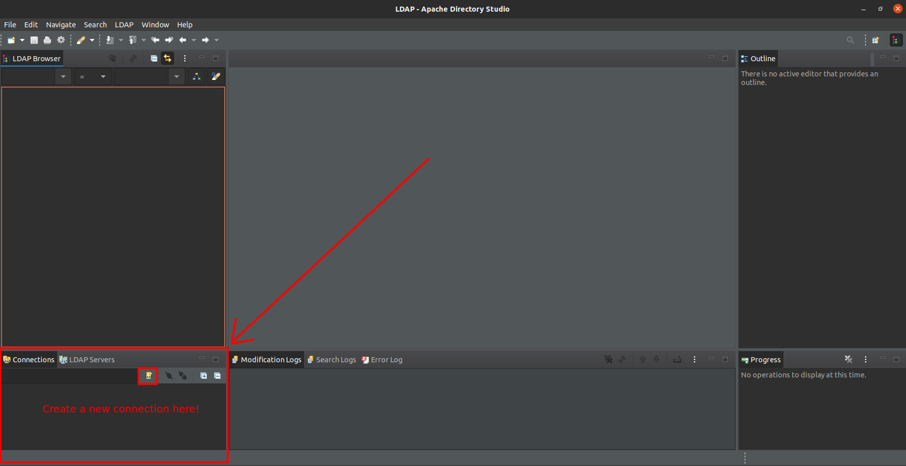

In order to connect, we will input the connection URL and input our admin credentials.

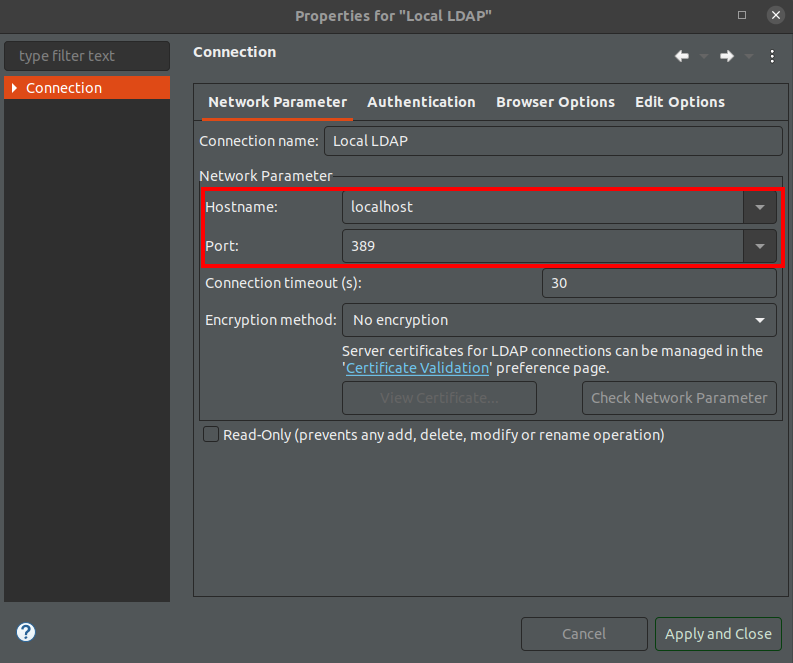  
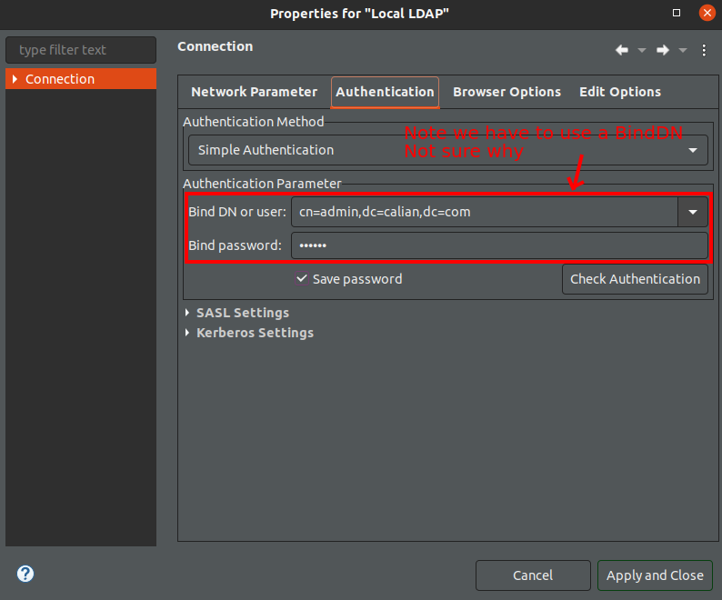

Once connected, we can see the LDAP directory tree.

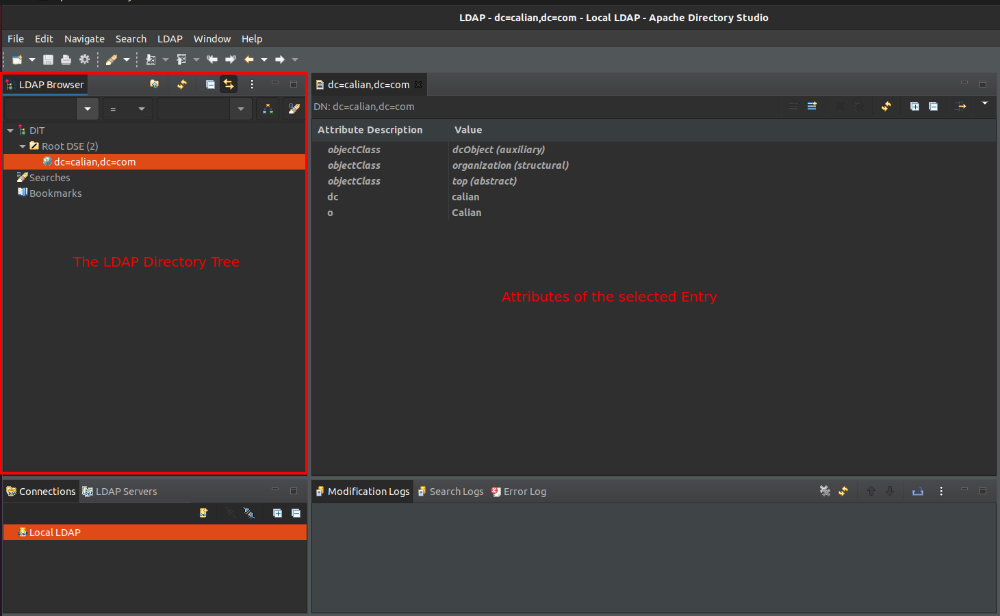

Let's add some content to our directory tree.  
First, let's add an Organizational Unit (OU) for our Employees.

- Right-click on the root node and select `New Entry`.
- Select `New Entry from Scratch` and click `Next`.
- Next, find the `Organizational Unit` object class and add it to the entry and click `Next`.
- Select the parent to be the root node (`dc=calian,dc=com`), and input the `RDN` (Relative Distinguished Name) to set
  the `ou` name. Input `ou=Employees` and click `Next`.

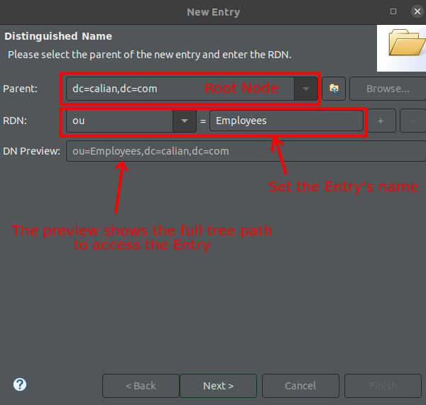

- Click `Next` one more time and select `Finish`.

We should now see our Organizational Unit, `ou=Employees` in the directory tree.  
Now let's add a user to our Employees OU.

- Right click on the `ou=Employees` node and select `New Entry`.
- Select `New Entry from Scratch` and click `Next`.
- Next, find the `inetOrgPerson` ObjectClass and add it to the entry and click `Next`.

**Remember what an ObjectClass is?**

An ObjectClass is a base class that includes a collection of attributes that must be set.  
LDAP provides many ObjectClasses by default, for example `person`, `organizationalPerson`, and `inetOrgPerson` object
classes out of the box.  
When we select `inetOrgPerson`, we notice that it automatically inherits the attributes from `organizationalPerson`,
`person`, and `top`.  
The `inetOrgPerson` contains attributes for a `uid`. `inetOrgPerson` also inherits attributes from
`organizationalPerson`, which contains attributes like `employeeNumber`, `telephoneNumber`, `title`, `department` and
more.  
And the `person` ObjectClass contains attributes to set a `sn` (Surname) and password.

Because we want a `uid` as well as other organizational information, we will select the `inetOrgPerson` ObjectClass and
click `Next`.

On the next panel, we want to set the `RDN` (Relational Distinguished Name) that is used to identify the Entry in the
tree.  
The `cn` is typically used as the identifier for leaf-nodes in an LDAP tree, though this depends on your directory
structure.  
Let's select the parent to be the `ou=Employees` node, and input the `RDN` to set the `cn` name. Input `cn=QuinnBast` (
or use your own name) and click `Next`.

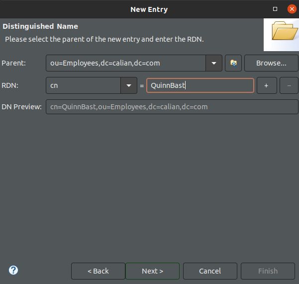

Click `Next` and we are prompted to fill in any required attributes.  
We can fill in the `sn` (surname) to be our last name.  
We can also fill in additional attributes that we inherit from our ObjectClass.  
By default, the non-required attributes are not shown.  
In specific, we definitely want to set a password for our user.

In the top right, click "Add Attribute", and select `userPassword` as an attribute to add and add it to the user.  
Once added, the directory studio will ask you to set a password. I set `password` as the password.  
Select an encryption method **that isn't plaintext**.... we talked about this...

> **IMPORTANT**: [OpenLDAP only supports a subset of password encryption algorithms](https://www.openldap.org/doc/admin24/security.html).  
> Apache Directory Studio provides a number of algorithms, but *if you select an unsupported hash algorithm, the user will
not be able to login at all*.  
> This only caused me 3-4 hours of headache when I created this guide.  
> See the image below for the encryption methods that OpenLDAP supports and ensure you choose one of these.  
> I selected `SSHA` to ensure that my password is salted.

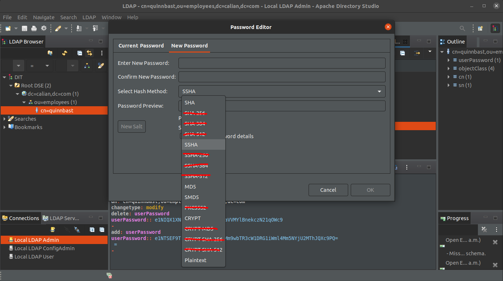

Once you have set the password, click `Finish`.

Also, add some other attributes, especially `uid` and `mail`, as these are common attributes for users and are typically
required by certain applications when integrating.  
Once we have added the user, we can see the user in the directory tree under our `ou=Employees` node along with the set
attributes.

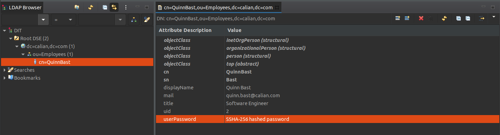

Our user's DN is `cn=QuinnBast,ou=Employees,dc=calian,dc=com`.

## Authenticating Users

Now that we have a user in our LDAP directory, we can begin to authenticate our users within our server.

### Kotlin

To do this, we are going to [follow along with the ktor LDAP docs](https://ktor.io/docs/server-ldap.html). To configure
LDAP, we can add an `authentication` block using `basic` auth. Ktor supports LDAP through the `Basic`, `Digest`, and
`Form` auth providers. We will use the `basic` auth provider so that we are prompted for a username and password.

Recall: Our user's DN is `cn=QuinnBast,ou=Employees,dc=calian,dc=com`

```kotlin
basic("ldap") {
    realm = "ktor"
    validate { credentials ->
        println("Trying LDAP auth for ${credentials.name}")

        // Fetch the user from an LDAP server.
        val user = ldapAuthenticate(
            // Login to LDAP using the credentials provided via basic auth
            credentials,
            // The LDAP server URL
            "ldap://0.0.0.0:389",
            // The user DN pattern.
            // This is a DN where "%s" gets replaced with the username in order to look up the LDAP user.
            // Our user was cn=QuinnBast,ou=Employees,dc=calian,dc=com, so for any user we can use the pattern:
            "cn=%s,ou=Employees,dc=calian,dc=com"
        )

        // Verify if the user logged in or not and print a message
        if(user != null) {
            // If the user is found, we can return the user principal
            println("LDAP auth successful for ${user.name}")
            user
        } else {
            // If the user is not found, we return null
            println("LDAP failure for ${credentials.name}")
            null
        }
    }
}
```

This configures the `basic` auth provider to use LDAP for authentication. Now let's add a route that requires LDAP
authentication:

```kotlin
authenticate("ldap") {
    get("/ldap") {
        call.respond(HttpStatusCode.OK, "Authenticated through LDAP!")
    }
}
```

### C#

To work with LDAP directory calls, we need to include the NuGet package `System.DirectoryServices.Protocols`. This
allows us to work with LDAP and AD methods.

C# does not have native support for LDAP, but to get LDAP working, we can use a custom method that just makes use of
Cookies to hold the user's session. This is going to be similar to what we have been doing, but instead of
authenticating against our database, we are just going to configure some LDAP calls.

To start, let's create a new class to handle LDAP operations, called `LdapAuth.cs`. Once created, we want to write a
function to bind to the LDAP database:

Inspiration taken from [this blog](https://decovar.dev/blog/2022/06/16/dotnet-ldap-authentication/)

```csharp
public class LdapAuth
{
    // Some connection strings
    private string ldapHostname = "localhost";
    private int ldapPort = 389;

    // A variable to manage our active connection
    private LdapConnection connection = null;

    // Function that will create the initial LDAP connection
    public bool bindLdap(
        string username,
        string password
    )
    {
        // Here we create a new connection using the user's credentials that we just created
        // Note the credentials here. They are logging in using the full DN for the user.
        var connection = new LdapConnection(new LdapDirectoryIdentifier(ldapHostname, ldapPort))
        {
            AuthType = AuthType.Basic,
            Credential = new($"""cn={username},ou=Employees,dc=calian,dc=com""", password)
        };

        // Configure some settings for the connection...
        connection.SessionOptions.ProtocolVersion = 3;
        //connection.SessionOptions.SecureSocketLayer = true; // Enable if using TLS

        // Start the connection and bind as the desired user.
        // Bind method will throw if the credentials are invalid or it cannot connect.
        try
        {
            connection.Bind();
            return true;
        }
        catch (Exception e)
        {
            Console.Error.WriteLine(e);
            return false;
        }
    }
}
```

This method gives us a good starting place. It allows us to bind to a local LDAP instance using an LDAP user.

Once the LDAP function is created, we just need to make a route to login with LDAP:

```csharp
[Route("loginLdap")]
[HttpPost]
public IActionResult LoginLdap(UserLoginRequest request)
{
    var ldap = new LdapAuth();
    if (ldap.bindLdap(request.username, request.password))
    {
        return Ok("Successfully authenticated with LDAP!");
    }

    return Unauthorized("Failure.");
}
```

And, just update our HTML to call our new LDAP endpoint instead:

```html
fetch("/api/lesson7/loginLdap", {
```

---

Let's try it! Run our server and try to access the `/api/ldap` page.
You should be prompted for a username and password.
Use the username `QuinnBast` and the password `password` that we set earlier.

You should see a successful login!
We have successfully logged in with our LDAP server.

### LDAP Binds

#### Single-Stage Auth

When you call `Bind` for LDAP, you are essentially logging in to the LDAP directory as the specified user.
In the code that we have just implemented, we implemented LDAP's single-stage authentication.
That is, we immediately logged in to the user account of interest.

Using this flow, we only get the privilege level of the individual user.
Typically, in LDAP, individual users cannot see anything in the LDAP directory except for their own entity (if that!).
In our case, our users cannot see their own entities.

#### Multi-Stage Auth

Using LDAP Single-stage auth is not a typical flow when using LDAP.
Typically, LDAP is setup like a database and you would have an administrator account in the database that is used to
perform look-ups for other users.
This flow typically involves logging in as the admin, and then querying LDAP entities for anyone else wanting to login
to the system.

This is known as Multi-Stage auth, and is the typical flow for LDAP interactions.
To configure this, we first need to bind to the LDAP directory as an `admin` user, and then perform further ldap
searches to verify individual user accounts.

In order to do this, we need to modify the code in our server so that we bind as our admin user first.
Then, we can use the admin user to lookup and authenticate other users.

**NOTE:** Most LDAP documentation does not show any of this information for some reason.
But this is a very typical authentication flow when using LDAP.
It is the same idea as logging into your database as an admin user to be able to lookup user accounts.

Let's update our auth provider to bind as an admin and perform lookups through the admin account:

**IMPORTANT:** Reminder, the admin password is `calian`, not `admin`.

#### Kotlin

```kotlin
basic("ldap") {
    realm = "ktor"
    validate { credentials ->
        println("Trying LDAP auth for ${credentials.name}")
        // Hard code our credentials here. In a real application, you would want to pass these as config or env variables.
        val bindAdmin = UserPasswordCredential("admin", "calian")
        ldapAuthenticate(
            bindAdmin, // Login to LDAP using the admin user
            "ldap://0.0.0.0:389", // The LDAP server URL
            "cn=%s,dc=calian,dc=com" // Our DN is different for the admin, so update the pattern
        ) {
            // We need to use the lambda here to ensure we stay logged in as the admin user.
            println("LDAP admin bind successful.")
            // Now we have logged in as an admin to perform lookups.
            // We can now search for the user we want to authenticate like we did before:
            val user = ldapAuthenticate(
                credentials, // The credentials the user passed
                "ldap://0.0.0.0:389", // The server URL
                "cn=%s,ou=Employees,dc=calian,dc=com" // The user DN format (not the admin one)
            )

            // Check if the user was found
            if (user != null) {
                // If the user is found, we can return the user principal
                println("LDAP auth successful for ${user.name}")
                user
            } else {
                // If the user is not found, we return null
                println("LDAP failure for ${credentials.name}")
                null
            }
        }
    }
}
```

#### C#

Unfortunately, C# does not have any built in methods to validate the user's password.
The only way to validate our user's password is to attempt to bind as them.

So, for C#, our flow will be:

- Attempt to bind as the user
- If successful, rebind as an admin and return their profile information

Let's extract the `Bind` code into it's own function, and proceed to do an `LdapSearch` after that to get the user profile:

```csharp
public class LdapAuth
{
    private string _ldapHostname = "localhost";
    private int _ldapPort = 389;
    private string _adminUsername = "cn=admin,dc=calian,dc=com";
    private string _adminPassword = "calian";

    private LdapConnection connection = null;

    private bool Bind(string userDn, string password)
    {
        connection = new LdapConnection(new LdapDirectoryIdentifier(_ldapHostname, _ldapPort))
        {
            AuthType = AuthType.Basic,
            Credential = new(userDn, password)
        };
        
        connection.SessionOptions.ProtocolVersion = 3;
        // If the connection is LDAPS, set this.
        //connection.SessionOptions.SecureSocketLayer = true;

        try
        {
            connection.Bind();
            return true;
        }
        catch (Exception e)
        {
            Console.Out.WriteLine(e);
            return false;
        }
    }

    public List<Dictionary<String, String>> GetLdapUser(string username, string password)
    {
        var userDn = $"""cn={username},ou=Employees,dc=calian,dc=com""";
        // First, attempt to login as the user.
        if (Bind(userDn, password))
        {
            // Rebind as an admin so we can query the user's entity and return their account details.
            Bind(_adminUsername, _adminPassword);
            return LdapSearch("ou=Employees,dc=calian,dc=com", $"""(cn={username})""");
        }

        return null;
    }

    private List<Dictionary<String, String>> LdapSearch(string searchDn, string filter)
    {
        var results = new List<Dictionary<String, String>>();
        var request = new SearchRequest(searchDn, filter, SearchScope.Subtree, null);
        var response = (SearchResponse)connection.SendRequest(request);
        
        foreach (SearchResultEntry entry in response.Entries)
        {
            var dict = new Dictionary<String, String>();
            foreach (DictionaryEntry userAttribute in entry.Attributes)
            {
                var key = (string)userAttribute.Key;
                var value = entry.Attributes[key][0].ToString();
                dict[key] = value;
            }
            results.Add(dict);
        }

        return results;
    }
}
```

Now that we have modified the Ldap code, we can update our Ldap login function:

```csharp
[Route("loginLdap")]
[HttpPost]
public IActionResult LoginLdap(UserLoginRequest request)
{
    // Now we call some Ldap methods here...
    var userAttributeList = ldap.GetLdapUser(request.username, request.password);
    if (userAttributeList.Count == 1)
    {
        var userInfo = "";
        foreach (var keyValuePair in userAttributeList[0])
        {
            userInfo += $"""{keyValuePair.Key} -> {keyValuePair.Value}""";
        }

        return Ok("Successfully authenticated with LDAP!" + userInfo);
    }
    
    return Unauthorized("Failure.");
}
```

---

Now if we restart our server and hit the `/api/ldap` endpoint, we should again be able to authenticate, this time using
the admin user to perform the lookup.

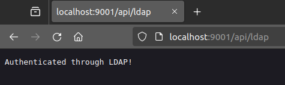

### Attribute Based Access Control (ABAC)

Once a user has been authenticated with LDAP, we now want to lock down certain endpoints based on the user's information
in LDAP.
However, in Kotlin we currently only have the user's name. Let's grab more information about the user first:

#### Kotlin

In order to get more information about our users, we need to perform a lookup on the LDAP server.
Unfortunately, KTOR does not provide a way to do this out of the box, so we need to make our own LDAP search function...

```kotlin
fun ldapSearch(
    credential: UserPasswordCredential,
    ldapServerURL: String,
    baseDN: String,
    filter: String,
    attributes: Array<String>
): NamingEnumeration<SearchResult> {
    val env = Hashtable<String, String>()
    env[Context.INITIAL_CONTEXT_FACTORY] = "com.sun.jndi.ldap.LdapCtxFactory"
    env[Context.PROVIDER_URL] = ldapServerURL
    env[Context.SECURITY_AUTHENTICATION] = "simple"
    env[Context.SECURITY_PRINCIPAL] = "cn=${credential.name},dc=calian,dc=com"
    env[Context.SECURITY_CREDENTIALS] = credential.password

    val context = InitialDirContext(env)

    val controls = SearchControls()
    controls.searchScope = SearchControls.SUBTREE_SCOPE
    controls.returningAttributes = attributes

    return context.search(baseDN, filter, controls)
}
```

This function was generated by Copilot and somehow works miracles.  
The function accepts the user credentials to look-up user attributes, the LDAP server URL, the base DN to search from, a
filter to apply to the search, and the attributes to return.  
The function returns a `NamingEnumeration<SearchResult>` which contains a list of results that match the filter.

Let's use this function to look up our user's attributes:

```kotlin
val searchResults = ldapSearch(
    bindAdmin,          // Must search as admin
    "ldap://0.0.0.0:389", // The LDAP server URL
    "ou=Employees,dc=calian,dc=com", // The base DN to search from
    "(&(cn=${credentials.name}))",  // The filter to apply. Here we only want `cn` that matches the user logging in
    arrayOf("cn", "sn", "mail", "role") // An array of attributes to return
).toList()

if(searchResults.size == 1) {
    println("User has attributes: ${searchResults[0].attributes}")
} else {
    println("Did not find attributes for user. Found ${searchResults.toList().size} results.")
}
```

--- 

Giving this a try, you should see the following results printed to the console:

```shell
LDAP auth successful for QuinnBast
User has attributes: {mail=mail: quinn.bast@calian.com, sn=sn: bast, cn=cn: quinnbast}
```

Here we can see that we are successfully reading the user's attributes from the LDAP server.

Now that we can collect the user's attributes, we can start to use these attributes on our server to perform access
control.  
This is basically the exact same idea as using RBAC from lesson 3, but instead of our roles being stored in the
database, we are using the user's LDAP attributes to determine what they can access.

However, we have not yet given our LDAP users any way to determine what levels of access they have.

There are a few ways that we can do this using LDAP attributes:

- Create an `organizationalRole` object class and add users to the role through the `roleOccupant` attribute.
- Create a custom attribute like `role` and manually assign users a role through custom attributes.

Unfortunately, the LDAP way to do things is by defining `organizationalRole` entities and setting the `roleOccupant`
attributes on the role.  
This is a bit backwards, as we now need to do another lookup to determine if the user that has logged in is a member of
a particular role.  
This is not ideal, but it is the way that LDAP is designed to work.

So, sadly, let's create some roles in LDAP and see what this looks like.  
Before we make our Roles, however, we want to group them together so they are easier to find and search.  
So let's create an `organizationalUnit` for our roles.

1. Right-click on the root node and select **New Entry**.
2. Select **New Entry from Scratch** and click **Next**.
3. Find the **Organizational Unit** object class and add it to the entry, then click **Next**.

   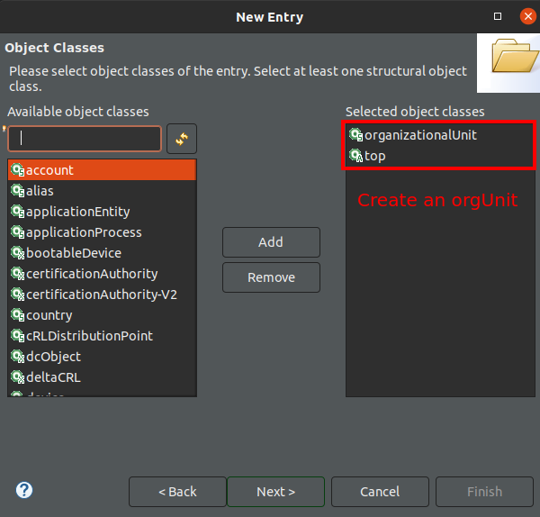

4. Select the parent to be the root node (`dc=calian,dc=com`), and input the **RDN (Relative Distinguished Name)** to
   set the `ou` name.
   Input `ou=Roles` and click **Next**.

   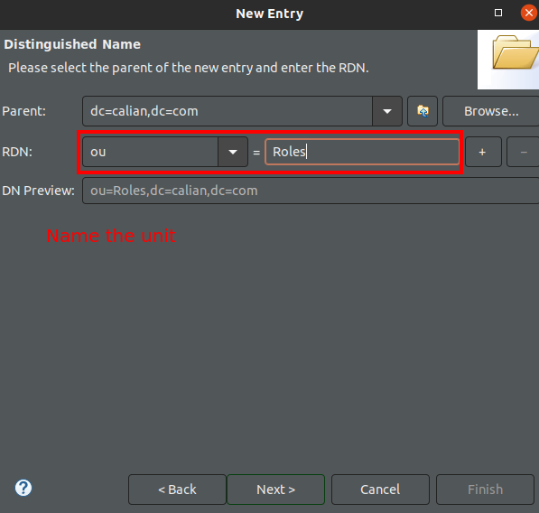

5. Click **Next** one more time and select **Finish** to create the **Organizational Unit**.

Now that we have an `ou=Roles` organizational unit, we can start creating our roles.

1. Right-click on the `ou=Roles` node and select **New Entry**.
2. Select **New Entry from Scratch** and click **Next**.
3. Find the **organizationalRole** ObjectClass and add it to the entry, then click **Next**.

   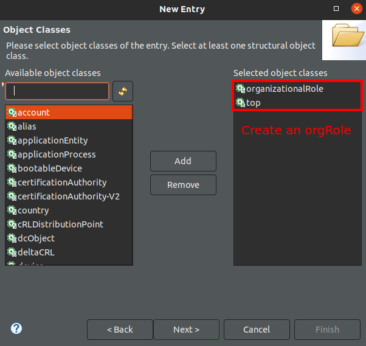

4. Select the parent to be the `ou=Roles` node, and input the **RDN (Relative Distinguished Name)** to set the `cn`
   name. Input `cn=AdminRole` and click **Next**.

   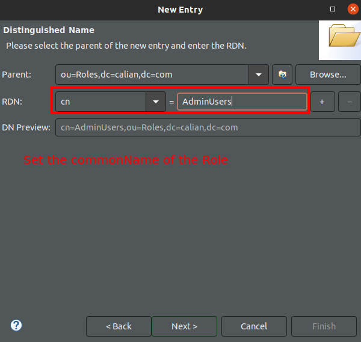

5. Click **Next** and you are prompted to fill in any required attributes. For now, skip this.
6. Once finished, you should see both the `ou=Roles` and `cn=AdminUsers` nodes in the directory tree.

   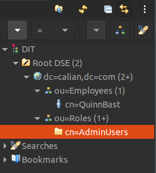

The final step is to add our user to the role.

1. Open the `AdminRole` entity.
2. In the attribute listing, right-click and select **New Attribute**.
3. Select the **roleOccupant** attribute from the list and click **Finish**.

4. Once you select it, you will be prompted to type in (or search for) the **RDN** of an entity in the LDAP directory to
   assign as an occupant.
   Type in (or use the browser) to select the user we created earlier, `cn=QuinnBast,ou=Employees,dc=calian,dc=com`, and
   click **Finish**.

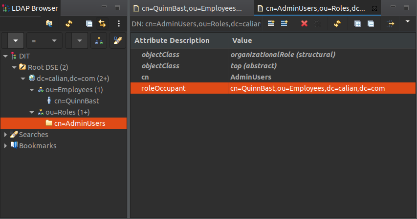

> **NOTE:** The `roleOccupant` attribute is a multi-value field, which means we can add additional users to the role.  
> To add multiple users to a role, just add an additional `roleOccupant` attribute to the role for each additional
> member.

Now that we have our user in a role, we can use this information to perform access control on our server.

### Let's reflect on our current authentication flow:

- We bind as the admin user to perform lookups.
- We authenticate the user based on their passed-in credentials.
- We use `ldapSearch` to look up the user's specific attributes.

The final step is to perform yet another `ldapSearch` to determine all of `organizationalRole` LDAP entries that contain a `roleOccupant` of our user.
To do this, we can perform an `ldapSearch`, query the `ou=Roles` unit and filter on entities with `(&(roleOccupant=cn=QuinnBast,ou=Employees,dc=calian,dc=com))`.

Putting this all together, we can finish off our authentication flow:

### Kotlin

```kotlin
val userRoles = ldapSearch(
    bindAdmin,
    "ldap://0.0.0.0:389",
    "ou=Roles,dc=calian,dc=com",
    "(roleOccupant=cn=${credentials.name},ou=Employees,dc=calian,dc=com)",
    arrayOf("cn")
).toList()

if (searchResults.size == 1) {
    println("User has attributes: ${searchResults[0].attributes}")
    println("User has roles: $userRoles")
} else {
    println("Did not find attributes for user. Found ${searchResults.toList().size} results.")
}
```

### C#

To get the user's roles, we just need to add a new method to our `LdapAuth` class to query our user's roles:

```csharp
public List<Dictionary<String, String>> GetUserRoles(string username)
{
    Bind(_adminUsername, _adminPassword);
    return LdapSearch("ou=Roles,dc=calian,dc=com", $"""(roleoccupant=cn={username},ou=Employees,dc=calian,dc=com)""");
}
```

This method binds as the admin user and checks the `Roles` organizational unit for roles where our user is a member.

Finally, we just need to return the user's list of roles in our login endpoint:

```csharp
[Route("loginLdap")]
[HttpPost]
public IActionResult LoginLdap(UserLoginRequest request)
{
    // Now we call some Ldap methods here...
    var userAttributeList = ldap.GetLdapUser(request.username, request.password);
    if (userAttributeList.Count == 1)
    {
        var userInfo = "";
        foreach (var keyValuePair in userAttributeList[0])
        {
            userInfo += $"""{keyValuePair.Key} -> {keyValuePair.Value}""";
        }

        var userRoles = ldap.GetUserRoles(request.username);
        var roles = new List<string>();
        foreach (var userRole in userRoles)
        {
            roles.Add(userRole["cn"]);
        }

        return Ok("Successfully authenticated with LDAP!" + userInfo + " Roles: " + String.Join(",", roles));
    }
    
    return Unauthorized("Failure.");
}
```

---

Now, if you restart your server and hit the `/api/ldap` endpoint, you should see the following results printed to the
console:

```shell
LDAP auth successful for QuinnBast
User has attributes: {mail=mail: quinn.bast@calian.com, sn=sn: bast, cn=cn: quinnbast}
User has roles: [cn=AdminRole: null:null:{cn=cn: AdminRole}]
```

Success! We can get the user's attributes as well as a list of roles which they are a member of.  
All that is left is to create some way to store this information to be able to use it during future authentication
requests.

To do this, we will create a new `UserSession` that contains the user's attributes and roles.  
This session can then be used to authenticate the user in future requests.

### Kotlin

Once the session is stored, we can create another `authenticate` method that checks if the user's session has the
required roles to access a particular route.

Unfortunately, Ktor has a bug where the `ldapAuthenticate` function requires returning a `UserIdPrincipal` which is a
final class that cannot be extended.  
There is a [bug report](https://github.com/ktorio/ktor/issues/376) to fix this, but until that bug report is fixed, we
need to use a bit of a workaround.  
Since we can't directly return the user's data, let's just make a top-level variable, and return it at the end of the
`validate` block:

```kotlin
validate { credentials ->

    val ldapUserSession = null

    ldapAuthenticate() { /* Set the ldapUserSession in here... */}

    return ldapUserSession
}
```

This is pretty hacky, but it works. Let's implement this.  
Create a new `LdapUserSession` class that extends `Principal` and contains the user's attributes and roles:

```kotlin
data class LdapUserSession(
    val username: String,
    val email: String,
    val roles: List<String>,
    val expiresAt: Long,
) : Principal
```

Then, let's set our session where relevant:

```kotlin
basic("ldap") {
    validate { credentials ->

        var ldapUserSession: LdapUserSession? = null

        // Stuff
        ldapAuthenticate() {
            // More stuff
            if (user != null) {
                // Do Ldap searches here

                // Set the user session using the data we collected
                ldapUserSession = LdapUserSession(
                    user.name,
                    userAttributeSearch[0].attributes.get("mail").get() as String,
                    userRoles.map { searchResult -> searchResult.attributes.get("cn").get() as String },
                    System.currentTimeMillis() + 1000 * 60 * 60
                )
            }
        }

        // Return the custom data as the auth principal
        ldapUserSession
    }
}
```

Finally, let's update our `/api/ldap` route to report the user's "principal":

```kotlin
get("/ldap") {
    val principal = call.principal<LdapUserSession>()
    call.respond(HttpStatusCode.OK, "Authenticated through LDAP! Principal: ${principal}")
}
```

### C#

To do this, we need to re-configure our server to re-enable Cookies again!  
Simply update `Program.cs` to use the cookies as we did in lesson 3:

```csharp
builder.Services.AddAuthentication(CookieAuthenticationDefaults.AuthenticationScheme)
            .AddCookie();
```

Once configured, we can just set the user's session after they have logged in:

```csharp
[Route("loginLdap")]
[HttpPost]
public async Task<IActionResult> LoginLdap(UserLoginRequest request)
{
    // Now we call some Ldap methods here...
    var userAttributeList = ldap.GetLdapUser(request.username, request.password);
    if (userAttributeList.Count == 1)
    {
        var userRoles = ldap.GetUserRoles(request.username);
        var roles = new List<string>();
        foreach (var userRole in userRoles)
        {
            roles.Add(userRole["cn"]);
        }

        // Create some "Claims" for ASP.NET to know about our user's information
        var claims = new List<Claim>
        {
            new Claim(ClaimTypes.Name, userAttributeList[0]["cn"]),
            new Claim(ClaimTypes.Email, userAttributeList[0]["mail"]),
            // Etc....
        };

        // Add roles to the claim...
        foreach (var userRole in roles)
        {
            claims.Add(new Claim(ClaimTypes.Role, userRole));
        }

        // Create an identity that uses a cookie
        var claimsIdentity = new ClaimsIdentity(claims, CookieAuthenticationDefaults.AuthenticationScheme);

        // Register the user's cookie with ASP.NET
        await HttpContext.SignInAsync(
            CookieAuthenticationDefaults.AuthenticationScheme,
            new ClaimsPrincipal(claimsIdentity),
            new AuthenticationProperties
            {
                IsPersistent = true,
                ExpiresUtc = DateTime.UtcNow.AddMinutes(20)
            }
        );

        return Ok("Successfully authenticated with LDAP!");
    }

    return Unauthorized("Failure.");
}
```

---

Once this is done, we can hit our endpoints like:

- `https://localhost:9443/api/lesson7/session`
- `https://localhost:9443/api/lesson7/testAuth`

And verify that we are logged in and are keeping track of our user's details across requests!

Putting it all together, if you restart your server and hit the `/api/ldap` endpoint, you should see the following
results:

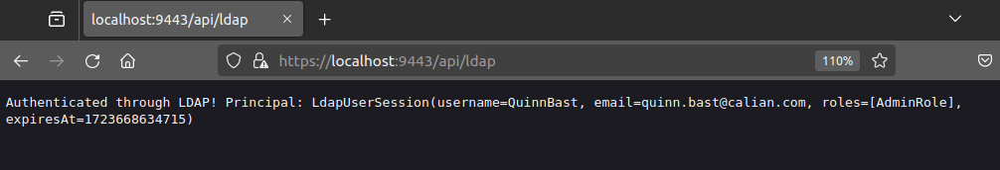

And that's it! We have successfully authenticated a user with LDAP and stored their attributes and roles in a session.
There is much more that can be done with LDAP, but this is a very basic starting point that can be expanded upon if more
complex access control is required.

## Conclusion

In this lesson, we learned the basics of LDAP, how to set up an LDAP server, authenticate users with LDAP, and store
their user information as attributes.
We also learned about `objectClasses` in LDAP and got to create some of the more common LDAP `objectClasses` like
`inetOrgPerson` and `organizationalRole`.
We also learned how to perform LDAP searches to look up user information and roles, and also learned how to interact
with LDAP as a client.

LDAP is a powerful tool, but its complexity and lack of support are barriers to entry for many developers.
Because LDAP is so complex, it is typically being replaced by more modern IAM solutions like OAuth2 and OpenID Connect (
OIDC).
However, LDAP is still widely used in many organizations and is a valuable skill to have.

If you are interested in learning more about LDAP, I would recommend checking out the [LDAP.com](https://ldap.com/)
website.

In the next lesson, we are going to learn about the more modern OpenID Connect protocol, and we will be deploying our
own Keycloak server to authenticate users with OIDC.