# OpenID Connect (OIDC)

OpenID Connect (OIDC) is an authentication protocol built on top of OAuth 2.0.  
It allows clients to verify the identity of an end-user based on authentication that gets performed by an Authorization
Server.  
OIDC also allows obtaining basic profile information about the user in an interoperable and REST-like manner.

OIDC is a modern-day standard for authentication and is widely used in the industry.  
In addition, using OIDC allows you to leverage Single-Sign-On (SSO) capabilities, which can be a huge benefit for users
to prevent them from having to log in to multiple apps.  
Service providers like Google, Microsoft, Facebook, and Amazon all provide OIDC endpoints so that you can allow users
to "Login with Google" or "Login with Facebook", etc., on your website.

Not only does OIDC provide a standard protocol for authentication, but it also moves the responsibility of setting,
storing, and managing user accounts and passwords away from developers, reducing the headache of having to manage user
credentials.

## OIDC Basics

In order to understand OIDC, we first need to begin by looking at the authentication flow.  
While using OIDC, the following steps are performed between a browser, your server, and the OIDC provider:

1. The user visits your website and clicks on the "Login with OIDC" button.  
   a. Or, you could just automatically redirect users to an internal OIDC login page.
2. Once the button is clicked, your server redirects the user to an internal `/oidc/login` (or similar) endpoint that
   you host on your server.  
   This endpoint tells your server to start authentication with the OIDC provider.
3. Your server will then redirect the user to the OIDC provider's login page.  
   Before being sent to the OIDC provider, your server will also pass along the `redirectUrl` to tell the OIDC provider
   where to send the user back to after authentication has succeeded.  
   Typically, this `redirectUrl` will be an endpoint like `/callback` specifically designed to accept callbacks from the
   OIDC server.
4. The user logs in to the OIDC provider. The OIDC provider responds with a JWT that contains an access token for the
   user's session, and it stores a cookie in the user's browser.
5. The OIDC provider redirects the user back to your server at the `redirectUrl` that was passed in step 3 and includes
   the user's access Token (JWT).
6. Your server receives a call to `/callback?redirectUrl=...&token=...`. The server accepts the JWT token and extracts
   the user's information (like their role, email, profile, etc.) from the token.
7. Your server then creates a session for the user and stores the user's information in the session.
8. Finally, your server redirects the user to their final destination, the `redirectUrl`.

Here is my attempt at a diagram outlining the OIDC flow:

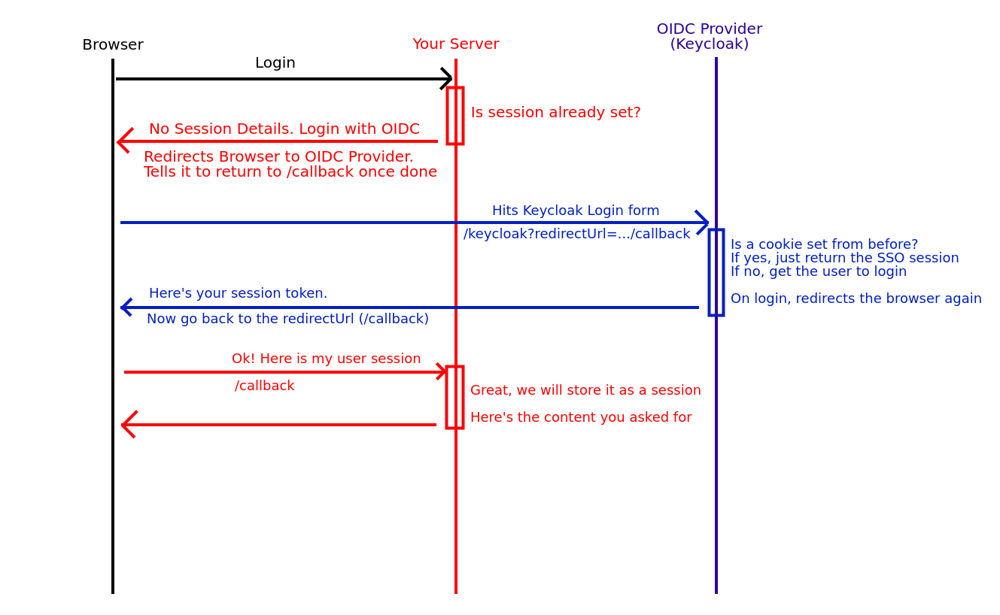

## Deploying an OIDC Server

There are many OIDC providers available:

- Keycloak
- Okta
- Auth0
- AWS Cognito
- Google Identity Platform
- Microsoft Azure Active Directory
- Ping Identity
- and many more...

However, the most popular open-source (and thus free) OIDC provider is Keycloak.  
Deploying a Keycloak server is pretty trivial and can be done using
their [docker deployment guide](https://www.keycloak.org/getting-started/getting-started-docker) for docker-compose, but
they also have a [guide for Kubernetes](https://www.keycloak.org/getting-started/getting-started-kube) as well.

To start a local keycloak instance, you can use the following docker command:

```shell
docker run --name keycloak -p 8080:8080 -e KEYCLOAK_ADMIN=admin -e KEYCLOAK_ADMIN_PASSWORD=admin quay.io/keycloak/keycloak:24.0.4 start-dev
```

**NOTE:** This command does not persist any data, so you will lose all data if you stop the container.

This creates a default admin account with the username `admin` and password `admin` and exposes the Keycloak server on
port 8080.  
Once the container has started up, navigate to `http://localhost:8080` in your browser to access the Keycloak admin
console.

## Using Keycloak

Once you have logged in to Keycloak, there are a number of terms that you need to understand to properly configure
Keycloak:

| Term              | Definition                                                                                                                                                                                                                                                                                        |
|-------------------|---------------------------------------------------------------------------------------------------------------------------------------------------------------------------------------------------------------------------------------------------------------------------------------------------|
| **Realm**         | A segregated area of Keycloak.                                                                                                                                                                                                                                                                    |
| **Clients**       | Downstream users of Keycloak. Clients grant access to allow apps to authenticate and use Keycloak for Authentication.                                                                                                                                                                             |
| **Client Scopes** | Client scopes are filters that can be applied to individual clients which allow you to restrict what information is provided to the client. For example, if you don’t want a particular app to know the user’s email address, a client scope can be created to drop the email from the user data. |
| **Realm Roles**   | A list of all the roles that exist within a Realm.                                                                                                                                                                                                                                                |
| **Users**         | All the users within a realm. Users can be manually assigned roles.                                                                                                                                                                                                                               |
| **Groups**        | All groups within the realm. Groups are a collection of users. Groups can be assigned roles to apply to all users within the group.                                                                                                                                                               |
| **Sessions**      | Active user sessions. Allows you to revoke access to users if necessary.                                                                                                                                                                                                                          |

Now that we know what these terms mean, let’s create a user, give them a role, and create a client within Keycloak to
allow external apps to authenticate through Keycloak.

### Creating a User

To create a user, click **Users** and click **Add user**.

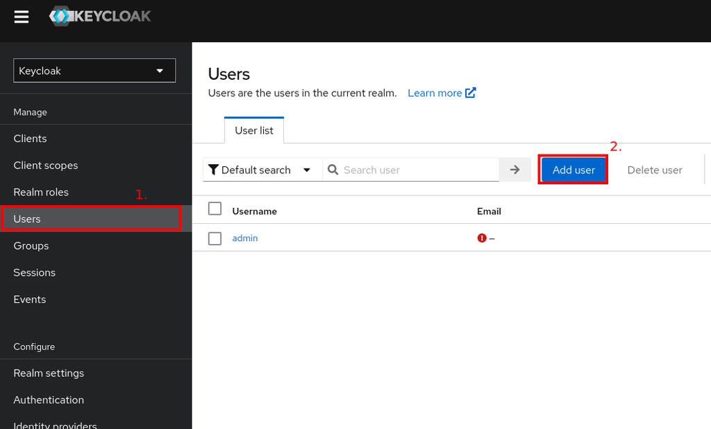

Fill in the basic user's details.

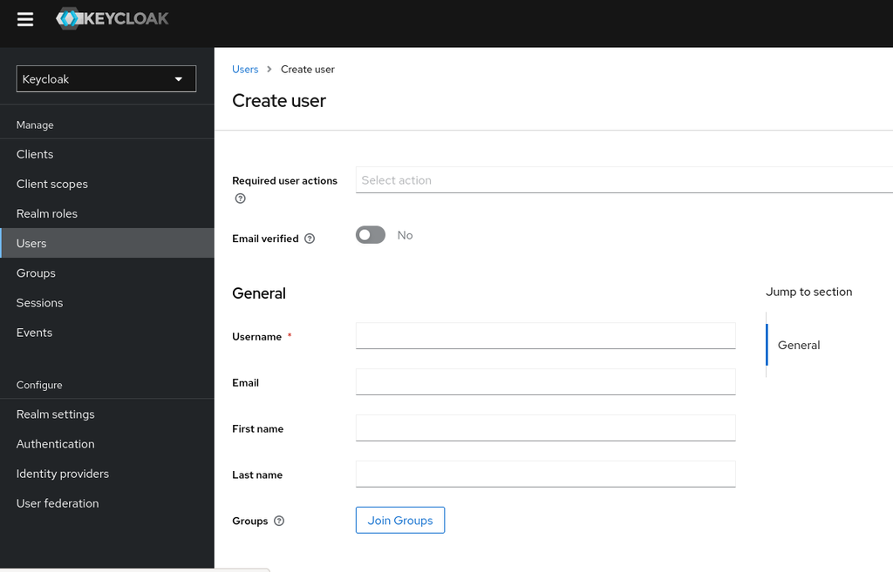

Once the details are filled in, click **Credentials** and click **Set Password** and mark it as a permanent password.

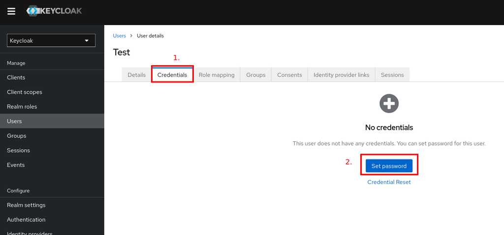

Finally, click **Role Mappings** and click **Assign Role** to assign the user a role.

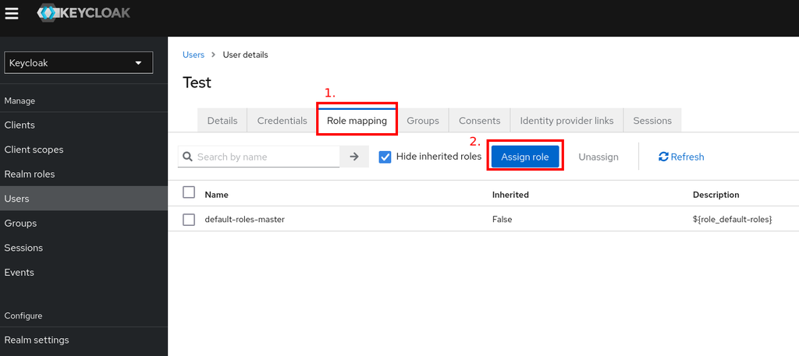

I assigned my user the `offline_access` role just for testing.

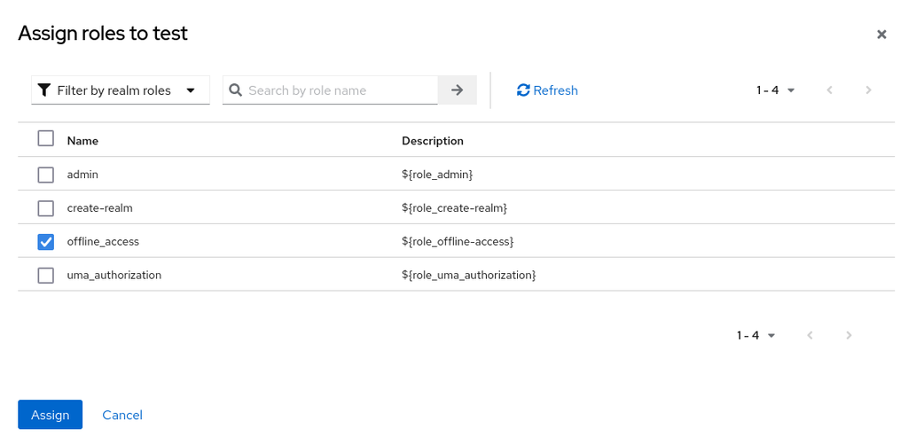

Now that we have created a user inside of Keycloak, it is time to configure Keycloak so that it is ready to communicate
with our application.

### Creating a Keycloak Client

In order to allow Keycloak to communicate with other applications (like our server), we need to configure a client
within Keycloak.  
By default, a number of clients already exist.  
We will leave these alone and create a new one for our apps.

Go to the clients screen and click **Create Client**.

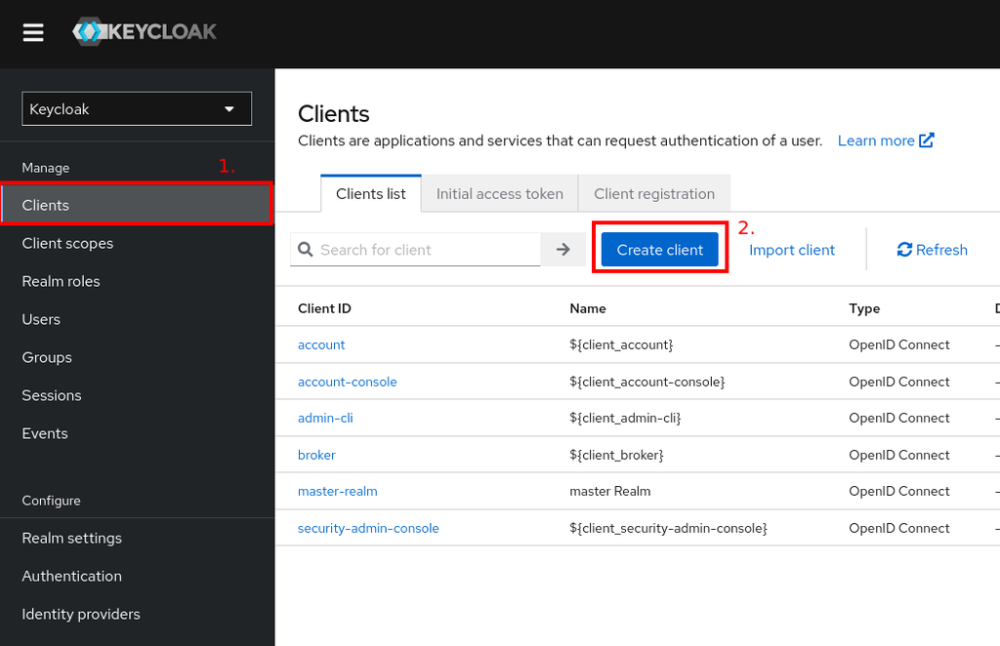

When creating the client, select **OpenID Connect** (OIDC) as the client type.  
Give your client an ID, name, and description.  
The only field that matters here is the client ID, the rest are just for your own reference to help understand what you
made each client for.  
For me, this is going to be used for every application I use, so I am just going to name it **oidc-client**.  
Then click **Next**.

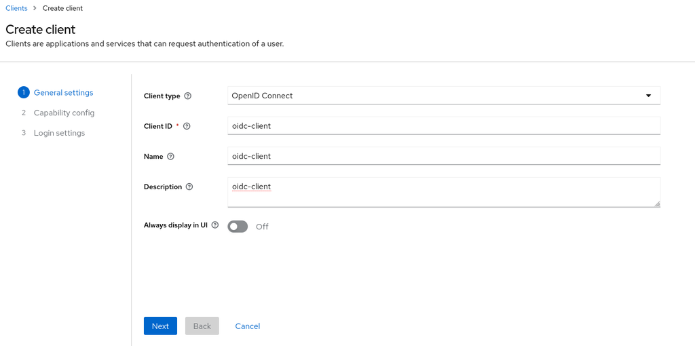

In the **Capability Config** section, enable **Client authentication** to allow our app to authenticate users.  
Also enable **Authorization** to allow the client to authorize users.  
Keep the Authentication flow on **Standard Flow** and **Direct Access grants** and click **Next**.

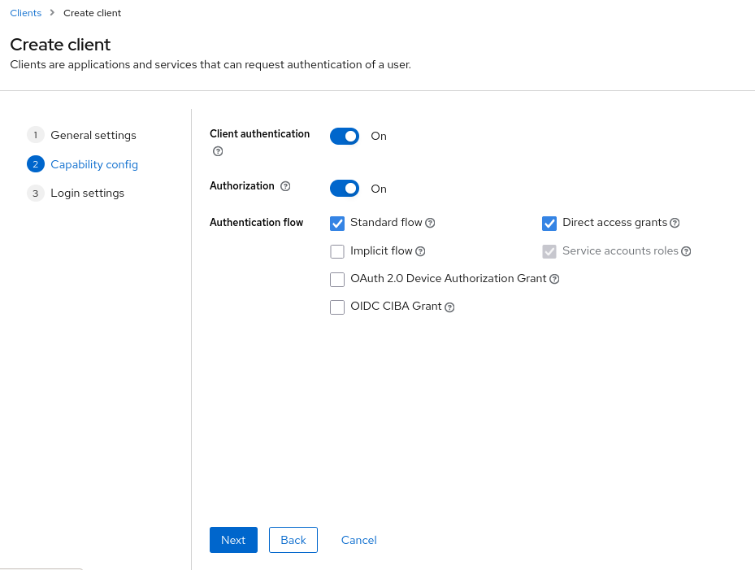

For the **Login settings**, we need to tell Keycloak what URLs Keycloak should accept as redirect URLs.  
This is a security feature and protects your OIDC server from being hijacked by a malicious actor.  
If the redirect URLs contain a wildcard for every domain (*), it means that anyone can use your OIDC server and redirect
back to their own server.  
Setting the redirect URL to a specific domain will prevent this from happening.

However, to make things easy for this demo, add `http://*` and `https://*` to allow Keycloak to provide redirections to
anywhere.  
The **Web Origins** field is to allow CORS to accept requests from your domains.  
Again, we will set `*` to the web origins, but consider protecting your domain to prevent incoming requests from
websites that aren't you.

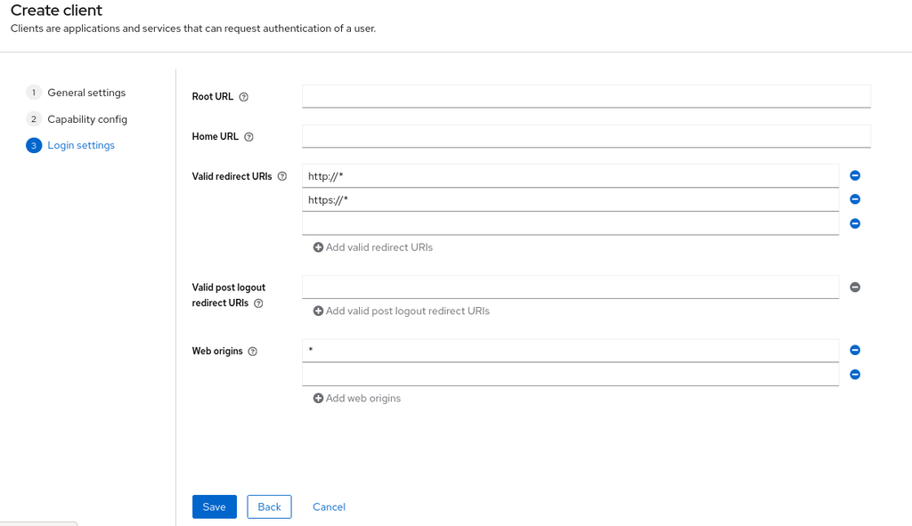

Finally, click **Save** to create the client.  
Once you have created your client, we need to get access to its client secret.  
Click **Credentials** at the top, and copy the client secret.  
We need this secret to communicate with Keycloak.

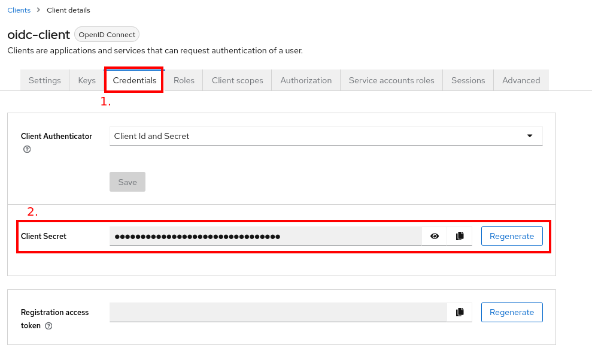

Copy this value to a text editor or dump it into a file somewhere.

### Determining our OIDC Endpoints

Once the client has been set up, you need to determine your OIDC endpoints to be able to configure apps to communicate
over OIDC.  
To find your OIDC endpoints, click **Realm Settings** in the bottom left of Keycloak.  
On the first page that appears, find the **Endpoints** box.

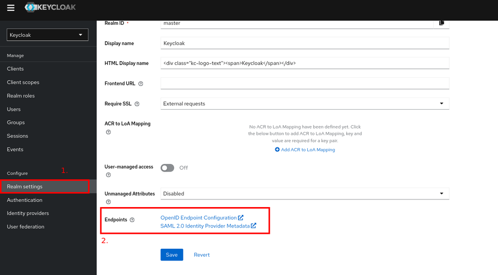

Click **OpenID Endpoint Configuration**.  
This will show you a JSON document containing the configuration for your realm.  
In this document, the URLs that are visible at the top are your OIDC endpoints.  
We will also need these in order to configure any OIDC client.

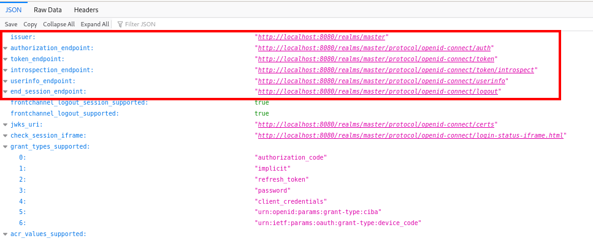

These endpoints are the REST endpoints that are available for your client to communicate with.  
There are a number of endpoints available. The main endpoints of interest are:

- `/auth` - The URL to authenticate users.
- `/token` - The URL to get a new token for a user using refresh tokens (i.e. they have already logged in).
- `/userinfo` - The URL to get information about a user.
- `/logout` - The URL to log out a user.

## Securing Apps using OIDC

Now that we have created an OIDC client within Keycloak, we can begin to lock down our services.  
There are two scenarios to consider when securing your applications:

1. The app you are securing supports OIDC Authentication
2. The app you are securing does not support OIDC Authentication

Keycloak supports both cases, and we are going to look at how to secure both types of applications.

### Apps with OIDC Support

Certain applications will support OIDC authorization out of the box within their application.  
A good example of this is Grafana, which we are going to use and configure to be able to authenticate with Keycloak in
this demo.

Apps that support OIDC will allow you
to [configure their application to use OAuth through their app configuration](https://grafana.com/docs/grafana/latest/setup-grafana/configure-security/configure-authentication/generic-oauth/#configure-generic-oauth-authentication-client-using-the-grafana-configuration-file).  
Looking at Grafana’s configuration options, we find out that Grafana supports OIDC Authentication and that we are able
to specify and configure all of our OIDC details.  
By specifying all of this information to Grafana, Grafana will be able to authenticate users with Keycloak before they
are able to access any Grafana resources.  
[More detailed auth settings for Grafana](https://grafana.com/docs/grafana/latest/setup-grafana/configure-grafana/#auth)
can be found here.

Luckily Grafana also allows you to set configuration values through environment variables, so when the guide says “set
the `[auth.generic_oauth]` section of the Grafana configuration file”, we can
just [override configuration using environment variables](https://grafana.com/docs/grafana/latest/setup-grafana/configure-grafana/#override-configuration-with-environment-variables).

**NOTE:** The discussion above is Grafana specific, however, at the end of the day, this method may slightly vary based
on what app you are using and how that application allows you to configure its OIDC settings.  
Be sure to read the documentation for your 3rd party applications to determine if it supports OIDC and, if it does, how
you can configure it, as each application will be different.

Let’s use this information above to deploy a local Grafana instance and configure it to communicate with Keycloak.  
All we need to do is configure our app with the appropriate settings, and Grafana should be able to authenticate with
Keycloak.

We can just run a local Grafana Docker container and configure the environment variables to point to our Keycloak
endpoints.

```shell
docker run -p 3000:3000 \
    --net=host \
    -e GF_AUTH_GENERIC_OAUTH_ENABLED=true \
    -e GF_AUTH_GENERIC_OAUTH_CLIENT_ID=oidc-client \
    -e GF_AUTH_GENERIC_OAUTH_CLIENT_SECRET=HDSNn8Vs70yUTnZiWV3WVjCaXpfUw6dq \
    -e GF_AUTH_SIGNOUT_REDIRECT_URL=http://localhost:8080/realms/master/protocol/openid-connect/logout \
    -e GF_AUTH_GENERIC_OAUTH_AUTH_URL=http://localhost:8080/realms/master/protocol/openid-connect/auth \
    -e GF_AUTH_GENERIC_OAUTH_TOKEN_URL=http://localhost:8080/realms/master/protocol/openid-connect/token \
    -e GF_AUTH_GENERIC_OAUTH_API_URL=http://localhost:8080/realms/master/protocol/openid-connect/userinfo \
    --name grafana grafana/grafana:9.1.6
```

This command:

- Runs a Grafana container on port 3000
- Enables OAuth authentication
- Configures the OAuth client ID and secret to be our client ID and secret we created in Keycloak
- Sets the Auth URLs to our Keycloak OIDC endpoints

**WARNING:** The domain name you use here depends on your container's networking configuration.  
For this demo, I recommend using `--net=host` so that the container runs on your host network, and you can use
`localhost` as your Endpoint URLs.  
Using a URL of `localhost` without using `--net=host` means that Grafana is just going to try to talk to itself which
will not work.

After running the command, if everything is configured properly, you should be able to browse to a local Grafana
instance at `http://localhost:3000`.  
Once you are at the Grafana login page, you should now see a button at the bottom, **Sign in with OAuth**!

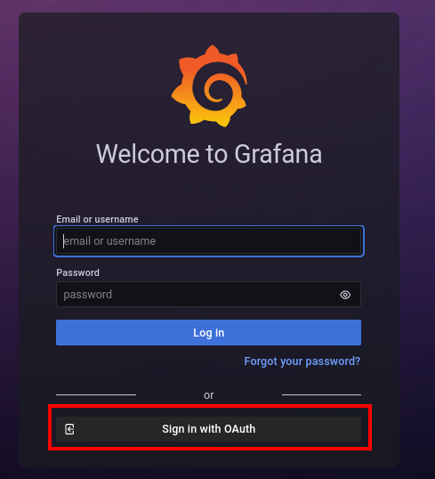

If we click this button, and try to log in to Grafana we can... get an error... Lame.  
Where did we go wrong? Let’s check the logs.

```shell
$ docker logs grafana
logger=oauth t=2024-05-16T16:30:53.023864193Z level=error msg="failed to login " error=invalid_scope errorDesc="Invalid scopes: user:email"
```

Keycloak is complaining because Grafana has requested to know about our user’s username and email (the scopes), but we
have not allowed our Keycloak client to send these scopes to Grafana.  
There are a few different ways to fix this:

- Either update Keycloak to allow these scopes to be sent to Grafana
- Or update Grafana to request different scopes

The easiest of the two is to update Grafana’s configuration to indicate what scopes it requests.  
We can simply add a new environment variable,
`GF_AUTH_GENERIC_OAUTH_SCOPES=openid profile email offline_access roles`.  
Once we have done this, Grafana should only look for scopes that the Keycloak client can offer.

We can stop our Grafana container, and try again with the added configuration:

```shell
docker run -p 3000:3000 \
    --net=host \
    -e GF_AUTH_GENERIC_OAUTH_ENABLED=true \
    -e GF_AUTH_GENERIC_OAUTH_CLIENT_ID=oidc-client \
    -e GF_AUTH_GENERIC_OAUTH_CLIENT_SECRET=HDSNn8Vs70yUTnZiWV3WVjCaXpfUw6dq \
    -e GF_AUTH_SIGNOUT_REDIRECT_URL=http://localhost:8080/realms/master/protocol/openid-connect/logout \
    -e GF_AUTH_GENERIC_OAUTH_AUTH_URL=http://localhost:8080/realms/master/protocol/openid-connect/auth \
    -e GF_AUTH_GENERIC_OAUTH_TOKEN_URL=http://localhost:8080/realms/master/protocol/openid-connect/token \
    -e GF_AUTH_GENERIC_OAUTH_API_URL=http://localhost:8080/realms/master/protocol/openid-connect/userinfo \
    -e GF_AUTH_GENERIC_OAUTH_SCOPES="openid profile email offline_access roles" \
    --name grafana grafana/grafana:9.1.6
```

**IMPORTANT:** If you get the error: "Error getting email address", this is because the default admin user in Keycloak
does not have an email address set.  
You are likely using the same browser where you are already logged in as the Keycloak admin, so it is not asking you to
login and is just using the session you already have active.  
To fix this, just go into Keycloak and update the admin user to have an email address.

Now, after clicking the **Sign in with OAuth** button, we are taken in to Grafana, and we can see that if we hover our
profile in Grafana, we are signed in through the Keycloak user!

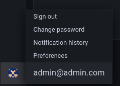

We were automatically signed in because we were already logged in to the admin account in our browser.  
Let’s try a different account.  
Open a new incognito or private browser window and go back to Grafana.  
This time, when we click **Sign in with OAuth**, we are taken to the Keycloak sign-in page where we are asked to login
with an account in Keycloak.

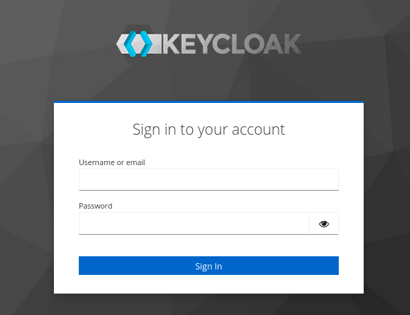

Now, we can log in using our non-admin account.  
Try logging in as the test user we created above.  
Voilà! We are authenticated using Keycloak.

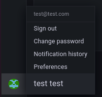

**NOTE:** There are significantly more configuration options in Grafana where you can configure role mappings so that a
user’s role in Grafana is automatically determined by their roles in Keycloak.  
I will not go into details about this, just know that some apps will have more advanced settings like this to further
lock down on account roles and access.

### Apps without OIDC Support

Sometimes, a third party application may not support OAuth authentication.  
In our case, we were lucky because Grafana happened to support OAuth configurations, however, many applications will not
have this kind of support.

**NOTE:** See the section below, "Enabling OIDC in our Apps", for how to enable OIDC in your own applications.

In order to secure applications that otherwise have no OIDC support, we need to use an OIDC Proxy.  
Let’s take a look at how this works.

First, we are going to deploy a simple application that does not allow us as administrators to configure any OIDC
settings.  
A simple app that fits this is a basic nginx web server:

```shell
docker run -p 9999:80 nginx:latest
```

This command will run a nginx server that gets forwarded to port 9999.  
Try to access the nginx UI by navigating to `http://localhost:9999`.  
You will notice that we are able to access the nginx web UI without needing to authenticate with Keycloak.  
Let’s make this more secure and ensure users need to log in before they are able to access our nginx server.

#### OAuth2 Proxy

[OAuth2 Proxy](https://github.com/oauth2-proxy/oauth2-proxy) is a reverse proxy that sits in front of your applications
and authenticates users with an OIDC provider.  
If a user is not authenticated, the proxy will redirect the user to the OIDC provider to login.  
Only after the user is logged in will the proxy allow the user to access the application.

In order to use OAuth2 Proxy, we just need
to [configure it with our OIDC settings](https://oauth2-proxy.github.io/oauth2-proxy/configuration/overview/#command-line-options).  
Unfortunately, there are a lot of options that we can configure here. But luckily, they are similar to the settings we
saw when configuring Grafana.

After surfing the documentation, we can come up with this command:

```shell
docker run -p 4180:4180 \
    --net=host \
    -e OAUTH2_PROXY_PROVIDER=keycloak \
    -e OAUTH2_PROXY_CLIENT_ID=oidc-client \
    -e OAUTH2_PROXY_CLIENT_SECRET=HDSNn8Vs70yUTnZiWV3WVjCaXpfUw6dq \
    -e OAUTH2_PROXY_LOGIN_URL=http://localhost:8080/realms/master/protocol/openid-connect/auth \
    -e OAUTH2_PROXY_REDEEM_URL=http://localhost:8080/realms/master/protocol/openid-connect/token \
    -e OAUTH2_PROXY_PROFILE_URL=http://localhost:8080/realms/master/protocol/openid-connect/userinfo \
    -e OAUTH2_PROXY_VALIDATE_URL=http://localhost:8080/realms/master/protocol/openid-connect/userinfo \
    -e OAUTH2_PROXY_EMAIL_DOMAINS="*" \
    -e OAUTH2_PROXY_COOKIE_SECRET=8RSHlQE4RdtwbA2uoozOyA== \
    -e OAUTH2_PROXY_HTTP_ADDRESS=0.0.0.0:4180 \
    -e OAUTH2_PROXY_SCOPE="profile email openid" \
    -e OAUTH2_PROXY_COOKIE_SECURE=false \
    -e OAUTH2_PROXY_UPSTREAMS=http://localhost:9999 \
    --name oauth2-proxy quay.io/oauth2-proxy/oauth2-proxy:v7.6.0
```

This command will:

- Run an OAuth2 Proxy on port 4180
- `OAUTH2_PROXY_PROVIDER` tells the proxy we are using Keycloak
- Configure the client ID and secret to be our client ID and secret we created in Keycloak
- Set the OIDC endpoints to be our Keycloak OIDC endpoints
- `OAUTH2_PROXY_EMAIL_DOMAINS` is required to be set for OAuth2 Proxy and allows you to validate which users should be
  allowed based on what domain their email contains. If the value is not set, everyone is blocked, so we set this to `*`
  to allow all emails.
- `OAUTH2_PROXY_COOKIE_SECRET` is a salt that the OAuth proxy uses to hash the resulting cookie
- `OAUTH2_PROXY_HTTP_ADDRESS` is what URL OAuth2 Proxy listens on in the container
- `OAUTH2_PROXY_SCOPE` is the scopes that the proxy will request from the OIDC provider. We specifically need `email`
  and `profile` to get the user’s email and profile information.
- Finally, the `OAUTH2_PROXY_UPSTREAMS` tells the OAuth proxy the URL that users should be sent to once they have
  authenticated. In this case, this is the URL of our nginx server.

Let’s run this command and navigate to `http://localhost:4180` to access the OAuth proxy in our browser.  
You will see we are prompted to log in with Keycloak!

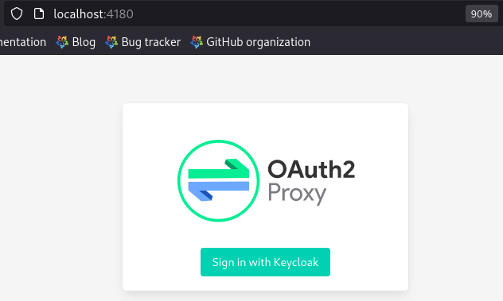

Click the button to sign in with Keycloak, login with any Keycloak account, and you now have access to the nginx web
server behind an OAuth proxy!

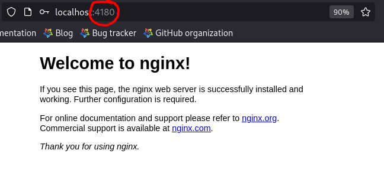

Some important notes here:

1. Your NGINX server should now only be accessed through the proxy port, 4180.
2. If your service’s regular port is exposed (in our case, nginx was on 9999), you can still access your nginx service
   without authorization by directly navigating to the service port: `http://localhost:9999`. Because of this, I would
   recommend making this port inaccessible (i.e., Make it only accessible to the internal Docker or k8s network) and not
   expose your nginx server to the outside world. Only send your users to the proxy.
3. In Docker, you need one OAuth2 Proxy for each service you want to proxy. However, in Kubernetes, you can use Ingress
   rules and annotations to make a single OAuth2 Proxy work for multiple apps.

### Enabling OIDC in our Apps

While the previous steps showed us how to instrument other applications with OIDC, we need to know how to lock down our
own apps with OIDC!

While you could use the OAuth2 Proxy method outlined above to secure your own apps, it should really only be used as a
last resort.  
If you have control of the source code for your app, Keycloak recommends a number of OIDC provider libraries for a
number of programming languages
which [can be found here](https://www.keycloak.org/docs/latest/securing_apps/#openid-connect).  
However, I personally am not a fan of their recommendations.  
I would recommend looking up whatever HTTP or web framework you are using for your web server (e.g., gRPC, ktor, spring,
etc.) and finding an appropriate library to instrument.

### Using Ktor with OIDC Authentication

To start implementing OIDC in our application, we just need to follow along with some guides that we can easily find
online!
The general steps are:

- Configure our application with the OIDC settings
- Integrate logins with an OAuth library
- Lockdown routes using OAuth user information

As you may have noticed in the previous 2 implementations, whenever we configure an OIDC integration, we always needed a
handful of settings to connect to our OAuth provider.
This includes the client id, client secret, OIDC endpoints, and a list of scopes.
Well, we need to allow our application to accept these values as inputs as well!
In order to streamline this, I made a simple data structure that we can use to configure our OIDC settings:

#### Kotlin

For Kotlin's KTOR, we can follow along with the [KTOR OAuth documentation](https://ktor.io/docs/server-oauth.html).
The first step we need to perform is to configure our OIDC provider.

```kotlin
@Serializable
data class OAuthConfiguration(
    val name: String = "keycloak",
    val clientId: String = "oidc-client",
    val secret: String = "HDSNn8Vs70yUTnZiWV3WVjCaXpfUw6dq",
    val authUrl: String = "http://localhost:8080/realms/master/protocol/openid-connect/auth",
    val tokenUrl: String = "http://localhost:8080/realms/master/protocol/openid-connect/token",
    val userInfoUrl: String = "http://localhost:8080/realms/master/protocol/openid-connect/userinfo",
    val scopes: List<String> = listOf("openid", "profile", "email", "roles"),
)
```

This allows the application to accept input from a YAML configuration file (though we will just keep this hard-coded for
now).
In the example above, I have set all the values to default to the values we need for our local Keycloak client. You
should update these values to contain the client ID, secret, and endpoint URLs for your keycloak instance.

Once this data structure has been created, we can begin to configure ktor.
In order for our server to make calls to Keycloak, we need to configure an HTTP client.
To do this, just add a new HTTP client at the top of our `Application.module()` function.

> _NOTE:_ The `ContentNegotiation` variable has two imports with the same name.
> I had a bit of trouble here and had to change my import to be:

```kotlin
import io.ktor.client.plugins.contentnegotiation.ContentNegotiation as ClientContentNegotiation
```

```kotlin
// In order to make HTTP requests to another server, we configure an HTTP client with no auth tokens configured
val httpClient = HttpClient(CIO) {
    install(ClientContentNegotiation) { json() }
}
```

Once the client has been created, we can configure our OIDC settings in the `authentication` block.

```kotlin
oauth("keycloak") {
    // This configures our callback URL
    // Once the user logs in, they will be redirected back to this URL with their access token and user information
    urlProvider = { "http://localhost:9001/api/callback" }

    val oauthConfig = OAuthConfiguration()

    providerLookup = {
        OAuthServerSettings.OAuth2ServerSettings(
            name = oauthConfig.name,
            authorizeUrl = oauthConfig.authUrl,
            accessTokenUrl = oauthConfig.tokenUrl,
            requestMethod = HttpMethod.Post,
            defaultScopes = oauthConfig.scopes,
            clientId = oauthConfig.clientId,
            clientSecret = oauthConfig.secret,
        )
    }
    // Configure the HTTP client used to talk to keycloak
    client = oauthClient()
}
```

#### C#

In C#, there is a wonderful NuGet package, `Keycloak.AuthServices.Authentication` provided by Keycloak to streamline
ASP.NET development! WOO!
Feel free to use this package if you like, but we are not going to use it for this lesson as it removes some of the
basics and is Keycloak specific.

We are instead going to use the built-in functionality from ASP.NET.
The first thing we need to do is configure our Authentication provider in `Program.cs` to use OAuth.

Let's update `Program.cs` and replace our `AddAuthentication` to instead be configured for OAuth:

```csharp
builder.Services.AddAuthentication(options =>
    {
      // If an authentication cookie is present, use it to get authentication information
      options.DefaultScheme = "Cookies";

      // If authentication is required, and no cookie is present, use OAuth (configured below) to sign in
      options.DefaultChallengeScheme = "OAuth";
    })
    .AddCookie("Cookies")
    .AddOpenIdConnect("OAuth", options =>
    {
        options.SignInScheme = "Cookies"; // Tell OAuth that we are going to use Cookies to store the user session.
        
        // Configure some OAuth Settings
        options.ClientId = "csharpapp";
        options.ClientSecret = "7Maq8jxPl1C2w4LJOFPGCpfYXtjj7VHh";
        options.Authority = "http://localhost:8080/realms/master";
        options.RequireHttpsMetadata = false; // Because we are not using a TLS Keycloak.
        options.ResponseType = "code";
        options.SaveTokens = true;

        // Configure the Scopes
        // Scopes tell us what information we are requesting from Keycloak
        options.Scope.Add("openid");
        options.Scope.Add("profile");
        options.Scope.Add("email");
        options.Scope.Add("roles");

        // After the user signs in, an authorization code will be sent to a callback
        // in this app. The OAuth middleware will intercept it
        options.CallbackPath = new PathString("/api/lesson8/callback");
    });
```

---

With the current code, our applications will integrate with Keycloak, however, we need to configure the routes.

We will configure one route, `/api/oauth` which will tell our application to 'trigger' the authentication flow and start
a login process with Keycloak.
This will automatically send users to the Keycloak sign in page if they are unauthorized.

However, once the user logs in on the Keycloak website, Keycloak needs some way to send them back to our application.
Our website needs to implement a `/callback` route which will accept information from keycloak.
This includes things like the user's JWT, their refresh token, and more.

When we configured the OAuth settings, we configured a callback URL.
That is a callback URL that our application needs to implement.

Let's create these routes and finish off the integration:

#### Kotlin

```kotlin
authenticate("keycloak") {
    // This will automatically trigger a sign-in flow with Keycloak
    get("/oauth") {}
    // This is our callback URL that is called by keycloak after a login.
    get("/callback") {
        // Get the current principal which contains the OIDC access Token
        val principal = call.principal<OAuthAccessTokenResponse>()

        // Return early if someone tried to cheat the system
        if (principal == null) {
            call.respond(HttpStatusCode.Unauthorized, "Failed to authenticate through OAuth")
            return@get
        }

        // Otherwise, let's just respond with the principal
        call.respond(HttpStatusCode.OK, "Authenticated through OAuth! Principal: ${principal}")
    }
}
```

#### C#

In C#, to trigger an authentication flow, we just need to hit a route that is protected, and it will direct us to use Keycloak.
We already have a route that does this, `TestAuth`, so we will just use this for testing.
However, let's update this route to also dump the user's token:

```
[Route("testAuth")]
[HttpGet]
[Authorize]
public async Task<IActionResult> TestAuth()
{  
    var token = await HttpContext.GetTokenAsync("access_token");  
    return Ok($"Authorized. {token}");
}
```

---

Let's start our server and give it a try!
Once the server has started, navigate to `https://localhost:9443/api/oauth` in your browser.
For C#, go to `https://localhost:9443/api/lesson8/testAuth`

We should immediately be redirected to the Keycloak sign-in page!


Login with our account and we should be redirected back to our server!
If everything is configured properly, we should see a message saying "Authenticated through OAuth!", as well as a dump
of the OAuth access token!

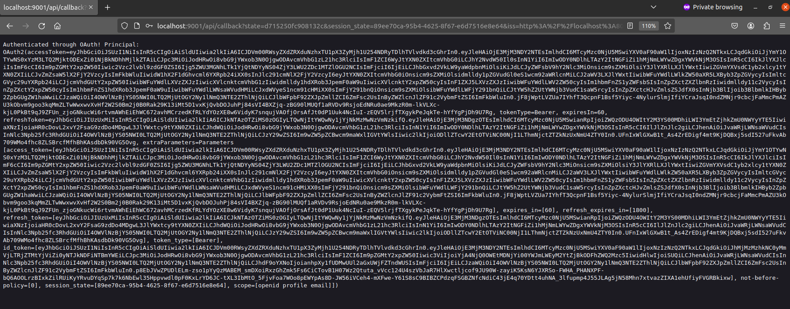

Now we have gotten the authentication flow working, we need to send our users somewhere after they hit the `/callback`
endpoint.
There are a few things we can do here:

- Just redirect the user to some "main" dashboard or homepage
- Keep track of the user's session and redirect them to the page they were trying to access before they were redirected
  to the login page.

It is much simpler to just redirect the user to a main page, so let's do this for now.

C# has already done this, so for Kotlin, follow along:

#### Kotlin

Create a new route, `/api/oauth-protected`, that we will send users to after they have logged in.

Then, once the `/callback` is complete, we will just redirect our users to this new route:

```kotlin
authenticate("keycloak") {
    // This will automatically trigger a sign-in flow with Keycloak
    get("/oauth") {}
    // This is our callback URL that is called by keycloak after a login.
    get("/callback") {
        // Get the current principal which contains the OIDC access Token
        val principal = call.principal<OAuthAccessTokenResponse>()

        // Return early if someone tried to cheat the system
        if(principal == null) {
            call.respond(HttpStatusCode.Unauthorized, "Failed to authenticate through OAuth")
            return@get
        }

        // Redirect our user to some generic page that shows they are authenticated
        call.respondRedirect("/api/oauth-protected")
    }
    get("oauth-protected") {
        val principal = call.principal<OAuthAccessTokenResponse>()
        call.respond(HttpStatusCode.OK, "Successfully authenticated through OAuth. Principal: ${principal}")
    }
}
```

Let's restart our server and try it out.
Let's again navigate to `https://localhost:9443/api/oauth` in your browser and attempt to login.
This time, we are met with an odd error:

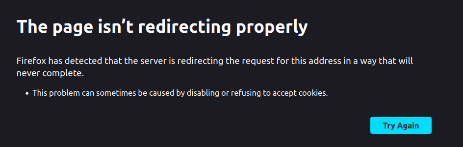

If we look at our server logs, we can see that we are getting stuck in a redirect loop:

```shell
2024-08-15_12:37:17.465|eventLoopGroupProxy-4-1|302 Found: GET - /api/oauth in 54ms -> null|invoke$log|Application|CallLogging.kt|45|INFO
2024-08-15_12:37:17.635|eventLoopGroupProxy-4-2|302 Found: GET - /api/callback in 116ms -> /api/oauth-protected|invoke$log|Application|CallLogging.kt|45|INFO
2024-08-15_12:37:17.641|eventLoopGroupProxy-4-2|302 Found: GET - /api/oauth-protected in 2ms -> http://localhost:8080/realms/master/protocol/openid-connect/auth?client_id=oidc-client&redirect_uri=http%3A%2F%2Flocalhost%3A9001%2Fapi%2Fcallback&scope=openid+profile+email+roles&state=80277ee56251d1af&response_type=code|invoke$log|Application|CallLogging.kt|45|INFO
2024-08-15_12:37:17.669|eventLoopGroupProxy-4-2|302 Found: GET - /api/callback in 18ms -> /api/oauth-protected|invoke$log|Application|CallLogging.kt|45|INFO
2024-08-15_12:37:17.674|eventLoopGroupProxy-4-2|302 Found: GET - /api/oauth-protected in 2ms -> http://localhost:8080/realms/master/protocol/openid-connect/auth?client_id=oidc-client&redirect_uri=http%3A%2F%2Flocalhost%3A9001%2Fapi%2Fcallback&scope=openid+profile+email+roles&state=e9c1705b8035447b&response_type=code|invoke$log|Application|CallLogging.kt|45|INFO
2024-08-15_12:37:17.705|eventLoopGroupProxy-4-2|302 Found: GET - /api/callback in 19ms -> /api/oauth-protected|invoke$log|Application|CallLogging.kt|45|INFO
2024-08-15_12:37:17.710|eventLoopGroupProxy-4-2|302 Found: GET - /api/oauth-protected in 1ms -> http://localhost:8080/realms/master/protocol/openid-connect/auth?client_id=oidc-client&redirect_uri=http%3A%2F%2Flocalhost%3A9001%2Fapi%2Fcallback&scope=openid+profile+email+roles&state=ece28deea8a294c6&response_type=code|invoke$log|Application|CallLogging.kt|45|INFO
2024-08-15_12:37:17.740|eventLoopGroupProxy-4-2|302 Found: GET - /api/callback in 18ms -> /api/oauth-protected|invoke$log|Application|CallLogging.kt|45|INFO
2024-08-15_12:37:17.746|eventLoopGroupProxy-4-2|302 Found: GET - /api/oauth-protected in 1ms -> http://localhost:8080/realms/master/protocol/openid-connect/auth?client_id=oidc-client&redirect_uri=http%3A%2F%2Flocalhost%3A9001%2Fapi%2Fcallback&scope=openid+profile+email+roles&state=972c0f76ce321a7e&response_type=code|invoke$log|Application|CallLogging.kt|45|INFO
2024-08-15_12:37:17.781|eventLoopGroupProxy-4-2|302 Found: GET - /api/callback in 23ms -> /api/oauth-protected|invoke$log|Application|CallLogging.kt|45|INFO
2024-08-15_12:37:17.786|eventLoopGroupProxy-4-2|302 Found: GET - /api/oauth-protected in 2ms -> http://localhost:8080/realms/master/protocol/openid-connect/auth?client_id=oidc-client&redirect_uri=http%3A%2F%2Flocalhost%3A9001%2Fapi%2Fcallback&scope=openid+profile+email+roles&state=98ede21f1d5958d0&response_type=code|invoke$log|Application|CallLogging.kt|45|INFO
2024-08-15_12:37:17.814|eventLoopGroupProxy-4-2|302 Found: GET - /api/callback in 16ms -> /api/oauth-protected|invoke$log|Application|CallLogging.kt|45|INFO
2024-08-15_12:37:17.817|eventLoopGroupProxy-4-2|302 Found: GET - /api/oauth-protected in 1ms -> http://localhost:8080/realms/master/protocol/openid-connect/auth?client_id=oidc-client&redirect_uri=http%3A%2F%2Flocalhost%3A9001%2Fapi%2Fcallback&scope=openid+profile+email+roles&state=9ca9ed87867c1bb8&response_type=code|invoke$log|Application|CallLogging.kt|45|INFO
2024-08-15_12:37:17.842|eventLoopGroupProxy-4-2|302 Found: GET - /api/callback in 14ms -> /api/oauth-protected|invoke$log|Application|CallLogging.kt|45|INFO
```

What is going on?

The issue is that we are redirecting the user to the `/api/oauth-protected` route, which is also protected by the
`authenticate("keycloak")` block. Whenever the user hits a route protected with `authenticate("keycloak")`, the Keycloak
client triggers a redirect to the Keycloak login page, and we have told the server to redirect the user to the
`/api/callback` route after they have logged in. This causes the user to be redirected to the Keycloak login page again,
and the cycle repeats infinitely.

To fix this issue, we need to set a user session after the user logs in.

## User Sessions

Now that we are logging in, we want to have some control over our user session.
In order to do this, we will need to create some custom session objects to hold the information.
Once the sessions are set, we can then use the user's session information instead of requiring the user to go through
Keycloak every single time they need authenticated.

Let's see how we can get more control over our sessions.

### Kotlin

First, we need to move our `/api/oauth-protected` route outside the `authenticate("keycloak")` block and instead, create
a session to store oauth-related information.
We can then check if the user has a session and if they do, we can allow them to access the `/api/oauth-protected`
route.
If they don't, we simply send them to the `/api/oauth` route to login.

First, we will create a new session authentication block to hold our OIDC session information.
But before we can do that, we need to create a data structure to hold our session information:

```kotlin
data class OauthSession(
    val accessToken: String,
    val refreshToken: String?,
    val expiresIn: Long,
) : Principal
```

Next, we can use this data structure in a session.
First, we need to configure our sessions to hold the cookie.
This is done in the `install` block at the very top of the method.

```kotlin
install(Sessions) {
    cookie<OauthSession>("Oauth-Cookie") {
        cookie.maxAgeInSeconds = 60
    }
}
```

Now that we have configured our cookie, we can configure an `authentication` block to check if our users have a session.

```kotlin
session<OauthSession>("keycloak-session") {
    challenge {
        // If the user does not have a session, redirect them to the OAuth login page.
        call.respondRedirect("/api/oauth")
    }
    validate { session ->
        if (session != null) {
            session
        } else {
            null
        }
    }
}
```

Next, we need to set the session in the `/callback` route after we get the token from Keycloak:

```kotlin
get("/callback") {
    // Get the current principal which contains the OIDC access Token
    val principal = call.principal<OAuthAccessTokenResponse.OAuth2>()

    // Return early if someone tried to cheat the system
    if (principal == null) {
        call.respond(HttpStatusCode.Unauthorized, "Failed to authenticate through OAuth")
        return@get
    }

    call.sessions.set<OauthSession>(
        OauthSession(
            principal.accessToken,
            principal.refreshToken,
            principal.expiresIn
        )
    )

    // Redirect our user to some generic page that shows they are authenticated
    call.respondRedirect("/api/oauth-protected")
}
```

Finally, we can move our `/api/oauth-protected` route outside the `authenticate("keycloak")` block and validate it
against our session instead:

```kotlin
authenticate("keycloak-session") {
    get("/oauth-protected") {
        val session = call.sessions.get<OauthSession>()
        call.respond(HttpStatusCode.OK, "Successfully authenticated through OAuth. Session: $session")
    }
}
```

Putting this all together, we can restart our server and try hitting our `oauth` endpoint one more time.  
If all went well, we should see the expected content at our protected route!

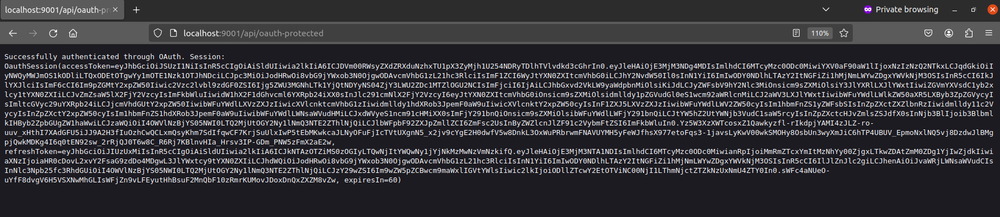

### Accessing User Roles and Information

Looking at the screenshot above, it might appear that the response we get from Keycloak is not very useful.

```shell
OauthSession(
  accessToken=eyJhbGciOiJSUzI1NiIsInR5cCIgOiAiSldUIiwia2lkIiA6ICJDVm00RWsyZXdZRXduNzhxTU1pX3ZyMjh1U254NDRyTDlhTVlvdkd3cGhrIn0.eyJleHAiOjE3MjM3NDg4MDIsImlhdCI6MTcyMzc0ODc0MiwiYXV0aF90aW1lIjoxNzIzNzQ2NTkxLCJqdGkiOiIyNWQyMWJmOS1kODliLTQxODEtOTgwYy1mOTE1Nzk1OTJhNDciLCJpc3MiOiJodHRwOi8vbG9jYWxob3N0OjgwODAvcmVhbG1zL21hc3RlciIsImF1ZCI6WyJtYXN0ZXItcmVhbG0iLCJhY2NvdW50Il0sInN1YiI6ImIwODY0NDlhLTAzY2ItNGFiZi1hMjNmLWYwZDgxYWVkNjM3OSIsInR5cCI6IkJlYXJlciIsImF6cCI6Im9pZGMtY2xpZW50Iiwic2Vzc2lvbl9zdGF0ZSI6Ijg5ZWU3MGNhLTk1YjQtNDYyNS04ZjY3LWU2ZDc1MTZlOGU2NCIsImFjciI6IjAiLCJhbGxvd2VkLW9yaWdpbnMiOlsiKiJdLCJyZWFsbV9hY2Nlc3MiOnsicm9sZXMiOlsiY3JlYXRlLXJlYWxtIiwiZGVmYXVsdC1yb2xlcy1tYXN0ZXIiLCJvZmZsaW5lX2FjY2VzcyIsImFkbWluIiwidW1hX2F1dGhvcml6YXRpb24iXX0sInJlc291cmNlX2FjY2VzcyI6eyJtYXN0ZXItcmVhbG0iOnsicm9sZXMiOlsidmlldy1pZGVudGl0eS1wcm92aWRlcnMiLCJ2aWV3LXJlYWxtIiwibWFuYWdlLWlkZW50aXR5LXByb3ZpZGVycyIsImltcGVyc29uYXRpb24iLCJjcmVhdGUtY2xpZW50IiwibWFuYWdlLXVzZXJzIiwicXVlcnktcmVhbG1zIiwidmlldy1hdXRob3JpemF0aW9uIiwicXVlcnktY2xpZW50cyIsInF1ZXJ5LXVzZXJzIiwibWFuYWdlLWV2ZW50cyIsIm1hbmFnZS1yZWFsbSIsInZpZXctZXZlbnRzIiwidmlldy11c2VycyIsInZpZXctY2xpZW50cyIsIm1hbmFnZS1hdXRob3JpemF0aW9uIiwibWFuYWdlLWNsaWVudHMiLCJxdWVyeS1ncm91cHMiXX0sImFjY291bnQiOnsicm9sZXMiOlsibWFuYWdlLWFjY291bnQiLCJtYW5hZ2UtYWNjb3VudC1saW5rcyIsInZpZXctcHJvZmlsZSJdfX0sInNjb3BlIjoib3BlbmlkIHByb2ZpbGUgZW1haWwiLCJzaWQiOiI4OWVlNzBjYS05NWI0LTQ2MjUtOGY2Ny1lNmQ3NTE2ZThlNjQiLCJlbWFpbF92ZXJpZmllZCI6ZmFsc2UsInByZWZlcnJlZF91c2VybmFtZSI6ImFkbWluIn0.Yz5W3XzXWTcosxZ1Qawkyzfl-rIkdpjYAMI4zJLZ-ro-uuv_xHthI7XAdGFU5iJJ9A2H3fIuOzhCwQCLxmQsyKhm7SdIfqwCF7KrjSuUlxIwP5tEbMKwkcaJLNyOFuFjIcTVtUXgnN5_x2jv9cYgE2H0dwfV5w8DnkL3OxWuPRbrwmFNAVUYMH5yFeWJfhsX977etoFqs3-1javsLyKwV00wkSMOHy8OsbUn3wyXmJiC6hTP4UBUV_EpmoNxlNQ5vj8DzdwJlBMgpjQwkMDKg4I6q0tEN92sw_2rRjQJ0T6w8C_R6Rj7KBlnvHIa_Hrsv3IP-GDm_PNW5zFmX2aE2w,
  refreshToken=eyJhbGciOiJIUzUxMiIsInR5cCIgOiAiSldUIiwia2lkIiA6ICJkNTAzOTZiMS0zOGIyLTQwNjItYWQwNy1jYjNkMzMwNzVmNzkifQ.eyJleHAiOjE3MjM3NTA1NDIsImlhdCI6MTcyMzc0ODc0MiwianRpIjoiMmRmZTcxYmItMzNhYy00ZjgxLTkwZDAtZmM0ZDg1YjIwZjdkIiwiaXNzIjoiaHR0cDovL2xvY2FsaG9zdDo4MDgwL3JlYWxtcy9tYXN0ZXIiLCJhdWQiOiJodHRwOi8vbG9jYWxob3N0OjgwODAvcmVhbG1zL21hc3RlciIsInN1YiI6ImIwODY0NDlhLTAzY2ItNGFiZi1hMjNmLWYwZDgxYWVkNjM3OSIsInR5cCI6IlJlZnJlc2giLCJhenAiOiJvaWRjLWNsaWVudCIsInNlc3Npb25fc3RhdGUiOiI4OWVlNzBjYS05NWI0LTQ2MjUtOGY2Ny1lNmQ3NTE2ZThlNjQiLCJzY29wZSI6Im9wZW5pZCBwcm9maWxlIGVtYWlsIiwic2lkIjoiODllZTcwY2EtOTViNC00NjI1LThmNjctZTZkNzUxNmU4ZTY0In0.sWFc4aNUeO-uYfF8dvgV6H5VSXNwMhGLIsWFjZn9vLFEyutHhBsuF2MnQbF10zRmrKUMovJDoxDnQxZXZM8vZw,
  expiresIn=60
)
```  

All we got from Keycloak was an accessToken, refreshToken, and an expiresIn time.  
However, if you recall from our earlier training sessions, we were able to encode user information into a token called a
JWT.  
This is exactly what we have obtained from Keycloak. If we take the `accessToken` and paste it
into [JWT.io](http://jwt.io), we can see that the token contains a lot of information about our user!

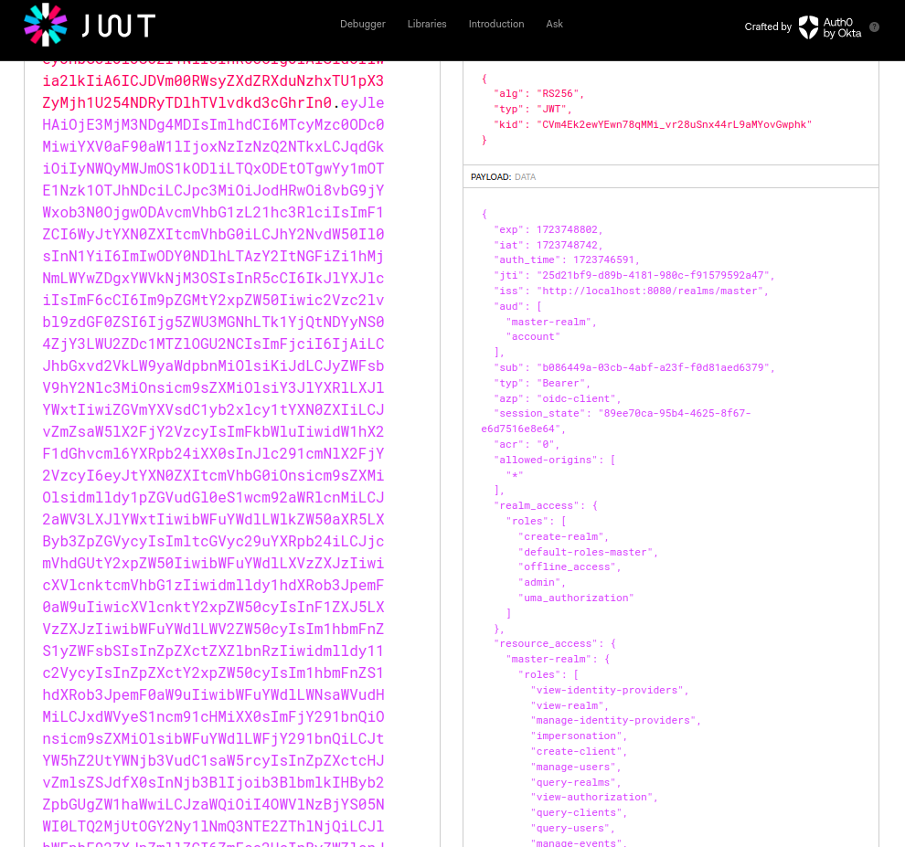

This token contains a plethora of information like:

- Id
- AllowedOrigins (for CORS)
- RealmAccess (i.e. User roles)
- Issuer URL (A link back to Keycloak)
- Name (first & last)
- Given Name (First Name)
- Family Name (Last Name)
- Middle Name
- Nickname
- Preferred Username
- Profile
- Picture
- Website
- Email
- EmailVerified
- Gender
- Birthday
- Address
- Phone Number
- Phone Number Verified

However, there are some questions that remain:

- How can we decode this token to gain access to this information in Ktor?
- Even if we decode it, how do we make a data structure to hold the information?
- Once we have the data, how can we use it?

Well, we could do it by hand. But that wouldn't be ideal, there is a lot of data here that I'd rather not try to
duplicate.

Unfortunately, this information was a bit hard to find, and it took me a bit of digging to find this.  
But, it turns out that Keycloak has a library that you can implement that can automatically parse and decode tokens.

### Kotlin

This library is already imported in our `build.gradle.kts` file, so we can use it in our application.  
To use it, all we need to do is create a new function on a user session data class that decodes the access token:

```kotlin
data class OauthSession(
    val accessToken: String,
    val refreshToken: String?,
    val expiresIn: Long,
) : Principal {
    fun userSession(): AccessToken? {
        return TokenVerifier.create(accessToken, AccessToken::class.java).token
    }
}
```

This function allows us to decode the access token from Keycloak so that we can access the user's information.  
However, the first thing we want to do with this information is update our `session` authentication to check that the
user's token is still valid!

```kotlin
session<OauthSession>("keycloak-session") {
    challenge {
        // If the user does not have a session, redirect them to the OAuth login page.
        call.respondRedirect("/api/oauth")
    }
    validate { session ->
        val keycloakToken = session.userSession()
        if (keycloakToken != null && keycloakToken.isActive) {
            session
        } else {
            println("User session is not valid. Refreshing user session.")
            null
        }
    }
}
```

This allows us to check if the user's session is still valid and if it is not, we can redirect the user back to the
login page to get a new token.  
This is important because by default, Keycloak makes it so that all access tokens only last 1 minute!  
Even though access tokens expire every minute, the user session itself lasts up to 12 hours based on your Keycloak
configuration.  
This means that even though a token expires every minute, the user is still logged in.

Because of this short timeout, what ends up happening is:

- We contact Keycloak every time a user makes a request to our server if their token is over 1 minute old.
- This makes Keycloak aware of our user's activity so their session gets extended.
- It also ensures that if an administrator revokes a user's token, the user will be logged out within the minute.

Ultimately, the end-user will not experience any difference here, but we need to ensure that our app is as secure as
possible, and that means verifying the user's session with Keycloak as often as we can.  
We don't want to overload Keycloak with requests, so a 1-minute expiration is a good balance between security and
performance.

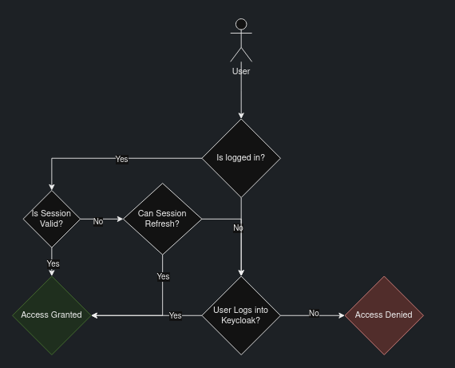

After implementing this, we can restart our server and try hitting our `/api/oauth` endpoint one more time.  
Our browser should remember the user's session and not prompt for a login.  
However, if we inspect the browser's network traffic, we will see that the user was actually redirected to the Keycloak
URL behind the scenes:

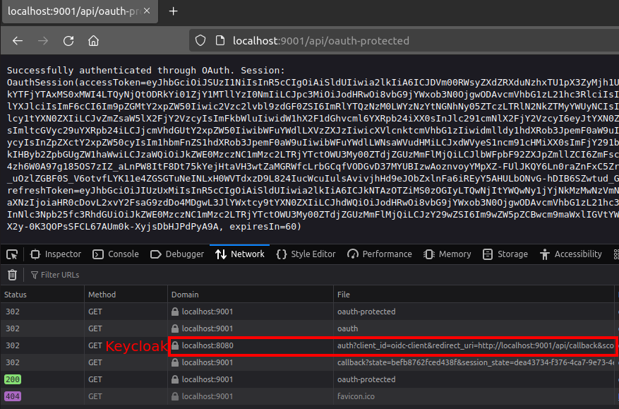

The user didn't experience any disruptions to their service because they were already logged in with Keycloak, but our
server was just making sure their session was still active.

Next, let's look more at the user's information.  
In our `/api/oauth-protected` route, we can access the user's information by calling our new function, `userSession()`,
to get the Keycloak data.

Unfortunately, the `AccessToken` class is not serializable, but, we can do something like this:

```kotlin
authenticate("keycloak-session") {
    get("/oauth-protected") {
        val session = call.sessions.get<OauthSession>()?.userSession()!!
        call.respond(
            HttpStatusCode.OK,
            "Successfully authenticated through OAuth. \n" +
            "Username: " + session.preferredUsername + "\n" +
            "Email: " + session.email + "\n" +
            "Roles: " + session.realmAccess.roles + "\n" +
            "Expires at: " + session.expiration + "\n" +
            "Phone: " + session.phoneNumber + "\n" +
            "Name: " + session.name + "\n" +
            "Nickname: " + session.nickName + "\n" +
            "Address: " + session.address + "\n" +
            "Birthdate: " + session.birthdate + "\n" +
            "Claims Locales: " + session.claimsLocales + "\n" +
            "Family Name: " + session.familyName + "\n" +
            "Gender: " + session.gender + "\n"
        )
    }
}
```

#### C#

So, I am actually fairly certain that the C# library we are using should actually already have this automatically
implemented out of the bug.
But I believe there is a bug (or something) that is preventing things from working how you would expect them to.

What we need to do is:

Unfortunately, the OpenIdConnect configuration can only access top-level JSON keys for their `Claims` types.
So, [there are two options for us](https://stackoverflow.com/questions/56327794/role-based-authorization-using-keycloak-and-net-core):

- Add a custom Mapper in Keycloak to make the roles a top level key.
  Or,
- Add a custom event listener in C# to parse out extra claims from the token.

But, because of a bug, we need to do both.
To put our roles at a top level JSON key, go to your Keycloak Admin Console > Client Scopes > roles > Mappers > realm
roles

Then,

- Change "Token Claim Name" as "roles"
- Multivalued: True
- Add to access token: True

Once this is completed, our access token will have a top level key, "role" that we can parse out with some `Claims` for
user access.

However, due to this bug that took me ~8 hours to figure
out ([I even solved an open StackOverflow question with this.](https://stackoverflow.com/a/79190782/7623407))
We also need to tell ASP.NET to parse some custom claims from the access token and add them to our user account.

To do this, we can simply add an event listener to the `OnTokenValidated` method:

```csharp
options.Events.OnTokenValidated = async ctx =>
{
    // For some reason, the access token's claims are not getting added to the user in C#
    // So this method hooks into the TokenValidation and adds it manually...
    // This definitely seems like a bug to me.

    // First, let's just get the access token and read it as a JWT
    var token = ctx.TokenEndpointResponse.AccessToken;
    var handler = new JwtSecurityTokenHandler();
    var parsedJwt = handler.ReadJwtToken(token);
    
    // For some reason, this is not enough.
    // The `role` claim is just being set to "role" as the claim type.
    // But Microsoft requires using their enum, `ClaimTypes.Role` if you want to use the claims with the `[Authorize(Roles = "...")]` Annotation.
    // So, we need to convert any "role" claims in the JWT to the actual Microsoft enum for them to be properly picked up...
    // So convert them here I guess...
    var updatedClaims = parsedJwt.Claims.ToList().Select(c =>
    {
        return c.Type == "role" ? new Claim(ClaimTypes.Role, c.Value) : c;
    });
    
    
    // Finally, use the new claims list and add a new `Identity` that contains them.
    ctx.Principal.AddIdentity(new ClaimsIdentity(updatedClaims));
};
```

By adding this, our `User` should now get all the correct Claims, and we can start to lock down routes to prevent them
access to things!
We now also get a plethora of other user information available to use.

---

Of course, getting this information from Keycloak would require the user to have set this information in the Keycloak
database in some way, however, if you want to provide this information to Keycloak it is totally possible to do.

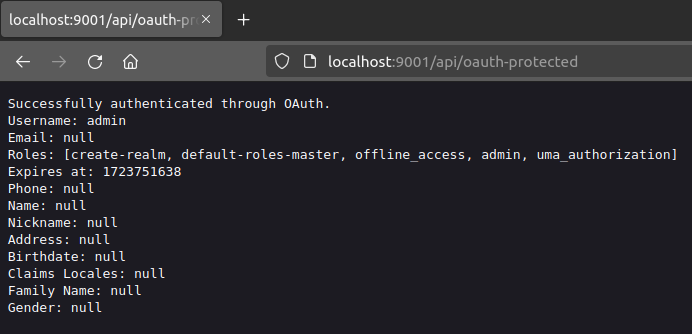

#### User Roles

One of the most important pieces of information we can get from Keycloak is the user's roles.
You can see in the screenshot above that we were able to get a list of the user's roles through the
`session.realmAccess.roles` field.
Additionally, you might have noticed that the user has the `offline_access` role, which I had previously assigned to the
user upon creation.

This is a very powerful feature of Keycloak, and you can make use of the roles to further restrict access to content
that your server provides.
Let's create a new route, `/api/oauth-admin`, that only users with the `admin` role can access.

#### Kotlin

To do this, we just need to create a new route and check if the user is an admin.
If they are, we will display content to them, otherwise we can respond with a 403:

```kotlin
authenticate("keycloak-session") {
    get("/oauth-admin") {
        call.respond(HttpStatusCode.OK, "You are an admin!")
    }
}
```

**IMPORTANT:**
There [is a better way to do this,](https://medium.com/@JalalOkbi/role-based-authorization-with-ktor-from-the-ground-up-552f4a259d74)
but it requires creating a custom ktor plugin and I will implore the reader to look at the article for more information.

#### C#

This route already exists:

```csharp
[Route("auth")]
[HttpGet]
[Authorize(Roles = "admin")]
public IActionResult Auth()
{
    return Ok("Authorized.");
}
```

---

Let's give this a try! Restart our server and navigate to `https://localhost:9443/api/oauth-admin` in your browser.
We notice that we can successfully log in and access the `/api/oauth-admin` route as an admin.

Additionally, if we log in as our `test` user which is not an admin, they are unable to reach the `oauth-admin` route
and are shown a 403.
However, there is one issue we still need to address:

Why are we sometimes getting redirected to the wrong place?

If our token expires (every 60 seconds), our users are getting redirected to the default homepage!
This is very annoying, especially since it happens every 60 seconds, and we need to fix it.

#### OIDC Redirects

In order to handle our redirects properly, we need to keep track of the user's original request before the
authentication flow begins and redirect them to it after they hit the `/callback` page with keycloak credentials.

Luckily, [the ktor documentation](https://ktor.io/docs/server-oauth.html#configure-oauth-provider) has an explanation on
how to do this.

To do this, we need to configure a variable that stores redirectUrls for each "state". Then, once the `/callback`
endpoint is hit, we can check the state and pop and if a redirectUrl exists, send the user there instead.

First, we add a new variable to store our redirect map. I just put this at the top of the `Application.module()`
function:

```kotlin
val redirects = mutableMapOf<String, String>()
```

Next, we need to parse the redirectUrl when we contact Keycloak for authentication:

```kotlin
oauth("keycloak") {
    val oauthConfig = OAuthConfiguration()

    providerLookup = {
        OAuthServerSettings.OAuth2ServerSettings(
            name = oauthConfig.name,
            authorizeUrl = oauthConfig.authUrl,
            accessTokenUrl = oauthConfig.tokenUrl,
            requestMethod = HttpMethod.Post,
            defaultScopes = oauthConfig.scopes,
            clientId = oauthConfig.clientId,
            clientSecret = oauthConfig.secret,
            // Save a redirect to the state if the `redirectUrl` is present.
            onStateCreated = { call, state ->
                // Saves new state with redirect url value
                call.request.queryParameters["redirectUrl"]?.let {
                    redirects[state] = it
                }
            }
        )
    }
    // Configure the HTTP client used to talk to keycloak
    client = oauthClient()
}
```

**NOTE:** Look at what is happening here.  
We are at `/api/oauth`, but reading the `call.request.queryParameters` to find a parameter named `redirectUrl`.  
This means to redirect, we need to pass a query parameter to the `/api/oauth` endpoint with the key `redirectUrl` to
trigger a redirect.

Once we have saved the redirect, we can use it in the `/callback` route:

```kotlin
// Check if a custom redirect was set in the state
// If so, send the user there instead.
if (principal.state != null) {
    val redirectMaybe = redirects[principal.state]
    if (redirectMaybe != null) {
        call.respondRedirect(redirectMaybe)
        return@get // Stops further processing
    }
}

call.respondRedirect("/api/oauth-protected")
```

Great! The final piece is to include the `redirectUrl` in our `challenge`.  
This will allow us to send the user back to the page that they were initially on if their token needs to be refreshed.

```kotlin
challenge { session ->
    // If the user does not have a session, or it was expired, redirect them to the OAuth login page.
    // Include the redirectUrl to get the user back to the page they were previously on.
    call.respondRedirect("/api/oauth?redirectUrl=${call.request.uri}")
}
```

Putting this all together, we should now have fixed our redirects so that they work! Let's restart our server and give
it a try.  
Let's navigate to `https://localhost:9443/api/oauth-admin` in your browser and attempt to login.

You will notice that, if you log in as an admin, things work like you would expect!  
You are asked to log in, and after logging in, you get sent directly to the `/api/oauth-admin` page!

## Conclusion

With that, we conclude our introduction to OIDC and Keycloak with Ktor.  
While this tutorial only focused on using OIDC with Keycloak, the same principles can be applied to any of the other
OIDC providers.

So now we can ask ourselves:

Why did we set up all of that hard-coded database and user validation, password hashing, etc. in the first place when we
can just use Keycloak to do it all for us?  
Using an OIDC provider makes life much simpler for developers.  
There is no need to worry about hashing, security, or user management, and we can focus on building our application
instead.

In the next section, we are going to look at multifactor authentication.  
We are going to understand how MFA works, build our own MFA provider, and we will also look at how to configure Keycloak
to use MFA itself.