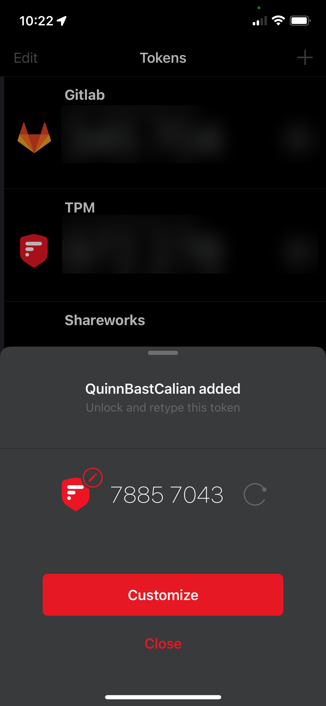
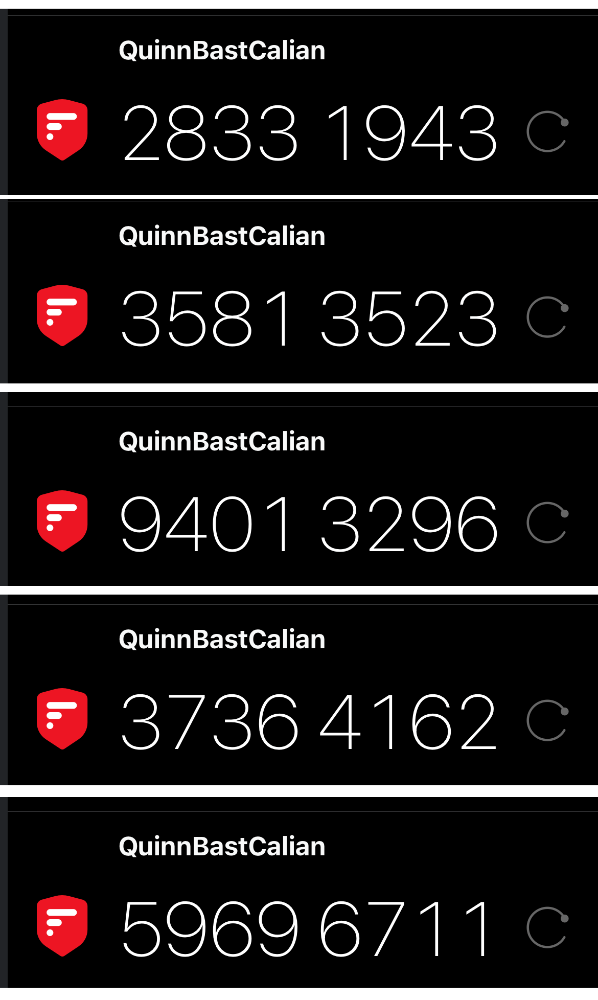
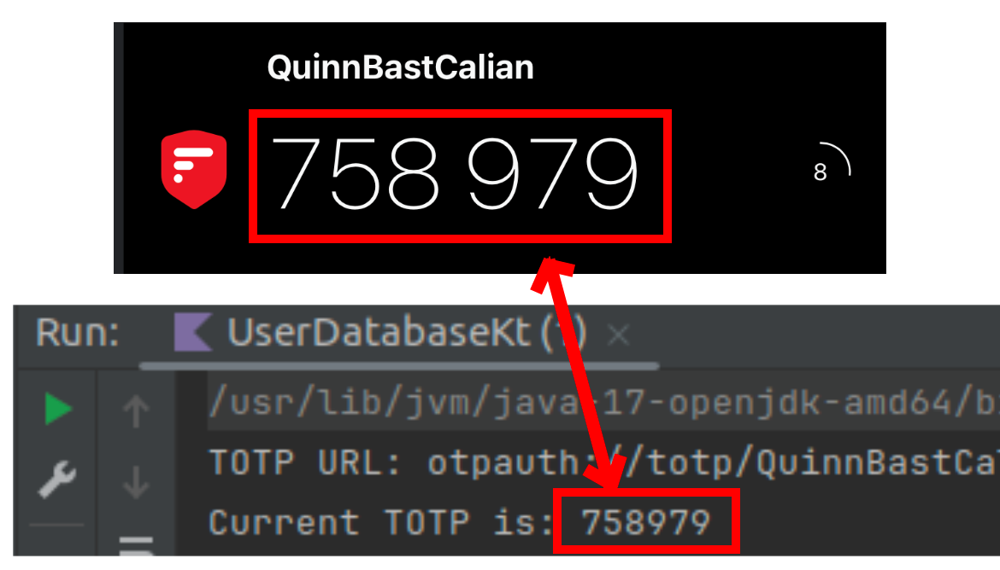
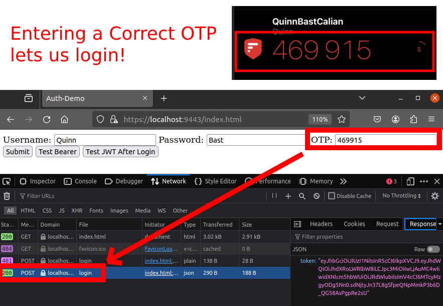
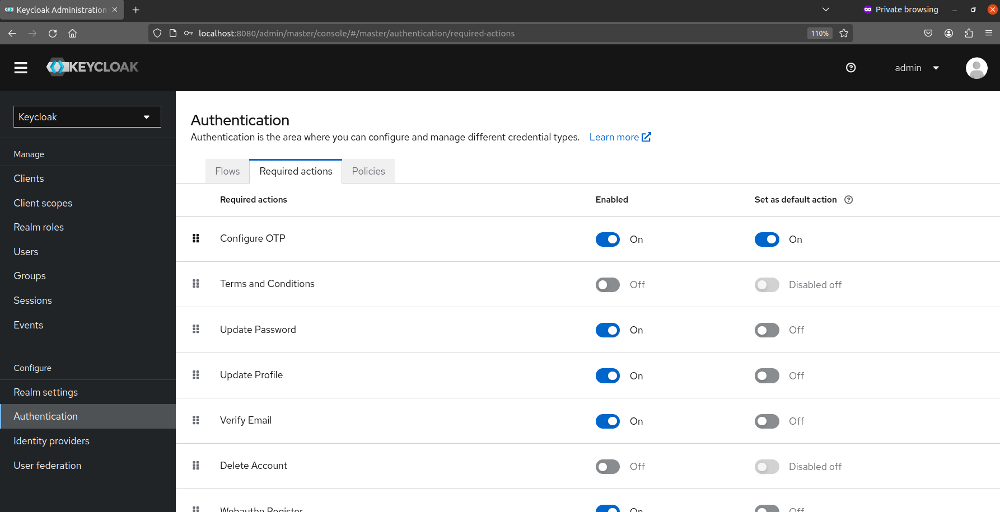
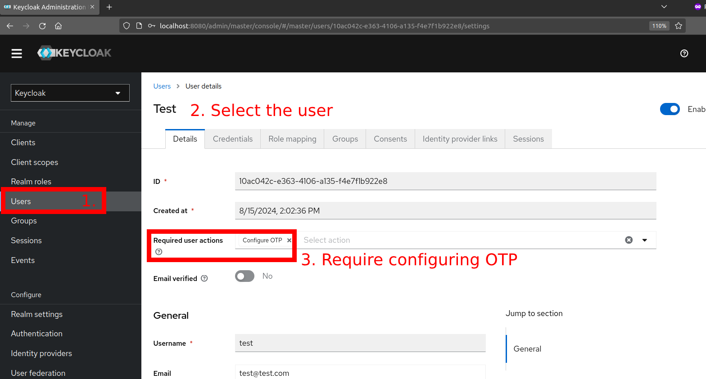
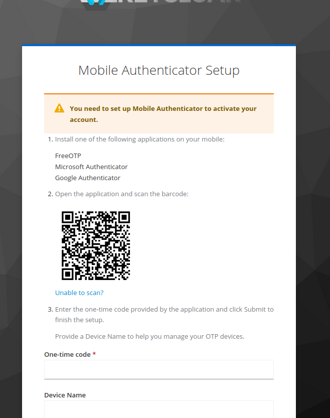
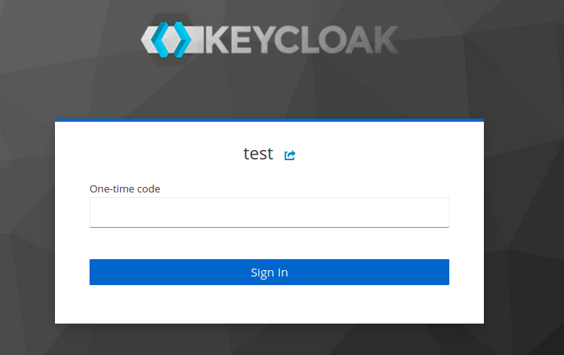

# Multi-Factor Authentication (MFA)

Multi-Factor Authentication is the final step in securing user accounts and data.  
It is a method of confirming a user's claimed identity by utilizing a combination of two different factors.

Recall that the three factors of authentication are:

- **Something you know** (password)
- **Something you have** (phone, token)
- **Something you are** (biometrics)

With two-factor authentication, we are using at least two of these methods to verify that the user is who they say they
are.  
Using passwords only provides a single layer of security and is extremely prone to phishing and social engineering
attacks.  
Adding a second factor of authentication makes it much harder for an attacker to gain access to your account.

But how do we verify something a user has or is?

## One-Time Passwords

One-Time Passwords (OTP) are a common method of verifying a user's identity.  
They are a password that is valid for only one login session, or for a short period of time.  
This means that even if an attacker is able to intercept an OTP, they will not be able to use it to log in as it will
have already expired.

OTPs are generated through a hashing function through the use of a secret key and some other value.  
The algorithm typically looks like this:

```kotlin
val secretKey = "SomeSecretKey"
val someOtherValue = 0
val digitsToGenerate = 6

val otp = hashFunction(secretKey, someOtherValue) % Math.pow(10, digitsToGenerate)
```

So as long as the server and the user are using the same inputs and using the same hashing function, they will generate
the same OTP.  
There are a few different ways to generate OTPs, but the most common methods are to use either **Hash-based One-Time
Passwords (HOTP)** or **Time-based One-Time Passwords (TOTP)**.

### Hash-based One-Time Password (HOTP)

HOTP is an algorithm that uses a counter value and a secret key to generate a one-time password.  
The counter value is incremented each time a new password is generated, and the secret key is known only to the user and
the server.

The server and the user both get a copy of the secret key and both the server and client keep track of the counter.  
Unfortunately, this means that the server and client must be in sync.  
This can be difficult to manage because it means that users cannot use multiple 2FA apps, and that if the user has to
re-download their 2FA, it loses the track of the counter.

The HOTP hashing algorithm is defined in [RFC 4226](https://www.ietf.org/rfc/rfc4226.txt).  
Because this is a known standard, there are many libraries that can generate HOTP tokens for you.

There are not many Java OTP libraries, but I found [this one](https://github.com/BastiaanJansen/otp-java) which I've
imported, and we are going to use in this demo.  
There is also the [Google Authenticator](https://github.com/wstrange/GoogleAuth) library, but it cannot generate HOTP
tokens which I want to demo.

To get started generating OTP codes, let's make an ad-hoc main method to generate HOTP tokens.  
We can do this by just reading the documentation of the library we are using to come up with this code:

```kotlin
// Create some random secret key
val secret = "ILoveCalian".toByteArray()

// Initialize the HOTP generator with an 8-digit code and our secret
val hotpGenerator: HOTPGenerator = HOTPGenerator.Builder(secret)
    .withPasswordLength(8)
    .withAlgorithm(HMACAlgorithm.SHA256)
    .build()

// Emulate a counter that iterates the user's code generations
for (counter in 0..9) {
    val code = hotpGenerator.generate(counter.toLong())
    println("HOTP code for attempt $counter: $code")
}
```

This code will generate 10 HOTP tokens for us:

```text
HOTP code for attempt 0: 47279349
HOTP code for attempt 1: 78857043
HOTP code for attempt 2: 28331943
HOTP code for attempt 3: 35813523
HOTP code for attempt 4: 94013296
HOTP code for attempt 5: 37364162
HOTP code for attempt 6: 59696711
HOTP code for attempt 7: 39291815
HOTP code for attempt 8: 81697468
HOTP code for attempt 9: 51028134
```

Next comes the cool part.  
Because the OTP algorithms are a standardized protocol (`otpauth://`), we can generate an `otpauth://` URL that defines
the parameters of this HOTP token.  
With the URL, anyone can get the same details about code generation and can use or import HOTP codes that are generated
by our application.

The library we are using has a URI generator, and we can get a URL using their built-in method (however, it would also
be very easy to construct this URL ourselves too):

```kotlin
// Generate a URL that defines our HOTP generator and the current counter value (we will use 0):
val generatorUrl = hotpGenerator.getURI(0, "QuinnBastCalian")
println("HOTP URL: $generatorUrl")
```

If we put this code in our main method, we can run it and get the following URL:

```text
otpauth://hotp/QuinnBastCalian?digits=8&counter=0&secret=ILoveCalian&issuer=QuinnBastCalian&algorithm=SHA256
```

Let's look at this URL:

- `otpauth://` - This tells us that the URL contains details about an OTP generator.
- `//hotp/QuinnBastCalian` - This tells us that it is an HOTP generator and the generator is named "QuinnBastCalian".
- `?digits` - This tells us that the generated codes will be 8 digits long.
- `&counter=0` - This tells us that the current counter value is 0.
- `&secret` - This is the secret key that is used to generate the codes.
- `&issuer=QuinnBastCalian` - This is the name of the issuer of the codes.
- `&algorithm=SHA256` - This tells us that the codes are generated using the SHA256 algorithm.

Using all of this information, anyone else can generate the same codes as us.  
And, because this is a URL, what easier way to share it with our users than giving them a QR code to scan into their
authenticator app?

Copying this URL into a [QR code generator](https://www.qr-code-generator.com/), we get the following QR code:


Give it a try! Scan this QR code into an authenticator app of your choice, and you will get the same HOTP codes that we
generated in our application:



**NOTE:** You will notice the name of the issuer is "QuinnBastCalian".  
This is the name that appears when a user scans the QR code into an authenticator app.

You will see that our authenticator is already displaying the first code, 89361406, which is the same as the second code
that our application generated.  
You may also notice that the app is showing a "refresh" icon instead of a timer.  
Clicking the "refresh" button will increment the local counter in the 2FA app to generate the next code.

By clicking this, I can generate a few more codes and verify that the generated codes do indeed match the codes that our
server is generating:



As you can see, these codes match up with the first 5 generated codes from our application.  
One caveat to HOTP codes is that they rely on the counter value.  
If the counter values get out of sync between the server and the client, the codes will no longer match, causing a
problem when users attempt to log in.  
A user might get frustrated that their code is not working and generate a new QR code, but this will just further the
problem, as their counter is now even further out of sync.

**NOTE:** The library also allows verification of the generated codes, but I won't show this for HOTP.

### Time-based One-Time Password (TOTP)

The next type of OTP is Time-based One-Time Passwords (TOTP).  
This is the most commonly used OTP algorithm and is utilized by most 2FA apps.  
Time-based passwords are similar to hash-based, but the counter's value is determined by the current time's 30-second
block.  
This means that the server and the client do not need to keep track of the counter value, and the codes will always be
in sync as long as the user's phone and server are using synchronized time servers (NTP).

The TOTP algorithm is defined by [RFC 6238](https://tools.ietf.org/html/rfc6238). If you are curious about the details
of how the algorithm is
implemented, [this article](https://medium.com/@rakesh.open.source/time-based-one-time-password-totp-java-implementation-82a472bd6bf9)
goes into the details of generating TOTP tokens in Java.  
The general algorithm is:

1. Base32 decode the secret key.
2. Calculate the time interval, which is derived from the current time divided by a predefined time step (30 seconds in
   this case).
3. Use the HMAC-SHA1 algorithm to hash the time interval with the secret key.
4. Extract a 4-byte dynamic binary code from the hash.
5. Convert the binary code to a 6-digit number, which is the TOTP.

The library we are using has a TOTP generator, and we can generate TOTP codes in a similar way to HOTP codes.  
Let's update our function to generate a TOTP code instead:

```kotlin
val secret = "ILoveCalian".toByteArray()
val totpGenerator = TOTPGenerator.Builder(secret)
    // TOTP is just HOTP with a time-based counter.
    // So here we use an HOTP generator, but just pass it bucketed time intervals.
    .withHOTPGenerator { builder: HOTPGenerator.Builder ->
        builder.withPasswordLength(6)
        builder.withAlgorithm(HMACAlgorithm.SHA256) // SHA256 and SHA512 are also supported.
    }
    .withPeriod(Duration.ofSeconds(30))
    .build()

// Generate a URL that defines our TOTP generator and the current counter value (we will use 0):
val generatorUrl = totpGenerator.getURI("QuinnBastCalian")
println("URL: $generatorUrl")

println("Current TOTP is: ${totpGenerator.now()}")
```

```text
TOTP URL: otpauth://totp/QuinnBastCalian?period=30&digits=6&secret=VV3KOX7UQJ4KYAKOHMZPPH3US4CJIMH6F3ZKNB5C2OOBQ6V2KIYHM27Q&issuer=QuinnBastCalian&algorithm=SHA256
Current TOTP is: 731187
```

Let's analyze this URL again:

- `otpauth://` - Again, this tells us that this is a URL for an OTP code.
- `//totp/QuinnBastCalian` - This tells us that this is a TOTP generator and the generator is named "QuinnBastCalian".
- `?period=30` - This tells us that the time interval for the codes is 30 seconds.
- `&digits=6` - This tells us that the generated codes will be 6 digits long.
- `&secret` - This is the secret key that is used to generate the codes.
- `&issuer=QuinnBastCalian` - This is the name of the issuer of the codes.
- `&algorithm=SHA256` - This tells us that the codes are generated using the SHA256 algorithm.

This URL is very similar to the HOTP URL, but instead of a `counter`, we have a `period` parameter.

You know what to do now! Let's generate a QR code for this URL and scan it into our authenticator app:


After scanning the QR code, you will see that the authenticator app is now displaying the current TOTP code.  
You will definitely get a different code than mine because I wrote this tutorial way before you read it.

However, if you run the main function again, you will see that the TOTP code generated by the application will match the
code generated by the authenticator app:



Now that we have an understanding of how OTP codes work, answer this question:

#### How can we generate OTP codes for different users?

We don't want all of our users to have the same OTP codes.  
To generate different codes for each user, we should just generate a different `secret` key for each user.  
This allows us to generate different OTP codes for each user.

If we generate and store a secret key for each user in our database, we can use that secret key to generate OTP codes
for that particular user.  
Then, when the user attempts to log in, we can verify that the code they entered matches the code for their account.

## MFA in Ktor

To integrate MFA into our application, we need to add a few things:

1. A secret key for each user in our database  
   a. Once the secret key is generated, we also want to present the user with a QR code to scan.
2. A way to verify the user's OTP

For now, let's just hard-code the user's secret key and require their 2FA code as part of the login process.

To get started, let's extract a class for TOTP generation that accepts a secret and has methods to verify TOTP attempts,
as well as print the URL:

```kotlin
class TotpGenerator(secret: String) {

    val generator: TOTPGenerator = TOTPGenerator.Builder(secret.toByteArray())
        .withHOTPGenerator { builder: HOTPGenerator.Builder ->
            builder.withPasswordLength(6)
            builder.withAlgorithm(HMACAlgorithm.SHA256) // SHA256 and SHA512 are also supported
        }
        .withPeriod(Duration.ofSeconds(30))
        .build()

    fun verifyTOTP(guess: String) = generator.verify(guess)

    fun getUrl(accountName: String?) = generator.getURI("QuinnBastCalian", accountName)
}
```

Next, let's also add `otpSecret` field to our `User` class to store their OTP secret code:

```kotlin
@Serializable
data class User(
    val username: String,
    val salt: String,
    val hashedPassword: String,
    val optSecret: String,
    val roles: List<Role> = listOf()
)
```

Then, populate the secrets in the `UserDatabase`.  
In the real world, you would just check if the user has an `optSecret` set.  
If not, generate them a secret and then show them a QR code to scan so that they also have the secret.  
If they do, prompt them for their TOTP to login.

But to make things simpler, let's just hard-code the secret for now:

```kotlin
override fun addUser(username: String, password: String, roles: List<Role>) {
    val random: SecureRandom = SecureRandom()
    val salt = ByteArray(16)
    random.nextBytes(salt)

    users[username] = User(
        username,
        Base64.getEncoder().encodeToString(salt),
        hashString(password, salt),
        username, // To make things easy, I'm just going to re-use the users username as their secret.
        roles
    )
}
```

> IMPORTANT: You want to encrypt the secret key before storing it.  
> While encryption can be reversed, it is still better than storing the secret key in plain text.  
> If a hacker gets access to the database, an unencrypted otpSecret will allow the hacker to generate OTP codes for the
> user which makes hijacking the account MUCH easier!

We are going to continue with our HTML journey (which we haven't modified in a while), and re-use the original
`/api/login` form.  
We will add a new field for the OTP code, and we will verify the user's OTP code when the user logs in.

In the `index.html`, we will add a new input field for the OTP code, and update our javascript to include the OTP guess
in the login request:

```html
<!-- Add the following input box: -->
<label>
    OTP: <input type="text" id="otp_guess"/>
</label>

<script>
// Update the login function to include the OTP guess:
function login() {
        // ....
        var otpGuess = document.getElementById("otp_guess").value; // New

        fetch("/api/login", {
            //...
            body: JSON.stringify({
                username: inputUsername,
                password: inputPassword,
                otpGuess: otpGuess
            }),
        })
</script>
```

Now, we should update our `LoginRequest` class to include the OTP guess:

```kotlin
@Serializable
data class LoginRequest(
    val username: String,
    val password: String,
    val otpGuess: String,
)
```

And finally, we need to update our database's `verifyUser` method to also verify the user's OTP code:

```kotlin
override fun verifyUser(username: String, password: String, otpGuess: String): Boolean {
    val user = users[username]
    if(user != null) {
        if(hashString(password, Base64.getDecoder().decode(user.salt)) == user.hashedPassword) {
            // If the password is correct, we can check the OTP
            val totpGenerator = TotpGenerator(user.optSecret)
            if(totpGenerator.verifyTOTP(otpGuess)) {
                return true
            }
        }
    }
    return false
}
```

After fixing a little typing and parameter updates, we are good to go!  
Let's dump out our user's OTP URLs in the `main` function so that we can scan one of them and test our OTP verification
process:

```kotlin
val userDatabase = UserDatabase()
for(user in userDatabase.users.values) {
    val totpGenerator = TotpGenerator(user.optSecret)
    println("User: ${user.username} OTP URL: ${totpGenerator.getUrl(user.username)}")
}
```

Output:

```text
User: Quinn OTP URL: otpauth://totp/QuinnBastCalian:Quinn?period=30&digits=6&secret=Quinn&issuer=QuinnBastCalian&algorithm=SHA256
User: Alice OTP URL: otpauth://totp/QuinnBastCalian:Alice?period=30&digits=6&secret=Alice&issuer=QuinnBastCalian&algorithm=SHA256
User: Bobby OTP URL: otpauth://totp/QuinnBastCalian:Joe?period=30&digits=6&secret=Joe&issuer=QuinnBastCalian&algorithm=SHA256
```

Now, let's run our application and scan one of these QR codes into our authenticator app.  
I am going to [generate a QR code](https://www.qr-code-generator.com/) for Quinn's URL and scan it into my authenticator
app.  
Then, we can try to login with `Quinn`'s username and password, and then enter the OTP code that the authenticator app
is displaying to see if we can login:

Let's run our server and give it a try! Once the server is started, navigate to `https://localhost:9443/index.html` and try to login with the username `Quinn`, password `Bast`, and the OTP code that your authenticator app is displaying.

If we try to login using an OTP code that is not correct, we will get a 401 Unauthorized response from the server.  
However, if we input the correct OTP code, we will see that we get a 200 OK response and are able to login!



We have successfully added MFA to our application!

**NOTE:** MFA does not require internet to work! Because the hashing algorithm is standardized, the OTP codes can be
generated offline.

### A few things that we should improve on:

- We should encrypt the secret key before storing it in the database.
- We should prompt users to scan a QR code if it is their first time logging in without an OTP secret.
- We should prompt for the 2FA code less frequently (e.g. only once a day).
- We should prompt for 2FA input after the user logs in, not at the same time as login.

These are just a few improvements we can make if we want to improve the application.

## MFA in Keycloak

While implementing our own MFA is possible, we should probably avoid re-inventing the wheel... again.  
It turns out that Keycloak (as well as most other OIDC providers) have built-in support for adding MFA flows to the
sign-in process.

Enabling these features is just a matter of configuring MFA to be part of the authentication flow.

To enable MFA in Keycloak, we need to start our Keycloak server again.  
If you followed along with the last section, you can just use the same Keycloak server as before:

```shell
docker start keycloak
```

Additionally, if you are following along from the previous section, the previous Keycloak data (the user account and
OIDC client) should all still exist when you start the container.

To enable MFA, we need to go to the `Authentication` tab in the Keycloak admin console.  
From there, we can view all the authentication flows that Keycloak currently implements.

To Enable 2FA, select the **"Required Actions"** tab and enable **"Configure OTP"**.



This will require all new Keycloak users to set up 2FA when they first log in.  
However, this does not apply to existing users.

To enable 2FA for existing users, we need to go to the **"Users"** tab and select the user we want to require 2FA.  
Edit the user and in the **"Details"** tab, there is a **"Require User Actions"** input. Select **"Configure OTP"** to
require the user to configure OTP the next time they log in.



Once this is done, the next time we login with the `test` user, we will be prompted to set up 2FA to login.

**NOTE:** I would recommend NOT requiring 2FA for the `admin` user in a development environment.

Let's logout of Keycloak and try to login with the `test` user.  
You will notice that after logging in with our username and password, we are prompted to set up 2FA.



After scanning the QR code into an authenticator app, we can enter the OTP code that the authenticator app is displaying
and login!

**NOTE:** The UI will probably just spin forever for the `test` user as they are not an admin and cannot access the
Keycloak admin UI.

We can also verify that our server now requires the 2FA as well by logging out of the `test` user and navigating to
`/api/oauth`.  
We will be prompted to login with our username and password, but once we do, we will also be prompted to enter our 2FA
code before being granted access to the `/api/oauth` endpoint.



## Conclusion

In this section, we learned about Multi-Factor Authentication and how to implement it in our applications.  
As you can see, configuring 2FA in Keycloak is extremely easy and can help to further secure applications that need an
extra layer of security.  
This is especially important for public-facing applications where user accounts could be targeted by brute force,
phishing, or social engineering attacks.

Other OIDC providers like Auth0 and Okta also have built-in support for MFA, which makes it easy to use a different OIDC
provider than Keycloak if desired.  
While it might initially seem like 2FA is a very complex protocol, it is actually quite easy to set up.  
At its core, OTPs are really just "Random number generator as a service."

## Additional Resources

- [Twilio Workshop on Two-Factor-Authentication with Java](https://www.youtube.com/watch?v=9eHDtty5ijk)
- [2FA in Python](https://www.youtube.com/watch?v=o0XZZkI69E8)
- [Configure 2FA in Keycloak](https://www.linkedin.com/pulse/enabling-two-factor-authentication-2fa-keycloak-using-k%C4%81sh%C4%81n-asim-kzzbf)