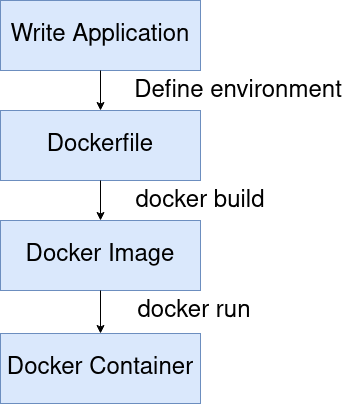

# Understanding Docker

To understand how Docker works, you need to know the process that is involved when working with Docker.

Turning an existing application into a Docker container involves a few steps which must be taken in this order:

1. Write your application code
2. Write the Dockerfile
3. Build your Image
4. Run the Container

These steps will be the same every time; however, you may not perform every step of this process.  
For example, if you are using an application that is already bundled into an image, you can easily just pull the image
and  
run it as a container, which skips steps 1-3. Steps 1-3 are only required if you are creating an application that you
want to bundle.

### Docker process

Let's take a look at each of these steps in more detail.

## Step 1: Write Application Code

Software applications can be written in any coding language and Docker doesn't care what language your app is written
in.  
Docker containers exist for every build environment, and you can create a Docker image for any software system.

This step is as you would expect and has no differences whether Docker is involved or not.  
You may want to consider HA or how your app may scale, but this is not important for just learning Docker.

## Step 2: Build a Dockerfile

Once you have created and developed an Application (and even if you are still in the development stages), the first  
step to containerizing your app is creating a Dockerfile.

A Dockerfile is simply a set of instructions that define the environment that your application should run in.  
You can think of the Dockerfile similar to an Ansible script. It is a set of instructions to be executed to set up
your  
container to behave exactly like you want it to. The Dockerfile starts from an empty environment (think a fresh OS) and
performs  
commands until it reaches the final command, which is the command to start your program.

For example:

- Need python installed? `RUN sudo apt-get install python3`
- Need to download a GitHub binary? `RUN curl <someUrl> && tar -xf theTar`
- Need to copy your source code into the container? `COPY . /app/src/`
- Need to build your source code into an executable? `RUN ./gradlew build`
- And start your program: `CMD ["java", "-jar", "yourJar.jar"]`

We will get into the specifics later, but think of Dockerfiles as a declaration of your app along with its environment
and dependencies.

## Step 3: Create an Image

Once you have a Dockerfile, the command `docker build` will execute the steps that are defined in your Dockerfile and  
output a Docker image. Think of Docker images as a bundled version of your software and its dependencies  
(in terms of VMs, a Docker image is equivalent to a VM image). Under the hood,  
Docker images reference a list of read-only "layers" (files) that represent the filesystem's differences after
performing each step indicated in the Dockerfile.

The Docker engine is able to parse the files that back the Docker image in order to re-create your exact software
application.  
This allows anyone who has access to your Docker image to be able to re-build your software's environment (and run it!).

However, it is important to note that Docker images are just files.  
Once you "run" your Docker image, it is called a container.

## Step 4: Run your container

As stated above, Docker images are just files.  
A Docker Image becomes a container at runtime.

Running the command `docker run` instructs Docker to create a running version of the software by using the files for the
image.  
Containers are built from the read-only layers of the image, but create their own read-write layer.  
All writes to the filesystem and any changes that the software makes while it is running are done to this writable
layer.  
However, once the container is destroyed, the writable layer is deleted with it. (However, you can keep the filesystem
using Volume mounts.)

Because each container has its own writable layer, this makes it easy to run multiple versions of the same Docker
image.  
Containers will share access to the underlying Docker image's layers but each container will make their own writable
layer when they start,  
making them independent software processes while being within their own isolated environments.

## Overview

Now that we know how each component works, let's review. Try to answer these on your own.

- **What is a Docker Container?**  
  A container is a running instance of a Docker Image. Containers have their own read-write layer.

- **What is the difference between a Container and an image?**  
  An image is a set of read-only files that define the software and its environment.  
  A Container has a running process and is a running instance of a Docker image with its own writable layer.

- **What is a Dockerfile?**  
  A file that defines the steps to take in order to configure the environment for your software to run.

- **How can I turn my source code into a Docker container?**
    1. Write a Dockerfile
    2. Build an image from the Dockerfile
    3. Start a container from the image

You should now understand the basics of Docker.

In the next lesson, we will look at some pre-existing Docker images (someone has already written the Dockerfile and made
the image publicly accessible) on Dockerhub  
to see how we can take a Docker image and turn it into a running container.

---

## Navigation

Next: [Dockerhub & Running existing images](./2-Dockerhub.md)

