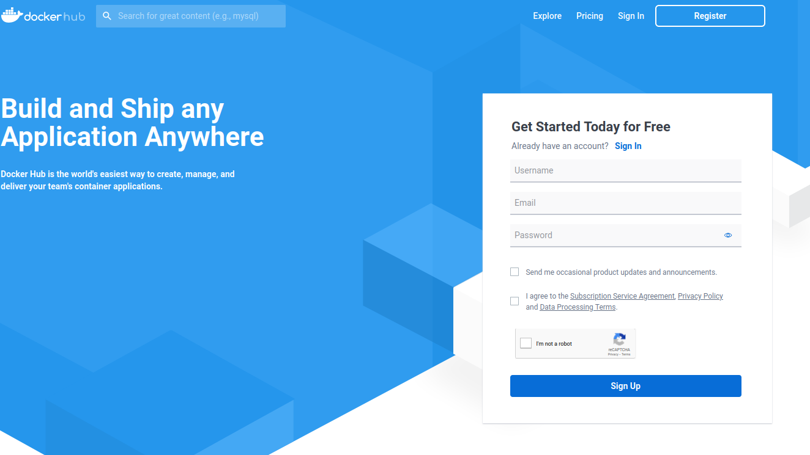
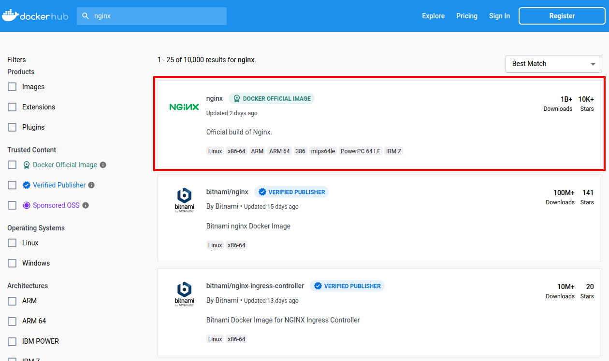
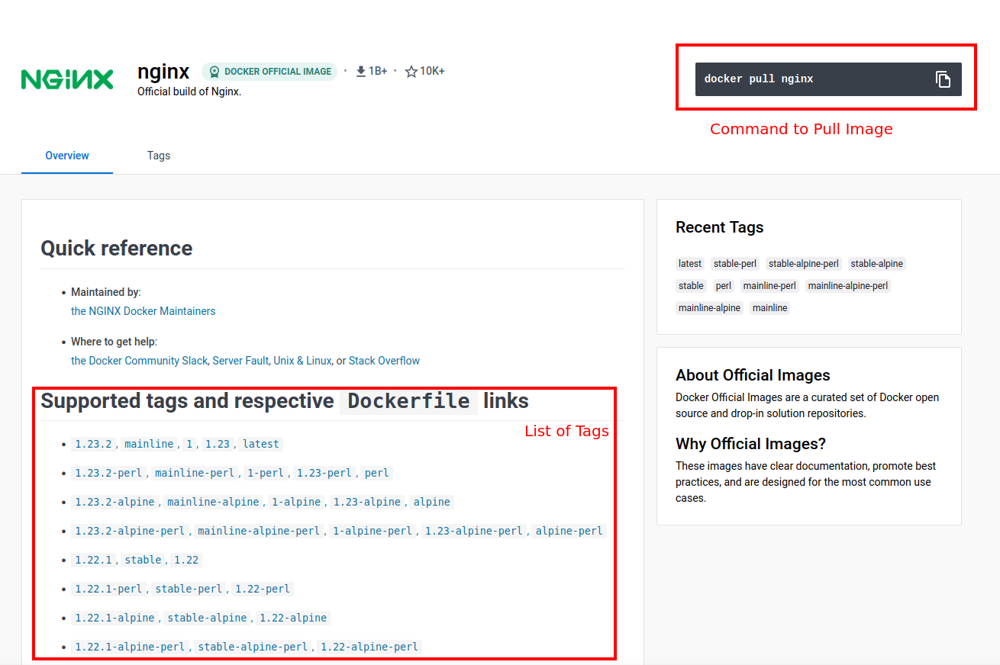
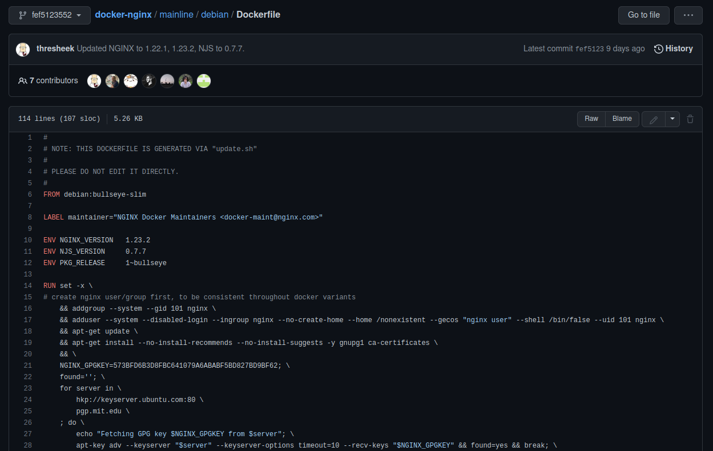
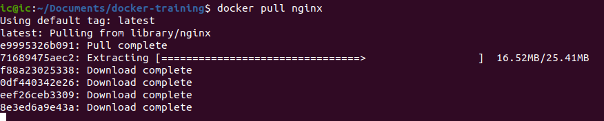
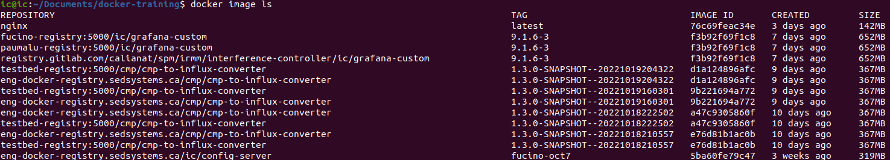
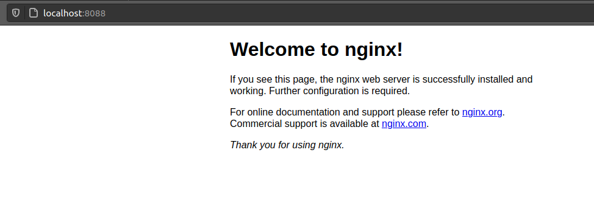

# Dockerhub

Before we jump into making our own Dockerfile, it is important to learn about the already existing docker images.  
This is because you can build your Dockerfile **ON TOP** of already existing images. This is **EXTREMELY** useful.

For example, let's say you are writing a Java 18 application using Maven. This means we would need to install Java,
install Maven, and do various other configurations to make the container have the dependencies needed to run our Java
app. But what if I told you there is an already existing docker image with Java 18 and Maven installed? This saves a
significant amount of work when writing our own Dockerfiles.

## Browsing Dockerhub

Dockerhub is the most popular docker image registry. (An Image registry is just a server to upload docker images to.)  
Let's browse to [Dockerhub](https://hub.docker.com/).

The website asks you to signup or register for an account. However, this is not necessary, as you can use the images
hosted on Dockerhub without creating an account. You only need an account if you plan on making your own docker images
accessible to the public.



On this page, let's click the "Explore" tab in the top right. This will take us to a page that shows the highest
downloaded docker images of all time. To name a few:

- **busybox**
- **ubuntu**
- **httpd**
- **node**
- **redis**

Docker images can be fully-fledged software applications such as Grafana, Postgres, Redis, Elasticsearch, etc.  
Or, they can just be a base docker image that is supposed to be extended by other developers like Ubuntu, Node.js,
OpenJDK, Golang, etc.

When building your own Dockerfile, you will want to look for docker images that include the tools for the programming
language you are using. For running existing software, you can simply download the image and run it.

Explore around Dockerhub and see if you can find docker images for some of the software you use. Some examples might be:

- Various Database providers
- Web servers like nginx or httpd
- Message buses like Kafka or RabbitMQ
- Metric servers like Elasticsearch or Grafana
- Anything else you might think of!

## Running a container from Dockerhub

Let's find a container to use and try to run the container locally.

In this example, let's run the nginx web server.

On Dockerhub, search for "nginx" and select the first one.



On this page, we get some information about the container, various tags, and information about how to do some advanced
configuration of the nginx server. Additionally, in the top right corner, we are shown the command to pull the latest
version of this docker container.



Let's focus on the **tags** a bit more. Tags of a docker image indicate the version of the software that you are
pulling.  
In the screenshot above, it indicates that `nginx:1.23.2` is the latest release, but you can also pull some of the other
versions like `nginx:1.23.2-alpine` or `1.22.1`.

Do you remember the difference between a Dockerfile, docker image, and docker container?

We are browsing docker images, which means that these images were created from a `Dockerfile` already. In fact, we can
see the Dockerfile that was used to build these images. Clicking on the link to one of the tags in the tag list will
take you to a GitHub repository that shows the Dockerfile that was used to generate the docker image. For now, don't
worry about the contents of this file. Just make sure you understand that we are browsing **Docker Images** that were
built by someone else.



Let's go back to the "nginx" main repository and pull the default `nginx` docker image using the command in the top
right corner.

```bash
docker pull nginx
```

Docker will download the read-only layers from Dockerhub, providing you with the layers required to run nginx.



Once the download is completed, we have the `nginx` docker image locally.  
To see a list of all the docker images we have, run the following command:

```bash
docker image ls
```

This command will output a list of all the docker images on your machine.  
I have a large number of images because I use Docker regularly. However, you can see the first image in the list is
`nginx` with the tag `latest`.



Great! We downloaded the Docker image.

## Running a Docker Container

An image is not a running instance of the container. In order to start running the docker image and turn it into a
container, we can use the command `docker run`. However, there are some flags we should know:

- `--name` names the container
- `-p HOST_PORT:CONTAINER_PORT` port-forwards the container's port to your host machine's port.

nginx runs on port 80 by default. By using `-p` we can bind the Docker container's port 80 to a port on our local
machine.  
Without `-p`, the port will not be accessible. `-p 80:80` will map the container's port 80 to our host's port 80.
Alternatively, you can map it to a different port, `-p 8888:80`. With this configuration, `localhost:8888` will serve
the docker container's port 80 (which is the nginx web server).

Putting this all together, you can run the following command to start the nginx container:

```bash
docker run --name my-nginx-container -p 8088:80 nginx
```

This will run the nginx server in your terminal. Opening the web browser to `localhost:8088`, we can see the nginx
server being hosted!



We could have used any of the other docker images that are available on Dockerhub to run them locally. For example, we
could have run redis with:

```bash
docker pull redis
docker run --name my-redis -p 6379:6379 redis
```

Or any other container.

## Summary

Now that we understand docker images, and have experienced Dockerhub, we know what images can do for us.  
Let's recap:

**What command is used to download/pull a docker image from Dockerhub?**

```bash
docker pull imageName
```

**What is the difference between a Container and an image?**

An image is a set of read-only files that define the software and its environment.  
A Container has a running process and is a running instance of a docker image with its own writable layer.

**What is a Dockerfile?**

A file that defines the steps to take in order to the environment for your software to run.

**What is Dockerhub?**

A public repository (image registry) of docker images.

**How can I turn my source code into a Docker container?**

1. Write a Dockerfile
2. Build an image from the Dockerfile
3. Start a container from the image

Now let's dive into writing our own [Dockerfiles](./3-Dockerfiles.md).
