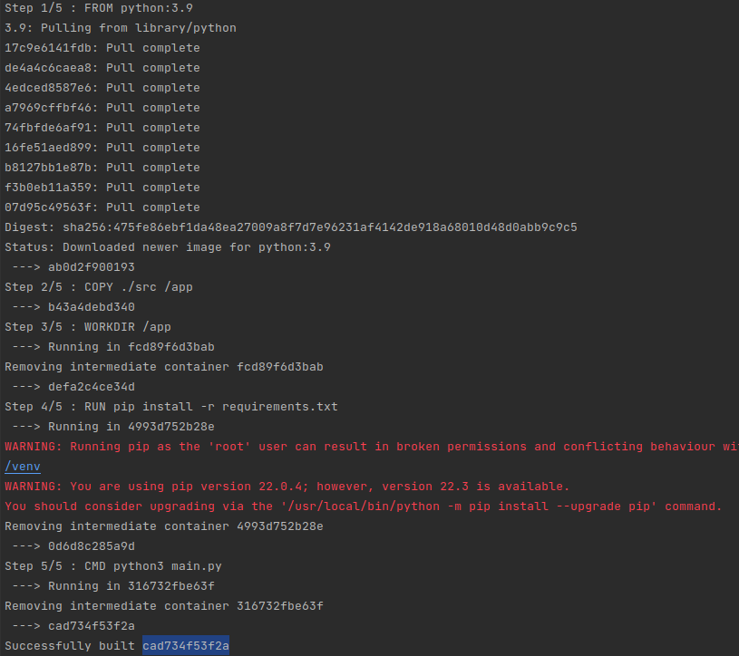

# Dockerfiles

Dockerfiles are the bread and butter for Docker. If you don't understand how to use Dockerfiles to create the Docker
image you need, you are going to have a rough time using Docker.

Dockerfiles define the environment that your application needs to run. Dependencies, build tools, source code, etc. are
all defined in the Dockerfile.

The first thing you need to understand when working with Dockerfiles is that NOTHING is pre-installed unless you use a
base image with existing software. 99% of the time, you are going to want to use a base image.

## What is a Base Image?

A base image is a Docker image that you 'start' from. They remove a large amount of the lift and will likely have all of
your programming
language's build tools installed already. This makes it easy to just jump in, copy your source code into the image, and
do a build.
There are generally base images for every programming language,  
and searching for your programming language on Docker Hub will return you some results.

In our case, we will be making a Python application (actually, the application is already created,
see [src](../../src)).  
This simple application will accept a `-f` flag for the location of the config file, will load the config file, and if
`loop`
is `True` in the config, the application will loop forever.

Our application requires python3, and therefore we will want to look for a python3 base image.  
Search Docker Hub to find a base image that has python 3 installed.

### What image did you find?

There are probably a number of images that work, but these are the ones we will use:

- python:latest
- python:3.*

## Making the Dockerfile

Let's start making our Dockerfile! To start off, create a new file called `Dockerfile` **in the root directory** (From
this file, `../../`).  
A Dockerfile is a text document that contains all of the commands that a user wants to call to assemble their Docker
image.  
There are a large number of commands that you can use in your Dockerfiles, but the most common ones are explained
here.  
[You can see the full Dockerfile reference with every command if you want](https://docs.docker.com/engine/reference/builder).

### FROM

The [FROM command](https://docs.docker.com/engine/reference/builder/#from) allows you to specify another Docker image
that you want to build on top of.  
This allows you to tell Docker you want to use a base image.  
`FROM` is almost always the first command any Dockerfile will contain.

To use our base image, let's use the `FROM` keyword and let's use `python:3.9` as our base.  
In our file, we can type:

```dockerfile
FROM python:3.9
```

This tells Docker that we want to start from the `python:3.9` Docker image, and we will add more on top of it.

### COPY

When running a Python application locally (on a new setup), the steps would usually go something like this:

```bash
# Clone the source code
git clone yourSourceCode.git

# Change into the directory
cd yourApplicationFiles

# Install the dependencies
pip install -r requirements.txt

# Run the application
python3 -u main.py
```

When building a Docker image, the Dockerfile tells us the instructions we need to take to create and run our app. We
have not copied/cloned any of our  
code into the image, so that is going to be our next step. To do this, we can use
the [COPY command](https://docs.docker.com/engine/reference/builder/#copy).

You can use the COPY command just like on the command line, `COPY <src> <dest>`.  
By default, Docker uses the `<src>` as a file path on your machine, and `<dest>` as the file path in the Docker image.

For example, `COPY . /app` will copy everything in the current directory into `/app` inside the image.  
All of our files are located in the `src` directory so let's copy them into the Docker image:

```dockerfile
# Copy all of our python files into the container
COPY ./src /app
```

**NOTE**: The `COPY` command copies files relative to where your Dockerfile is placed.  
**NOTE**: `<src>` is by default a path on your machine, however, you can use `--from=<name>` to tell Docker that the
`src` should copy from another Docker image.

### WORKDIR

Remember the Python build process?

```bash
git clone yourSourceCode.git

# -- We are here --

cd yourApplicationFiles
pip install -r requirements.txt
python3 -u main.py
```

Now that we have copied our code into the Docker container, we want to `cd` into the folder where we copied them.  
There are two ways to do this: [WORKDIR](https://docs.docker.com/engine/reference/builder/#workdir), which acts as a
`cd`,  
or we could use `RUN`, which can execute shell commands. In this example we will use `WORKDIR` just to diversify our
exposure.

To change our working directory, use `WORKDIR /path/to/dir`.  
In the previous step, we copied our files to `/app`, so let's set our WORKDIR there:

```dockerfile
# Set our working directory for future commands
# Acts as a `cd`
WORKDIR /app
```

We have now `cd`'ed into the directory where our application files are located and are ready to install our
dependencies!

### RUN

Remember the Python build process?

```bash
git clone yourSourceCode.git
cd yourApplicationFiles

# -- We are here --

pip install -r requirements.txt
python3 -u main.py
```

Now that we have changed directories, we are exactly where we want to be in order to install our dependencies and run
our  
application. The [RUN command](https://docs.docker.com/engine/reference/builder/#run), allows us to execute bash
commands.

There are two ways to use the RUN command:

```dockerfile
RUN my command to run

RUN ["my", "command", "to", "run"]
```

Both act the same way, it is personal preference which you use. Let's install our dependencies!

```dockerfile
# Tell the Docker engine to run a pip install in our image
RUN pip install -r requirements.txt
```

We've now installed our dependencies and we are ready to run the app!

### Entrypoint and CMD

The final step is for us to tell the Docker engine to run our program. There are two ways to do this, `CMD` or
`ENTRYPOINT`.  
Both can be specified in the same format as the `RUN` command.

What is the difference between `CMD` and `ENTRYPOINT`?

- `CMD` sets default parameters or flags that can be overwritten by the user of the image.
- `ENTRYPOINT` is for default parameters that cannot be overwritten by a user of the image.

For example, we will always want to run `python3 -u main.py`, however, we might want a user to add
`-f /path/to/other/config`.  
In this case, we might want to mix both `ENTRYPOINT`, and `CMD`.  
However, it is not necessary to use both `ENTRYPOINT` and `CMD`, and in our case, we can just use `CMD` since we know a
user may want to change the runtime command.

Let's put this into action:

```dockerfile
# Tell Docker to run our program!
CMD python3 -u main.py
```

## Building the image!

Throwing it all together, we should have [this](./3-Dockerfile)!  
We can now attempt to build this image! From the directory where the Dockerfile is located, run this command:

```bash
docker build .
```

You will see the Docker engine pull your base image and perform each step outlined in your Dockerfile!



We've built a Dockerfile for our python application and built an image for it!  
In the next lesson, we will learn more about managing images, tagging images, different ways to build an image, and
more.

## Navigation

**Next:** [Docker Images](./4-images-and-tags.md)
