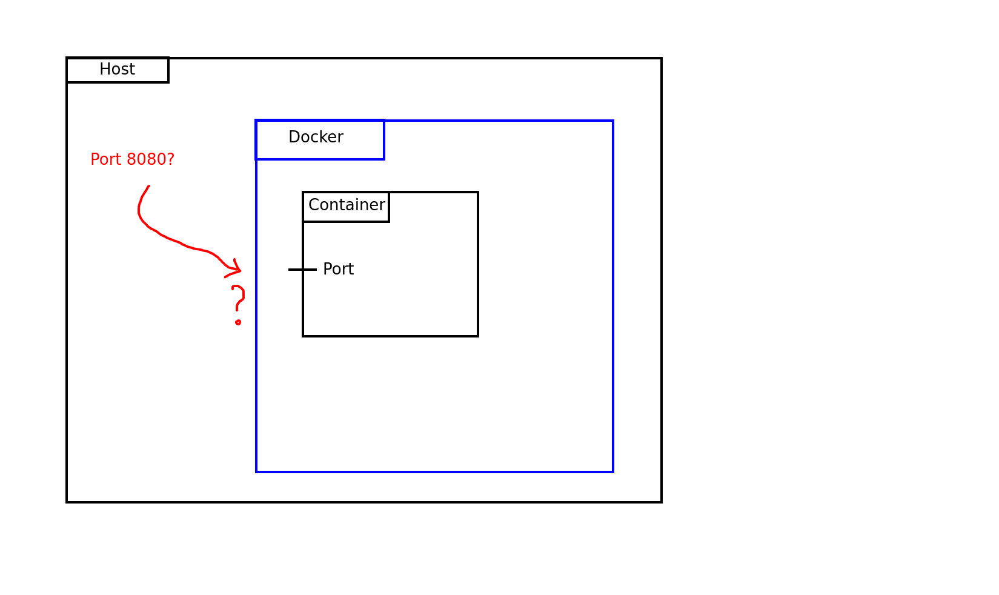
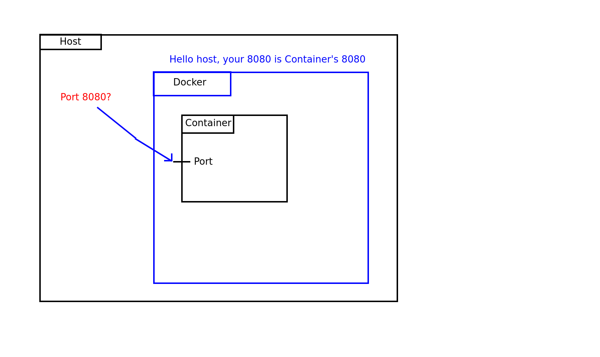
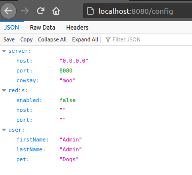
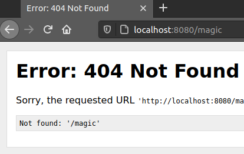
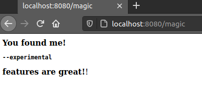
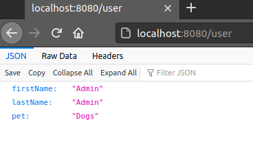
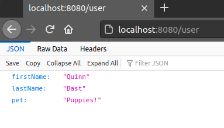

# Containers

Docker containers are running instances of docker images.  
From the last lesson, you should have a docker image named `python-training-container:1.0`.

If not, run this command from the root directory (`-f` points to a specific Dockerfile):

```bash
docker build . -t python-training-container:1.0 -f ./4-images-and-tags/Dockerfile
```

In this lesson, we will start the container, and investigate how to work with running containers.

## Understanding the app

Before we run the container we build, we should probably understand what the application we just bundled does!  
Take a look at the [README.md](../src/README.md) for the application.

As a quick summary; the application is a python REST server. The app has some command-line parameters we can set,  
some environment variables we can use, and also allows configuration through a config file.

While running the REST api has endpoints at: `/`, `/user`, `/cowsay`, `/config` and a feature-flagged endpoint
`/magic`.  
Once we have a running container, we should be able to hit these endpoints from the REST server, but we should also  
be able to change the settings for the app via CLI params, env variables, and see our effects.

By default, the web-server runs on port 8080 (this will be useful in the future).

## Running a Container

There are two ways to run a container, detached, or attached.  
This is done with [docker run](https://docs.docker.com/engine/reference/run/).

Attached means that the container will become attached to your terminal, while running the container detached means
the  
container will run in the background. To run attached, the `-it` flags allow you to use an interactive terminal, which  
allows the container to accept keypresses from your terminal into the container (making it so that Ctrl+C stops the
container).  
Alternatively, `-d` runs the container detached in the background.

Let's run the container detached:

```bash
docker run -d python-training-container:1.0
```

The output of this command tells you the container ID, and running `docker ps` will show you a list of your running
containers.

```bash
$ docker ps
CONTAINER ID   IMAGE                           COMMAND                  CREATED         STATUS         PORTS    NAMES
2766e3cbc19e   python-training-container:1.0   "/bin/sh -c 'python3…"   4 seconds ago   Up 3 seconds            clever_kalam
```

One thing to note is that your container was assigned a random name (`clever_kalam`).  
The name is random, and you may want an easier name so you don't have to reference your container by ID or the random
name.  
To give your container a name, use the `--name` parameter.

```bash
docker run -d --name python-container python-training-container:1.0
```

## Port Forwarding

Once your container is running you would expect to be able to access your application, right?  
Unfortunately not quite yet.

### Docker network without port forwarding



Since your applications are completely isolated, that means their ports are, too. In order to access the container's
ports,  
we need to tell Docker that there are ports on the container that we want to map to our host's ports.  
This will allow our host to access a local port that gets forwarded to the container's port in order to access the
application.

### Docker using port forwarding



Doing this
is [fairly simple](https://docs.docker.com/engine/reference/commandline/run/#publish-or-expose-port--p---expose) with
docker run.  
The `docker run` command has a flag that can be used to map a container's port to a host port:
`-p HostPort:ContainerPort`

Putting this into action, we can run the following command to expose our container's port:

```bash
docker run -d -p 8080:8080 --name python-container python-training-container:1.0
```

This will create a docker container that maps the running container's port 8080 to our host machine's port 8080.  
Now accessing `localhost:8080` in a browser should show you our application!  
You can even try some other endpoints like `localhost:8080/config` or `localhost:8080/cowsay`.

### Our app working locally!



Try accessing `localhost:8080/magic`...

### An endpoint that is inaccessible without config changes



Huh... There is nothing there.  
This endpoint is only accessible if we set the `--experimental` command line flag.  
More about how to configure apps in a future section.

We have successfully started our container and have a running app!  
But let's look a little more into containers and learn how we could configure the CLI params, environment variables, and
work more with containers.

## Viewing Container logs

Viewing the logs for your container is extremely important and can show you potential errors and problems as well as
general information about your app.  
Access the container logs using the [docker logs](https://docs.docker.com/engine/reference/commandline/logs/) command.  
To view the container logs, type `docker logs <container>`.

```bash
docker logs python-container
```

The logs give us a print-out of our application's process.  
In this case we can see that the server has started and is serving up requests.

The reference above provides additional flags like `--since` or `--follow` which you may want to use in other cases.

## Stopping a Container

Stopping a container is done with the [docker rm](https://docs.docker.com/engine/reference/commandline/rm/) command.  
Find your container with `docker ps`, and stop it.

```bash
docker rm python-container
```

Docker will complain that your container is running, and must be stopped first.  
You can either stop the container using [docker stop](https://docs.docker.com/engine/reference/commandline/stop/), or
force the container to stop with the `-f` flag.

```bash
docker rm python-container -f
```

Running `docker ps`, we can see that the container has been removed.  
This is necessary to stop the port-forward (since we want to re-start the container with some new features in the next
step!).

## Altering the Entrypoint

While creating the Dockerfile, we talked about `ENTRYPOINT` and `CMD`.  
The `docker run` command, allows you to specify a different entry point to the container.  
This can allow you to start the container without even running the app, or setting different command line parameters.

Our application accepts a `--experimental` command line flag and if it is not set, the `/magic` endpoint will not
exist!  
We definitely want this feature! Let's override the entrypoint to set this flag.

```bash
docker run -d -p 8080:8080 --name python-container python-training-container:1.0 python3 main.py --experimental
```

Here we specify our program should run with and also specify the `--experimental` flag.  
Running this command starts the container detached and port-forward the container on port 8080 again.

Let's try accessing this newly found `localhost:8080/magic`!

### App configured using CLI flags



We have successfully started our application with a different command without having to modify the image!

Alternatively, we could start the container without even starting the application at all.  
To do this, we can make the startup command `/bin/bash`.  
This will start up the container into a bash shell but won't do anything else.  
This allows us browse around the docker container in a bash shell to inspect the filesystem of the container before our
app is started and ensure  
everything is set up as expected.  
However, to do this, we will want to start our container in interactive mode with the `-it` flag so that we can type
commands to the container.

```bash
docker run -it python-training-container:1.0 /bin/bash
```

We now have a bash terminal inside the container!  
Feel free to browse around the container, `ls` the files, and ensure `python3` is installed.  
This is a great way to debug containers that you have created from a Dockerfile that might not be starting after running
a `docker run`.

Type `exit` (or use Ctrl+C) to leave the terminal.

## Exec into running containers

While we just saw how to open a bash terminal on a container that is not running, it can also be useful to shell into
the container  
while the application is running to view the filesystem, logs, and more.  
This is done with something called [docker exec](https://docs.docker.com/engine/reference/commandline/exec/).

Let's find a running container to do this with. Run `docker ps` to find our running containers and find the ID/name of
our running application.  
Using the container ID, we can use the docker exec command which has the following syntax:

```bash
docker exec CONTAINER COMMAND
```

While using exec, you almost always want it to accept input from your terminal, so be sure to always run `docker exec`
with the `-it` interactive terminal flag.  
For example, we can exec into our container with:

```bash
docker exec -it python-container /bin/bash
```

Once again, this opens up an interactive terminal, however this time, you are browsing the container while the
application is running.

To exit the terminal type `exit` (or use Ctrl+C).

## Setting Environment Variables

The application we setup also allows being configured through environment variables.  
Take a look at the `localhost:8080/user` endpoint:

### Application user data



Using environment variables, we can set what values get returned here.  
Setting an environment variable can be done by using the `-e` flag along with `docker run`.

Looking at the [App's Readme](../src/README.md), let's set all of the environment variables.

First, let's stop our existing container to stop the port-forward

```bash
docker rm python-container -f
```

Then, let's start another container with the environment variables set:

```bash
docker run -d -p 8080:8080 \
   --name python-container \
   -e API_USER_FIRST_NAME="Quinn" \
   -e API_USER_LAST_NAME="Bast" \
   -e API_USER_FAVORITE_PET="Puppies!" \
   python-training-container:1.0 python3 main.py --experimental
```

Great! This should have set our environment variables!  
Take a look at the `localhost:8080/user` endpoint and see if they were updated:

### Application with configured environment variables



Our data has been updated and the application recognizes the environment variables were set!

## Summary

Containers are extremely powerful and knowing how to start, stop, port-forward, set environment variables, and configure
the entrypoint  
are all essential knowledge to using containers properly and getting applications to work how you want them to.

In the next lesson, we will talk about [Volume mounts](./6-volumes.md) and how to provide files from your systems into
a docker container that were not initially copied into the container.  
This is extremely useful for providing configuration files that are different from the default.

## Navigation

Next: [Volumes](./6-volumes.md)
