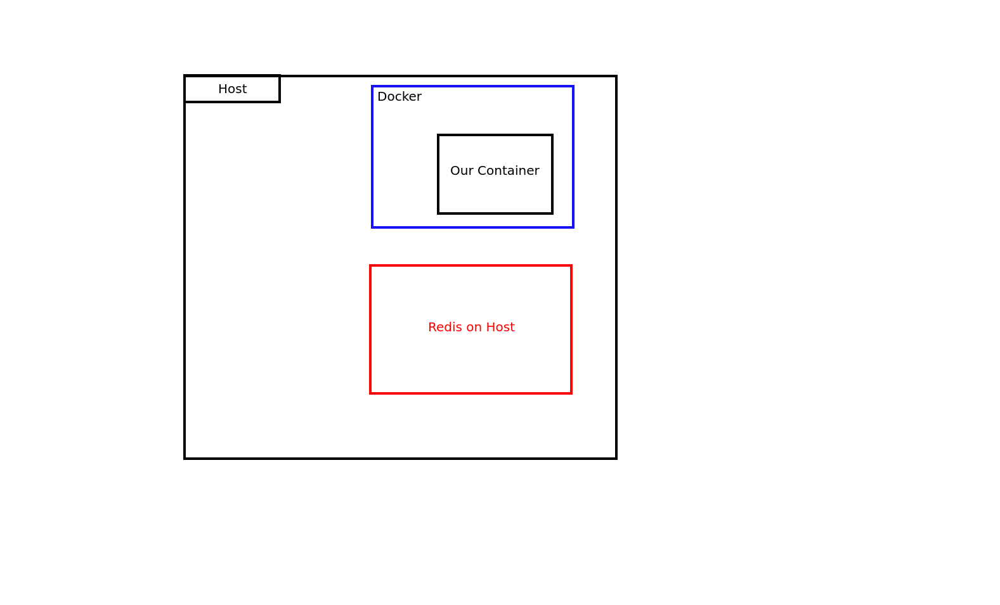
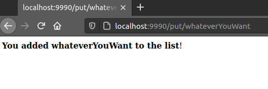
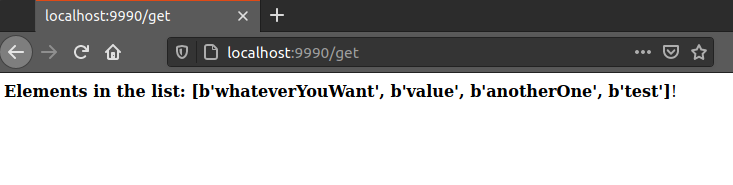

# Docker Networks

Now that we know how to work with containers as well as configure and work with the startup options for a container, we
need to know how to network them.  
Starting up your application alone isn't very useful unless it can talk to a database or another server!

Luckily, our Python app is designed to network with a database! [Redis](https://redis.io/), a key-value cache.

We will demonstrate two types of networks and how to configure your container for both scenarios.

## Host Network

The first scenario is configuring the container using your host network. In this scenario, you will have a Redis
instance running locally on your machine, and you need your container to talk to it.

**Diagram of Redis running on the host (not docker)**  


This will require configuring your container access to your host network.  
When using the host network, your container's ports are directly mapped to your host's machine, which means you also
don't need to port forward with `-p`.

In order to test this, we will need to run a local Redis server:

**WARNING:** This will install the Redis binary on your machine.  
You can follow along if you'd like, but if you don't want to install Redis on your machine, you can read along without
running the commands.

### Run Redis locally

[The official instructions are here incase the steps have changed](https://redis.io/docs/getting-started/installation/install-redis-on-linux/).

Open a new terminal and run the following commands:

```bash
sudo apt install lsb-release
curl -fsSL https://packages.redis.io/gpg | sudo gpg --dearmor -o /usr/share/keyrings/redis-archive-keyring.gpg
echo "deb [signed-by=/usr/share/keyrings/redis-archive-keyring.gpg] https://packages.redis.io/deb $(lsb_release -cs) main" | sudo tee /etc/apt/sources.list.d/redis.list
sudo apt-get update
sudo apt-get install redis
```

Once installed, Redis is running locally at `localhost:6379`. Verify this with:

```bash
redis-cli ping
```

Once we have Redis installed, let's update the configuration we created in the last lesson.  
Our `settings.yaml` has some configuration for Redis. Update your Redis settings to connect to Redis on our host network
as follows:

```yaml
redis:
  enabled: True
  host: "localhost"
  port: "6379"
```

Now that we have updated our settings, we will start our container (using the volume mount from lesson 6).  
However, we will also start our container on the host network.  
To start a container using the host network, start your container with `--network host`. (This means we don't need to
port forward)

**Can you figure out the command to run?**

Stop running containers first:

```bash
docker rm python-container -f
```

```bash
docker run \
   -it \
   -v $(pwd)/docker-app-bind:/data \
   --network host \
   --name python-container \
   python-training-container:1.0 python3 -u main.py --file /data/settings.yaml
```

Great! Our web app is running, and we have enabled Redis.  
In our browser, let's navigate to `localhost:9999/put/whatevereYouWant`.

**Storing to Redis in our app**  


We have added an item to a list! We can see all of the elements in the Redis list at `localhost:9999/get`.

**Fetching Redis through our app**  


Woohoo!! We successfully connected our container to a running version of Redis on the host machine!  
Some applications won't have Docker containers you can deploy, so connecting to the host network allows you to link into
pre-existing applications and interface with services that were deployed without Docker in mind.

However, Redis does have a Docker container deployment!  
Let's deploy Redis in a container and network the containers together!

### Stop and Uninstall Redis

```bash
/etc/init.d/redis-server stop
sudo apt remove redis
```

## Docker Bridge Network

Deploying multiple containers together is one of the best ways to manage your deployments.  
Containers can very easily talk to one another without any networking involved at all!

By default, all containers are deployed on the Docker `bridge` network, and any container can talk to one another given
that they are configured to do so.  
This means that, unless you define your own network, all deployed Docker containers can talk to one another.  
By finding the IP address of the container (using `docker inspect`), you can communicate with the container you need.

Let's try this out!

Start a Redis container with the name `redis`.

**Can you do this on your own?**  
[Source](https://hub.docker.com/_/redis)

```bash
docker run --name redis -d redis
```

Confirm it is running:

```bash
docker ps
```

Once the container is running, let's find the IP address of the container:

```bash
docker inspect redis | grep IPAddress
```

Great. Now let's update our Redis connection strings to point to the new container:

```yaml
redis:
  enabled: True
  host: "172.17.0.2"
  port: "6379"
```

And, let's run our container like before (with a port-forward):

**Can you figure out the command to run?**

Stop running containers first:

```bash
docker rm python-container -f
```

```bash
docker run \
   -it \
   -v $(pwd)/docker-app-bind:/data \
   -p 9999:9999 \
   --name python-container \
   python-training-container:1.0 python3 -u main.py --file /data/settings.yaml
```

Just like before, we are able to access the `localhost:9999/put/value` and `localhost:9999/get/` endpoints.

**However, using the default bridge network is not great.**

It allows any deployed container to talk to one another.  
Additionally, having to find the container's IP address is not reliable, and if the container shuts down, it may get
assigned a different IP address.  
To avoid this, we can use user-defined networks which allow us to use the container's name as the hostname.

## User-defined Bridge Network

Instead of using the default Docker bridge, creating your own network makes things a lot easier to manage and ensures
that only the containers you put on your network can talk to one another.

To do this, we can create our own Docker network with:

```bash
docker network create python-training-network
```

You can see a full list of networks with:

```bash
docker network list
```

Next, we need to deploy our Redis container to the network we created.  
This can be done using the `--network` flag on `docker run`.  
We saw this before with `--network host`, but this time we just name the network we just created.

Let's destroy the old containers and try this out:

```bash
docker rm python-container -f
docker rm redis -f
```

Now, let's run Redis but put it in our network:

```bash
docker run --name redis --network python-training-network -d redis
```

Since we now have a user-defined network and have named our container `redis`, we can update our connection strings one
more time.  
In the `redis.host` field, we can use the name of our container, in this case, `redis`.

Update the connection strings:

```yaml
redis:
  enabled: True
  host: "redis"
  port: "6379"
```

And launch the container in the network:

```bash
docker run \
   -d \
   -v $(pwd)/docker-app-bind:/data \
   -p 9999:9999 \
   --name python-container \
   --network python-training-network \
   python-training-container:1.0 python3 -u main.py --file /data/settings.yaml
```

Great! Check that both containers are running:

```bash
$ docker ps
CONTAINER ID   IMAGE                           COMMAND                  CREATED         STATUS         PORTS
3c17bc285843   python-training-container:1.0   "python3 -u main.py …"   3 seconds ago   Up 2 seconds   0.0.0.0:9990->9990/tcp
4650cc0d71c0   redis                           "docker-entrypoint.s…"   2 minutes ago   Up 2 minutes   6379/tcp
```

Once again, we are able to access the `localhost:9999/put/value` and `localhost:9999/get/` endpoints, confirming that
our application can talk to Redis!

## Summary

Allowing containers to communicate between one another is extremely important.  
You now know how to work with networks and enable your containers to communicate!

By now, you are a Docker expert!  
You can create Docker images, run a container, manage its volumes, and put it on a network.

Next, we are going to learn how to make our Docker container accessible to the world! (Or the company) through
an [Image registry](./8-image-registry.md).

## Navigation

Next: [Image registry](./8-image-registry.md)