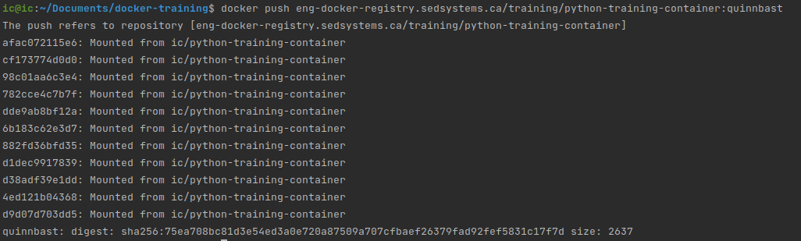
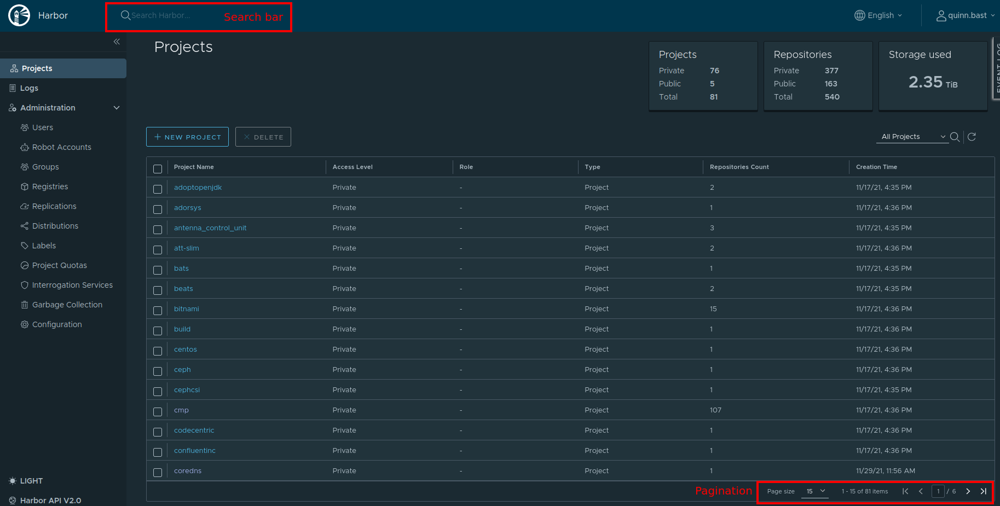
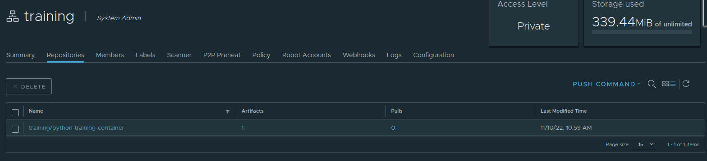
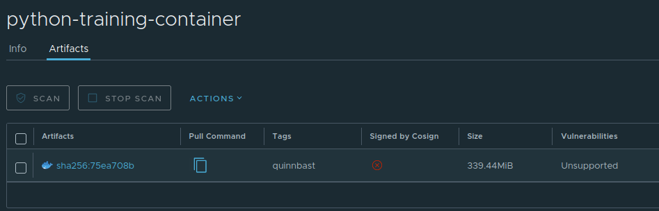
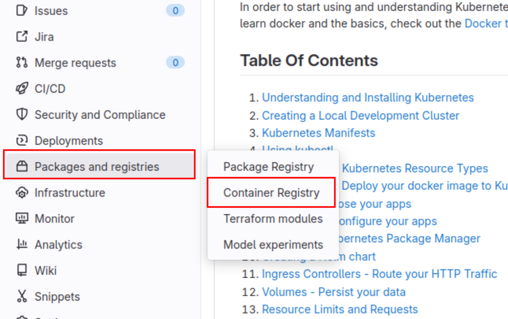

# Image Registries

An image registry is a database for storing docker images. One example of an image registry (that we have seen before)
is [Dockerhub](https://hub.docker.com/). On Dockerhub, you can freely browse and search for uploaded docker images, as
well as download them from the website.

Using an image registry allows people other than yourself to access your generated docker images. When building a docker
image with `docker build`, the image's layers are only present on your machine. In order to make your image accessible
to other people, you need to upload your docker image to an image registry.

## Private Registry

You can also host a private self-hosted registry. For this lesson, we will assume we have one available.  
In order to push docker images to an image registry, you must login to the registry. This can be done by using the
following command: `docker login <registryURL>`. We can use the following command:

```bash
docker login someRegistryUrl
```

Once executed, enter your ADFS username and password and you will be able to access any docker image that is present
within the registry. This is similar to when we used the `docker pull` command to pull an nginx or redis image from
Dockerhub.

When using `docker pull` or `docker push`, these commands will assume that if no registry is named in your docker image
that the default registry is `docker.io`. Therefore, when you run `docker pull redis`, it is the same as running the
command `docker pull docker.io/redis:latest`.

When working with a registry, unless you are using Dockerhub, all docker images must be in the following format:

```bash
<registry>/<repository>/<image>:<tag>
```

Here are some valid examples:

- docker.io/redis:latest
- testbed-registry:5000/cmp/influx-restore:1.0
- somePrivateRegistry/ic/python-training-container:1.0
- myRegistry.com/myRepo/myImage:latest

## Pushing to a Registry

Now that we have logged into the Calian docker registry, let's push a docker image to the registry so that other people
can access the docker image that we have created!

The first step is to get our docker image into the format shown above. This will ensure that running `docker push` will
put the docker image in the correct spot. Running a `docker ps`, we see the following:

```bash
$ docker image ls
REPOSITORY                  TAG       IMAGE ID       CREATED         SIZE
python-training-container   1.0       6db979b05677   2 days ago      929MB
```

Our image is just `python-training-container:1.0`. We need to re-tag our image to upload to the Calian registry. We have
seen this before, we can type `docker tag <existing> <newTag>` to give our image a new tag. Let's make the following
changes:

- Set `at-docker.eng.at.caliangroup.com` as the image registry
- Tag the image with our name, so that we don't push a docker image that already exists (so we know it is ours!)
- Use a repository called `training`
- Replace `<YOURNAMEHERE>` with your name

```bash
docker tag python-training-container:1.0 at-docker.eng.at.caliangroup.com/training/python-training-container:<YOURNAMEHERE>
```

Now we should see the tag appear when we run a `docker image ls`. We have now added the tag to our image, but we need to
upload the image to the registry. This is done with `docker push <image>`. Let's try it out:

```bash
docker push at-docker.eng.at.caliangroup.com/training/python-training-container:<YOURNAMEHERE>
```

We can see the result from the command line:

**Pushing to a private image registry**  


Additionally, we can look at our image on our private registry. Once logged
in, find the `training` project. You can either search for it in the search bar, or browse the list of projects by using
the page navigation on the bottom right.

**Viewing an image in Harbor**  


Once in the training repository, we can see a list of the docker images that have been uploaded to the repository:

**Images in the training repository**  


Clicking on our image, we can then get a list of tags that exist for that docker image.  
As we can see, our tag `quinnbast` (or your name) has been uploaded!

**Tags for the training container**  


## Pulling from a Registry

Just like `docker push`, `docker pull` does the reverse. It will load an image from the registry. Since we have uploaded
our image, we can safely delete any local references to the docker image.

Run a `docker image ls` and remove all of the images referencing the same image ID:

```bash
$ docker image ls
REPOSITORY                                                             TAG                     IMAGE ID       CREATED         SIZE
python-training-container                                              1.0                     6db979b05677   2 days ago      929MB
at-docker.eng.at.caliangroup.com/training/python-training-container   quinnbast               6db979b05677   2 days ago      929MB
```

For example, both of my images reference `6db979b05677`, let's remove the image completely:

```bash
docker image rm 6db979b05677 -f
```

The image is now completely removed from our machine.  
But wait! What if I wanted to do some more testing with that image, or what if I wanted to use that docker image still?

Well, we can just pull it down from the registry without having to build it again:

```bash
docker pull at-docker.eng.at.caliangroup.com/training/python-training-container:quinnbast
```

And the image is now back on our machine!

## Gitlab Registry

We can go through a similar workflow within Gitlab. Every Gitlab repository has an integrated docker registry that
GitLab calls the Container Registry. To find the container registry for your repository, open a GitLab repository, and
on the left side, find the "Packages and registries" menu and click "Container Registry".

**Accessing the Gitlab Container Registry**  


This is an integrated docker registry inside of GitLab, which makes it easy for CI/CD pipelines to automatically upload
docker images, as well as share docker images between collaborators for a particular project. In order to access the
GitLab registry, you need to create a Personal Access Token in GitLab that has the read_registry and write_registry
permissions. To do this, from your profile, open the "Preferences" tab for your profile in the top right corner. Once
there, select "Access Tokens" on the left side.  
If you have an Access Token with the read_registry and write_registry permissions, then perfect! Otherwise, create a new
access token (I prefer giving myself all the possible scopes) and ensure to save the token as this acts as a password
for your account.

Once you have your access token, we can login to the GitLab container registry from our command line:

```bash
docker login registry.gitlab.com
```

Enter your GitLab username and Personal Access Token as the password. Once logged in, we can use the same `docker push`
and `docker pull` commands to push and pull docker images from the registry. To push and pull from a repository's
container registry, we can use the URL:

```bash
docker push registry.gitlab.com/<PathToRepository>/<image>:<tag>
```

The path to your repository will differ, but as an example, the path for this docker-training is:  
`registry.gitlab.com/...`.

So let's add a tag to our docker image to indicate we will also upload it to the GitLab docker registry and push it!

```bash
docker tag python-training-container:1.0 example/python-training:<YOURNAMEHERE>
docker push example/python-training:<YOURNAMEHERE>
```

This is the same process we saw above, but we are just using a different URL.

## Using Tarballs

What if we are trying to upload to a site that does not have internet or has no access to a docker image registry?

Luckily, Docker allows us to save our docker images as tarballs which we can then SCP or copy around to the location we
need them. The `docker save` command allows you to save a docker image to a tar file. By default, this command writes to
stdout, but you can use the `-o` flag to specify a file name to output
to ([see the documentation here](https://docs.docker.com/engine/reference/commandline/save/)).

Let's save our docker image to a file:

```bash
docker save python-training-container:1.0 -o python-container.tar
```

Once completed, we should be able to view the file in our local directory:

```bash
$ ls
python-container.tar
```

Once we have this file, we can use SCP, put it onto a USB, or transfer the file wherever it needs to go. Once the file
is at its destination, we can load the image into the local docker cache with:

```bash
docker load -i python-container.tar
```

Voila! We have loaded the docker image from a file!

## Summary

In this lesson, we learned about how to move our images around. Using docker registries, and saving our docker image as
a tar file, we can now move our docker images around to make sure our images are accessible anywhere we need them to
be!  
In the [next lesson](./9-docker-compose.md), we will take one final look at Docker and learn how to manage and deploy
multiple containers at one time using docker-compose.

## Navigation

Next: [Docker Compose](./9-docker-compose.md)
