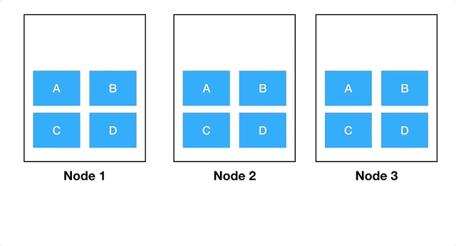

# Kubernetes Training - Hands On Basics

Kubernetes allows you to cluster containers across multiple machines.  
By the end of this training you will be a Kubernetes king!

Kubernetes is a container orchestration tool that allows you to manage  
the deployment of docker containers across multiple machines. Kubernetes  
is an extremely powerful tool for managing docker containers. Kubernetes  
can automate container rollouts, auto-restart failing containers, manage  
hardware failures, and has many more useful features.

In order to start using and understanding Kubernetes you **must** have a  
good and solid understanding of Docker. Without this knowledge, it is  
likely that some parts of this tutorial might be confusing or not fully  
make sense. To learn Docker and the basics, check out the  
[Docker training repository](https://gitlab.com/calianat/software/training/docker-training).

## Table Of Contents

1. Understanding and Installing Kubernetes (This page)  
2. [Creating a Local Development Cluster](1-localCluster)  
3. [Kubernetes Manifests](2-manifests)  
4. [Using kubectl](3-kubectl)  
5. [Understanding Kubernetes Resource Types](4-resourceTypes)  
6. [Deployments - Deploy your Docker image to Kubernetes](5-deployments)  
7. [Services - Expose your apps](6-services)  
8. [ConfigMap - Configure your apps](7-configMaps)  
9. [Helm - The Kubernetes Package Manager](8-helm)  
10. [Creating a Helm Chart](9-helmCharts)  
11. [Ingress Controllers - Route your HTTP Traffic](10-ingress)  
12. [Volumes - Persist your data](11-persistentVolumes)  
13. [StatefulSets - Sticky pods](12-statefulsets)  
14. [ReplicaSet - Distributed apps](13-replicasets)  
15. [Resource Limits and Requests](14-resourceLimits)  
16. [Priority Classes - Boot useless pods!](15-priorityClasses)  
17. [Observability - See app performance](16-metricStack)  
18. [Logging - View logs in one place](17-loggingStack)  
19. [ArgoCD - One button deployments](18-argocd)

### Extras:

- [Service Meshes](19-serviceMeshes)  
- [What are Custom Resource Definitions (CRDs)?](20-customResourceDefinitions)  
- [Kubernetes Operators](21-kubernetesOperators)  
- [Kustomize - For bad Helm Charts](22-kustomize)  

## Understanding Kubernetes

So, you’ve probably heard about Kubernetes but have no idea what it does  
or how it is useful. Fear not, this guide will walk you through the  
basics of Kubernetes so that you can start using it on your own  
projects.

Kubernetes is a tool to help manage Docker container rollouts across  
multiple servers. [Docker Compose](https://docs.docker.com/compose/) is a  
popular tool for managing the deployment of Docker containers; however,  
it does not allow containers to be spread out across multiple physical  
machines. Therefore, if your machine goes offline, Docker Compose has no  
ability to ensure your software is still running somewhere else. This is  
the main reason why you would want to use Kubernetes: to start up Docker  
containers with the ability to have them re-provisioned to another  
machine in the case that a machine goes down. This supports  
High-Availability (HA) deployments, as it allows you to lose  
connectivity to an entire machine while still being able to access your  
services.

The following gif shows a very good example of what Kubernetes does:



In the first stage, we see Node 3 goes offline. Kubernetes is able to  
automatically balance the running services from Node 3 onto the other  
available hardware. In the next stage, Node 3 comes back online, and we  
start to provision a 'v2' version of app A. Kubernetes supports  
'roll-outs,' and will slowly take down the previous version of app  
A but ensures that traffic can still be sent to application A.  
Once all the v2 instances are created, Kubernetes is able to remove  
the last remaining instance of the A application and ensures that  
new traffic is routed to the v2 application, ensuring that there is  
no service disruption during an upgrade.

These are just a few of the features of Kubernetes, but the main point  
is: It helps deploy Docker containers to many machines, which ensures  
HA.

## Prerequisites

Before getting started with this tutorial, there are a few tools that  
you are going to need installed on your machine.

### Docker

A tool for running Docker containers. If you don’t have Docker installed  
and have never used Docker, this tutorial is not for you. Please see the  
[Docker training](../../docker-training/README.md)  
first before continuing with this tutorial, otherwise, you will be extremely lost.

To install, follow the steps below depending on your OS:

- [Windows](https://docs.docker.com/desktop/install/windows-install/)  
- [MacOS](https://docs.docker.com/desktop/install/mac-install/)  
- [Linux](https://docs.docker.com/engine/install/#server)  
  - Select your distribution from the "Server" section  

To check if you have Docker installed, run the following command:

```shell
docker version
```

If you have Docker installed, this will print out some information about  
Docker to your machine. If you do not have it installed, it will fail  
with `command not found`.

**Note:** Sometimes, after the initial installation, you may need to run  
Docker as `sudo`.

### Kubectl

A command-line tool to interact with a Kubernetes cluster.

```shell
sudo wget https://dl.k8s.io/release/v1.26.0/bin/linux/amd64/kubectl -P /usr/local/bin
sudo chmod 755 /usr/local/bin/kubectl
```

Verify with:

```shell
kubectl version
```

### yq

A command-line JSON/YAML parser and formatter. Required for Helm.

```shell
sudo wget https://github.com/mikefarah/yq/releases/download/v4.30.6/yq_linux_amd64 -P /usr/local/bin
sudo mv /usr/local/bin/yq_linux_amd64 /usr/local/bin/yq
sudo chmod 755 /usr/local/bin/yq
```

Verify with:

```shell
yq --version
```

### Helm

A Kubernetes package manager to more easily bundle and install  
Kubernetes resources.

```shell
sudo wget https://get.helm.sh/helm-v3.10.3-linux-amd64.tar.gz -P /usr/local/bin
sudo tar -xzf /usr/local/bin/helm-v3.10.3-linux-amd64.tar.gz
sudo mv /usr/local/bin/linux-amd64/helm /usr/local/bin/helm
sudo chmod 755 /usr/local/bin/helm
```

Verify with:

```shell
helm version
```

### Local Kubernetes Environment

A local Kubernetes environment is required to start up a local  
development environment for Kubernetes. There are a few different tools  
and options for this, and they will be explained in the next section.

## Navigation

Next: [Creating a Local Development Cluster](1-localCluster.md)