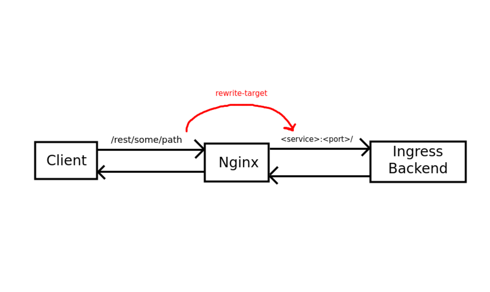
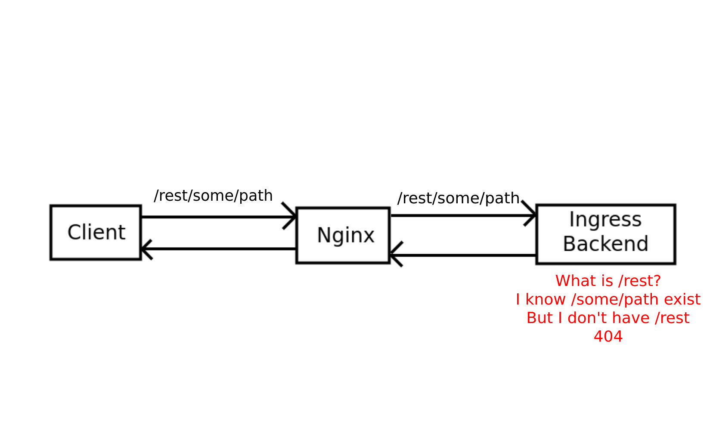
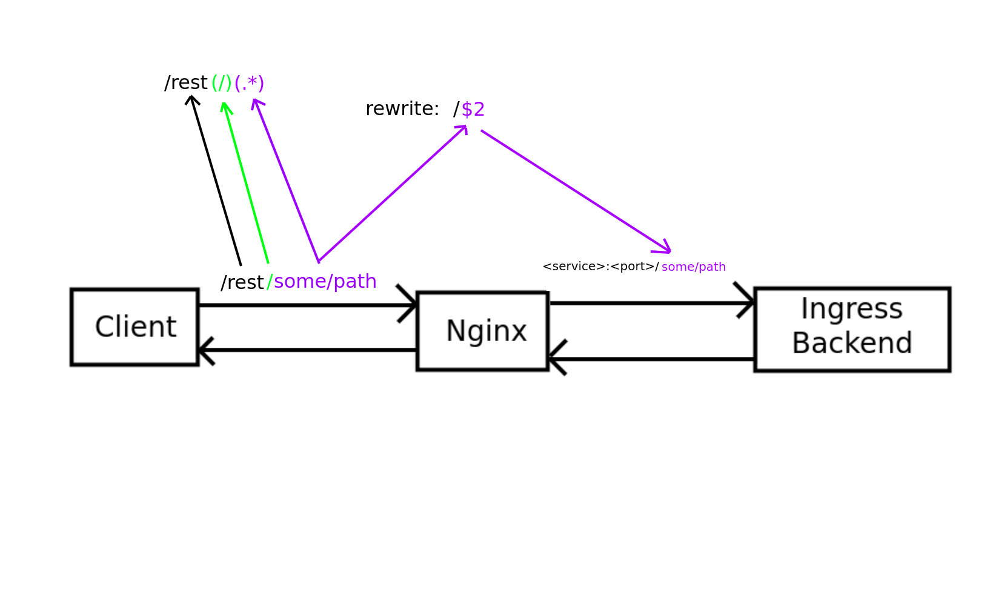

# Ingress - Routing your Web Traffic

> NOTE: This Document is maintained in Gitlab and mirrored to Confluence.
> Make changes to the [Gitlab repository](https://gitlab.com/calianat/software/training/kubernetes-training).

> NOTE: View this training as a [video series here](https://caliangroup.sharepoint.com/sites/ATSEngineering/Shared%20Documents/Software%20Training/Kubernetes%20Training/).


When we went over [Kubernetes Services](./6-services.md), we mentioned that we could expose apps in a variety of ways.
NodePort and LoadBalancer services allow us to expose apps on specific ports, however, that can get extremely confusing!
How are you supposed to remember that "Grafana is 30001, Prometheus is 30002, Our REST app is 30003...".
Wouldn't it be easier if we could expose all web traffic on port 80 but differentiate between them by the URL?
Using `/grafana` for Grafana, and `/prometheus` for Prometheus make it much easier to understand.

By using Ingress (and an Ingress Controller), we can allow any incoming web traffic to get router to the appropriate place.

## Nginx Ingress Controller

In order for this to work, we need to use an [Ingress Controller](https://kubernetes.io/docs/concepts/services-networking/ingress-controllers/).
In Kubernetes, and Ingress Controller is a web traffic handler which makes the decisions about where web traffic should be forwarded.
In essence, you are essentially just telling Kubernetes what web proxy you want to use.

Kubernetes has a large selection of potentially supported ingress controllers [listed here](https://kubernetes.io/docs/concepts/services-networking/ingress-controllers/),
however, the ones that are officially supported by Kubernetes are AWS, GCE, and nginx. So bascially, if you're not in the cloud, nginx Ingress Controller is the way to go.

To use `nginx` to control all of our web traffic, just [follow the guide here](https://kubernetes.github.io/ingress-nginx/deploy/#quick-start).
First, we need to deploy the `ingress-nginx` helm chart (or, alternatively, we can apply the raw manifest with `kubectl apply -f`).

Let's deploy the ingress controller. After looking at the helm chart's default `values.yaml`, they should suffice and we don't need to configure any additional settings.

Note: For production clusters you will want to configure the service to be a LoadBalancer on your floating IP.

```shell
helm upgrade --install ingress-nginx ingress-nginx \
  --repo https://kubernetes.github.io/ingress-nginx \
  --namespace ingress-nginx --create-namespace
```

Now, check if the pod has started:

```shell
kubectl get pods -A
```

Great! Now, because we are testing in a KinD cluster, all of our exposed Kubernetes ports are hidden by docker.
For local testing, we caan port-forward the Kubernetes service just to see what it would look like.

Let's port-forward the service (for non-local clusters this is not required):

```shell
kubectl port-forward --namespace=ingress-nginx service/ingress-nginx-controller 9123:80
```

This will ensure that any web traffic that comes into the cluster (through the ingress controller), can be sent from 8080 on your machine.
Navigating to `http://localhost:9123` should result in a "404 not found" page.
This is exactly what we would expect. This means that nginx is running, but we have not yet configured any routes for it.

In order to add routes to the ingress controller, we need to create an Ingress.

Note for production:

In the cluster, the service is using a `LoadBalancer` service type.
In Kubernetes, this means that the service will take control of the requested IP/port combination (if it is available).
In production clusters, you would want to set your ingress controller to control your cluster's floating IP on port 80 so that any incoming web traffic on the IP gets sent to the `nginx` ingress controller.

## Creating an Ingress

Once you have an `nginx` pod deployed and acting as your Ingress Controller, it is able to accept all web traffic.
To allow it to properly route to our applications, we need to give it an `Ingress`.

[Ingress](https://kubernetes.io/docs/concepts/services-networking/ingress/) is just another Kubernetes resource type and the Kubernetes documentation outlines how we can make a k8s manifest to apply an Ingress.

Looking at the documentation, we see that a minimal Ingress can be created like this:

```yaml
apiVersion: networking.k8s.io/v1
kind: Ingress
metadata:
  # Name the ingress
  name: minimal-ingress

  # Setup some annotations
  annotations:
    # Tell nginx to rewrite the URL.
    # This is VERY important and I will explain this more in detail in a bit.
    nginx.ingress.kubernetes.io/rewrite-target: /
spec:
  # Indicate what ingress class (which ingress Controller) should be used
  # We will change this to be `nginx`
  ingressClassName: nginx-example
  rules:
  - http:
      paths:
      # A list of paths to accept
      # Here `/testpath` should accept some traffic
      - path: /testpath
        pathType: Prefix
        # Indicate where the traffic should go:
        backend:
          service:
            # We send traffic to the k8s Service named "test" on port 80
            name: test
            port:
              number: 80
```

We should have enough details here to fill in this Ingress manifest.
Get our service name and port with `kubectl get svc -A`, and use a route of `/rest`.

### What would our Ingress look like?

```yaml
apiVersion: networking.k8s.io/v1
kind: Ingress
metadata:
  # Name the ingress
  name: python-rest-ingress

  annotations:
    nginx.ingress.kubernetes.io/rewrite-target: /
spec:
  ingressClassName: nginx
  rules:
  - http:
      paths:
      - path: /rest
        pathType: Prefix
        backend:
          service:
            name: python-rest-service
            port:
              number: 8080
```

Let's apply this manifest to our cluster.

```shell
kubectl apply -f 6-Ingress.yaml -n calian
```

Great now that the ingress is applied, let's try accessing our app!
Navigate to `http://localhost:91234/rest` (port is only needed in local development environments where we are port-forwarding).

We should see the "Hello World!" page to our app!
However, try accessing some other locations, like:

* http://localhost:91234/rest/cowsay
* http://localhost:91234/rest/config

Well that's weird... They all lead back to the "Hello World" page. What is happening here?

## Understanding URL Rewrites

You may have noticed that in our ingress definition, we specified:

```yaml
  annotations:
    nginx.ingress.kubernetes.io/rewrite-target: /
```

This is telling the `nginx` server to make any traffic on `/rest`, to get re-written to `/` before it hits the actual service.
So even though you are sending `/rest/this/is/all/extra/paths/that/should/work`, `nginx` is rewriting the URL so that your app only ever sees requests for `/`.



Well okay. Let's just remove the re-write altogether...
Well... Not so fast.. Our app knows about `/cowsay`, but it has no idea what `/rest/cowsay` means...



## Solving URL redirects

There are two ways to solve this.

First, we could check if the application allows you to configure the `basePath`.

Some apps, like Grafana, or others, may allow users to configure the applications `baseUrl`.
This means that setting the `baseUrl` to something like `/grafana` will tell grafana to serve all of their web endpoints from `/grafana` instead of the default `/`.

If you can do this, then you don't need to use URL rewrites at all, and can simply use the `Ingress` without a `rewrite-target`.

Second, if you cannot configure this, use a regex `rewrite-target`.

Many apps will not have this configuration. Specifically, our REST Api does not have this configuration and therefore we need to use `rewrite-target` in order to get things to work.

Luckily, `rewrite-target` accepts a regex expression and also allows using capture groups.
If you are not familiar with capture groups, in regex, the expression `(www).*` indicates a capture group through the use of `()`. In this case, "www" is a capture group.
This is mainly useful for applications where you might want to capture various expressions or values from one regex and use each capture.

For us, we want to use capture groups to match anything after the initial `/path` and rewrite the URL to not include the initial `/path` when it hits the app.
Let's see what this would look like:

```yaml
apiVersion: networking.k8s.io/v1
kind: Ingress
metadata:
  name: python-rest-ingress
  annotations:
    # Here we indicate that $2, or, the second capture group, should be used.
    # This is the real URL that our app will see.
    nginx.ingress.kubernetes.io/rewrite-target: /$2
spec:
  rules:
    - http:
        paths:
          # Indicate that an optional / can occur, and that anything after that (.*) is a capture group.
          # We need to capture the first optional "/", otherwise the .* will be greedy and take it.
          - path: /rest(/)(.*)
            pathType: Prefix
            backend:
              service:
                name: python-rest-service
                port:
                  number: 8080
```



Using this Regex re-write, the application is able to properly respond to and serve trafic as if the original ingress path didn't exist.
Understanding URL rewrites is the min point of confusion for Ingress controllers so understanding this will make you a pro when working with Ingress.

Let's apply this new manifest with URL rewrites and see what happens!

```shell
# You may need to delete the only one first
kubectl delete -f ../manifests/6-Ingress.yaml -n calian
kubectl apply -f ../manifests/7-IngressCorrected.yaml -n calian
```

Now we can try navigating to one of our more complex URLs like:

* http://localhost:91234/rest/cowsay
* http://localhost:91234/rest/config

And what do you know! They both work and our app is functioning as expected while being served through an Ingress.

Note:

You can deploy many `Ingress` resources, one for each app, all of your configurations don't need to be in one Ingress manifest.

## Summary

In this lesson we learnt how to use the `Ingress` resource type and how it works in conjunction with the `Ingress Controller`.
We can now configure all of our web traffic in our cluster to be served through one (or a cluster of) `nginx` web server(s).

In the next lesson we will finally take a look at data persistence and how we can ensure our services don't lose their data.

## Navigation

[Home](../README.md)

Next: [Volumes](./11-persistentVolumes.md)