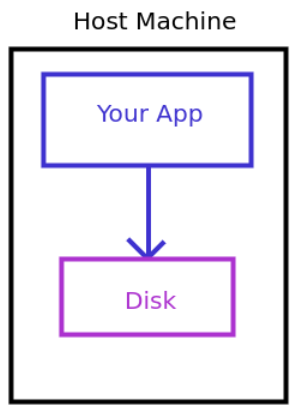
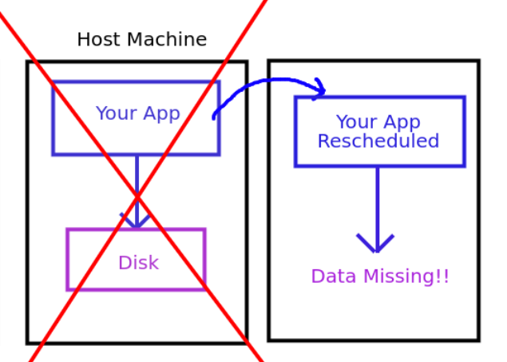

# Persistent Volumes - Storing your Data

Welcome to the most difficult part of Kubernetes: persistent storage.  
This is a complex topic and can be difficult to understand.

## Why is persistence difficult to understand in Kubernetes?

Simply because Kubernetes is a distributed system.  
In docker-compose, you can mount a volume to a container and it will store data on the host's filesystem.  
You don't need to worry about anything else, it "just works". But in Kubernetes, you have multiple host machines and you
can't just store your files in one place.

Within Kubernetes there are two potential solutions for storing data:

### Local Volumes

- Local volumes are tied to a specific node and are not recommended for production.
- If your host goes down, you lose access to your data, and thus your application cannot start.

When using docker or docker compose, this is how things work. Your app binds itself to a local directory on the host.

#### Local Disk Storage



However, if the host goes down, you lose access to your data.

#### Local Volume Missing on Host Failure



Therefore, it's essentially a requirement in Kubernetes to use distributed storage.

### Distributed Volumes

- Distributed volumes replicate your data across multiple nodes.
- This is the preferred solution for production, as if a single node goes down, your application can simply restart on a
  node that has a replica.

99% of the time, you want your application available 24/7, and thus you will want to use a system that allows you to
replicate your data in a distributed way.  
This is hard to do.

That being said, let's dive into the world of persistent storage in Kubernetes.

## Persistent Volume Claims

### PVC


In Kubernetes, your application asks for storage using a Persistent Volume Claim (PVC). Applications specify the amount
of storage that is needed as well as the storage class to use.

A storage class explains how the requested storage should be provisioned.  
More on this in the next section.

An example PVC is shown below:

```yaml
apiVersion: v1
kind: PersistentVolumeClaim
metadata:
  name: my-pvc
spec:
  # Here, we specify what storage class we want to use
  # More details about this in the next section.
  storageClassName: local
  # Then we configure what mode we want the file system to be in
  accessModes:
    - ReadWriteOnce
  # Finally, we specify the amount of storage that we want
  resources:
    requests:
      storage: 3Gi
```

This is a very important concept to understand.  
When you create a PVC, you are not creating storage, it is simply a request.

## What is a Storage Class?

### Storage Class


Storage classes are used to define the type of storage that is needed.  
For example, you can have a storage class that provisions storage on a local disk, or a storage class that provisions
storage on a distributed system.  
The nice thing about Kubernetes is that it doesn't care where your storage is being provided from.  
The only thing Kubernetes needs is to allow your cluster to provision storage, which requires your cluster to have a
storage class defined.

Storage classes are defined in the cluster by the cluster administrator.  
Some examples of storage classes that can exist within a cluster are:

- [Local Storage](https://kubernetes.io/docs/concepts/storage/storage-classes/#local)
- [AWS EBS](https://aws.amazon.com/ebs/)
- [Azure Disk](https://azure.microsoft.com/en-ca/products/storage/disks)
- [Google Persistent Disk](https://cloud.google.com/persistent-disk)
- [Rook-Ceph](https://rook.io/)
- [Longhorn](https://longhorn.io/)
- [OpenEBS (MayaStor)](https://openebs.io/)
- [Portworx](https://portworx.com/)
- Many more...

In order to install one of these storage classes, you will need to follow the instructions provided by the storage class
provider on their website.  
Most storage class providers will provide a [helm chart](../helm.adoc) that you can use to install the storage class.

More often than not, the storage class provider will require each machine in the cluster to have a specific driver
installed.  
This driver will allow the machine to communicate with the storage system, such as ISCSI or NFS. Keep this in mind, as
this means when you provision your machines, you will need to install these drivers as part of the installation of the
cluster.

Linking this back to the previous section:  
When you create a PVC, you will specify the storage class that you want to use. A cluster may have multiple storage
classes, and you can choose which one you want to use when you create the PVC.  
For example, you may have a storage class that provisions storage on a local disk, and another storage class that
provisions storage on a distributed system.  
This allows applications to choose the type of storage that they need through a Persistent Volume Claim.

## What is a Persistent Volume?

### Persistent Volume


So, your application requests storage using a PVC, and your PVC asks for storage from a Storage Class within the
cluster.  
What happens next?

When a PVC is created, it will look for a Persistent Volume (PV) that matches the request.  
A Persistent Volume is an actual piece of block storage that provides usable disk to applications (provided by the
storage provider).  
If an existing Persistent Volume is found, the PVC will bind to the PV and the application will be able to use the
storage.  
If no Persistent Volume is found, the PVC will remain in a pending state until a Persistent Volume is created that
matches the request.

The storage class providers will watch the Kubernetes resources in the cluster and look for PVCs that match their
storage class.  
When a PVC exists with no matching Persistent Volume, the storage class will then check if there is any storage
available that matches the request.  
If there is storage available, the storage class will provision the storage and create a Persistent Volume (PV).

## Example

Let's walk through an example of how this all works using OpennEBS'
s [localpv-provisioner](https://openebs.github.io/dynamic-localpv-provisioner/).

**WARNING:** While local-pv can be useful, it is not recommended for production as it is not distributed.  
If your pod gets scheduled on a different node, you will lose access to any data that was previously written to the old
host.

**WARNING: AGAIN, DO NOT USE THIS IN PRODUCTION.**

Local-pv-provisioner is a storage class that provisions storage on the local disk of the host.  
To install this storage class, we can use the localpv-provisioner helm chart:

```bash
helm repo add openebs-localpv https://openebs.github.io/dynamic-localpv-provisioner
helm repo update
```

Once we have added the helm chart, let's take a look at their `values.yaml`
in [their helm chart](https://github.com/openebs/dynamic-localpv-provisioner/tree/develop/deploy/helm/charts).

There are two things to note in the `values.yaml` that we may want to change:

1. **`basePath`**: Indicates the path on the filesystem where the storage will be provisioned.  
   Modify this to the directory of your choice (or leave it as the default).

2. **`hostpathClass.name`**: Indicates the name of the storage class that will be created.  
   This is the name we need to use when requesting storage in our PVC.

Personally, I don't think anything needs to be changed at all to make things work like we want, so we can just install
the helm chart:

```bash
helm install localpv-provisioner openebs-localpv/dynamic-localpv-provisioner --namespace openebs --create-namespace
```

Now that we have the storage class installed, we can create a Persistent Volume Claim that requests some data from the
storage class:

```yaml
apiVersion: v1
kind: PersistentVolumeClaim
metadata:
  name: my-pvc
spec:
  # NOTE: The storage class name must match the name of the storage class you installed.
  # The default is openebs-hostpath for localpv-provisioner
  storageClassName: openebs-hostpath
  accessModes:
    - ReadWriteOnce
  resources:
    requests:
      storage: 3Gi
```

Finally, after creating the PVC, we can create a pod that requests use of the PVC:

```yaml
apiVersion: v1
kind: Pod
metadata:
  name: my-pod
spec:
  containers:
  - name: my-container
    image: nginx
    # Here, we indicate that our container should mount the volume at /data
    volumeMounts:
    - mountPath: "/data"
      name: my-volume
  # And here, we indicate that the volume is being provided through a PVC
  # Note that the name here matches the `name` of the PVC we created
  volumes:
  - name: my-volume
    persistentVolumeClaim:
      claimName: my-pvc
```

When the pod is created, the PVC will look for a Persistent Volume that matches the request.  
The PVC will then bind to the Persistent Volume, and the pod will be able to use the storage.  
Because of the node affinity, the pod will always be scheduled on the node with the storage, and will always have access
to the storage.  
However, this means that if the node is offline, the pod will not be able to start.

## Conclusion

Persistent storage in Kubernetes is a complex topic, and this just scratched the surface.  
It is important to understand the difference between local and distributed storage, and to understand the concepts of
Persistent Volumes, Persistent Volume Claims, and Storage Classes.

In production, the type of storage that you might want to use depends on a number of factors which we will look at in
the next two sections.  
Stateful sets allow us to use Local Volumes while ReplicaSets require distributed storage.

In production, you will almost certainly want to use distributed storage, as it will replicate your data across multiple
nodes.  
This will ensure that your application is always available, even if a node goes down.

In the next section, we will look at how you can use Stateful Sets to manage your applications that require persistent
storage.

## Navigation

[Home](../README.md)

Next: [Stateful Sets](12-statefulsets.md)