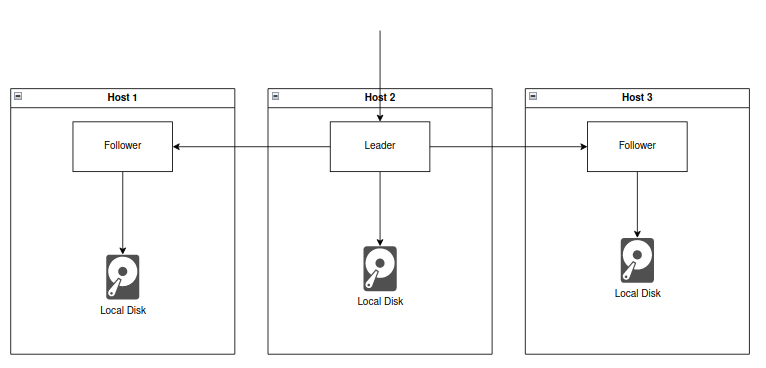

# Stateful Sets

## Stateful Sets


In the last lesson, we learned about Persistent Volumes and how to use them to store application data.  
When storing data, using a local provisioner is only recommended for very specific scenarios.  
These scenarios include when the application is designed to replicate itself and sync data between replicas using local
disk.

Let's take a look at how this works and the scenarios where this applies.

## How can applications be replicated?

Often times third party database applications are designed to be deployed in a replicated manner.  
This means that the application can be run with multiple instances which will work together to sync and share their
state between replicas.  
Under the hood the applications typically use a local disk to store local state, but sync their state at the software
layer over REST, gRPC, etc.  
This is a common pattern in distributed systems because writing to local disk is *much faster* than attempting to write
to a remote replicated disk.

Usually this is done within databases like MySQL, Postgres, Redis, and MongoDB, as well as distributed systems like
Kafka, Cassandra, ElasticSearch, and Loki.  
Each of these applications has a deployment that is able to replicate their data across multiple instances while each
replica only writes to the local disk.

An image of this is shown below:

### Local Disk Replication



Even if one of the applications dies, there are other replicas that can take over.  
In order to deploy applications like this to Kubernetes, we need to use StatefulSets.

**NOTE:** It is important to NOT use distributed storage for your StatefulSet workloads.  
If the StatefulSet is designed to replicate data, it will do so at the application layer.  
Using distributed storage will only slow down the application and cause you to store data in multiple places.

## What is a StatefulSet?

A StatefulSet is a Kubernetes resource that is used to manage stateful applications.  
The main advantage to StatefulSets is that they provide a "sticky" identity for each pod in the set.  
This means that each pod will tied to a particular host machine and as a result, will have a predictable hostname and
DNS entry, and always have access to the same disk.

We use StatefulSets to:

* Deploy N replicas of an application, but bind each replica to a specific host machine.
* Ensure each replica has a predictable hostname and DNS entry.
* Guarantee the same storage system for the application.

## How do StatefulSets work?

StatefulSets work by creating a headless service for the pods in the set.  
This service is used to create a DNS entry for each pod in the set.  
The Kubernetes DNS entries are created in the following format:

```
<hostname>-<ordinal>.<service-name>.<namespace>.svc.cluster.local
```

Where:

* `<hostname>` is the name of the StatefulSet.
* `<ordinal>` is the number of the pod in the set (think id).
* `<service-name>` is the name of the headless service.
* `<namespace>` is the namespace where the StatefulSet is deployed.

For example, if we have a StatefulSet named `mysql` with 3 replicas in the `default` namespace, the Kubernetes service
DNS entries would be:

```
mysql-0.mysql.default.svc.cluster.local
mysql-1.mysql.default.svc.cluster.local
mysql-2.mysql.default.svc.cluster.local
```

Because the DNS entries are predictable, replicated applications can use the predictable DNS names to contact the other
replicas within the set for data replication.

## How do I create a StatefulSet?

Generally, you won't need to create a StatefulSet yourself (unless for some reason you created a replicated database).  
Usually you will use a Helm chart or a Kubernetes Operator where the creators have defined a StatefulSet.

However, if you want to create a StatefulSet yourself, you can look at
the [Kubernetes documentation](https://kubernetes.io/docs/concepts/workloads/controllers/statefulset/).

But to get some experience using StatefulSets, let's deploy our web server as a StatefulSet just to see what happens.

In order to properly see what is going to happen, we need to restart our minikube/KinD clusters and tell them that the
cluster is going to have more than one node.  
[This article](https://mcvidanagama.medium.com/set-up-a-multi-node-kubernetes-cluster-locally-using-kind-eafd46dd63e5)
explains adding local nodes to KinD.  
And for Minikube, we can teardown the cluster and use the command `minikube start --nodes 3` when starting your cluster.

### KinD

First, create a file, `kind.yaml`. This will act as a configuration file for KinD so that KinD knows how to create the
cluster each time it starts.  
Within the file, add the following content:

```yaml
kind: Cluster
apiVersion: kind.x-k8s.io/v1alpha4
nodes:
- role: control-plane
  kubeadmConfigPatches:
  - |
    kind: ClusterConfiguration
    apiServer:
        extraArgs:
          default-not-ready-toleration-seconds: "30"
          default-unreachable-toleration-seconds: "30"
- role: worker
- role: worker
- role: worker
```

**NOTE:** There is something called a "pod eviction timeout" in Kubernetes.  
This timeout is the time it takes for Kubernetes to detect a node failure and reschedule a pod.  
By default, this is 5 minutes, but that is far too long for us to wait.  
So this configuration file sets the pod eviction timeout to be 1 minute.

This creates 4 nodes, where one is a control plane, and three are workers.  
Once created, destroy your old cluster, and start the new one:

```bash
kind delete cluster --name kind
kind create cluster --name kind --config kind.yaml
```

Once the cluster has restarted, check to see that multiple nodes are in the cluster with:

```bash
$ kubectl get nodes
NAME                 STATUS   ROLES    AGE   VERSION
kind-control-plane   Ready    master   82s   v1.18.2
kind-worker          Ready    <none>   46s   v1.18.2
kind-worker2         Ready    <none>   46s   v1.18.2
kind-worker3         Ready    <none>   46s   v1.18.2
```

You can also see each "node" acting as a container in KinD by listing your running docker containers:

```bash
$ docker ps
CONTAINER ID   IMAGE                  COMMAND                  CREATED              STATUS              PORTS                                                                         NAMES
00a2b2ef6bcc   kindest/node:v1.18.2   "/usr/local/bin/entr…"   About a minute ago   Up About a minute   127.0.0.1:34497->6443/tcp                                                     kind-control-plane
03a8c21a7a19   kindest/node:v1.18.2   "/usr/local/bin/entr…"   About a minute ago   Up About a minute                                                                                 kind-worker
f6bd4087985a   kindest/node:v1.18.2   "/usr/local/bin/entr…"   About a minute ago   Up About a minute                                                                                 kind-worker2
14f13f8a9g41   kindest/node:v1.18.2   "/usr/local/bin/entr…"   About a minute ago   Up About a minute                                                                                 kind-worker3
```

### Minikube

TODO.

## Deploying a StatefulSet

In order to deploy a StatefulSet, let's just change our previous helm chart to now deploy as a StatefulSet instead of a
Deployment.  
To do this, navigate to `./charts/ourChart/templates/deployment.yaml` and change the `kind` from `Deployment` to
`StatefulSet`.

Additionally, add the following two lines to the `spec`:

```yaml
spec:
  serviceName: "python-rest-service"
  replicas: 2
```

Once changed, run the following commands to deploy our app as a stateful set:

```bash
cd charts/ourChart
helm install python-sts ./ourChart
```

**NOTE:** Because this is a new KinD cluster, we need to re-add the docker image to KinD to allow the image to be
pulled:

```bash
kind load docker-image at-docker.eng.at.caliangroup.com/training/python-training-container:quinnbast
```

Once the image has loaded, let's look at our app (Note: using `-o wide` here tells the output to show more details,
including the name of the node each pod is on):

```bash
$ kubectl get pods -A -o wide
NAMESPACE            NAME                                         READY   STATUS    RESTARTS   AGE     IP           NODE                 NOMINATED NODE   READINESS GATES
default              python-rest-api-0                            1/1     Running   0          4m34s   10.244.2.2   kind-worker          <none>           <none>
default              python-rest-api-1                            1/1     Running   2          17m     10.244.1.2   kind-worker2         <none>           <none>
```

Some notes to observe here:

- Each app is on a separate host. Statefulsets will not allow two pods to be on the same host.
- The pods have a specific name, `python-rest-api-0` and `python-rest-api-1`.
- The pods are bound to a specific node, `kind-worker` and `kind-worker2`.

## Simulating a Failure

In order to see how stateful sets react during an outage, let's simulate a failure.  
First, make note of the name of the nodes that one of the pods is running on, as we need the name of the node to stop
it.  
Next, using the node name, we will "simulate" a failure by stopping the docker container that KinD is running.

To do this, list your running docker images and find the container for the `kind-worker` where one of your pods was
scheduled.  
For me, I will be stopping `kind-worker` because my pod was on this host.

```bash
$ docker ps
CONTAINER ID   IMAGE                  COMMAND                  CREATED              STATUS              PORTS                                                                         NAMES
00a2b2ef6bcc   kindest/node:v1.18.2   "/usr/local/bin/entr…"   About a minute ago   Up About a minute   127.0.0.1:34497->6443/tcp                                                     kind-control-plane
03a8c21a7a19   kindest/node:v1.18.2   "/usr/local/bin/entr…"   About a minute ago   Up About a minute                                                                                 kind-worker
f6bd4087985a   kindest/node:v1.18.2   "/usr/local/bin/entr…"   About a minute ago   Up About a minute                                                                                 kind-worker2
14f13f8a9g41   kindest/node:v1.18.2   "/usr/local/bin/entr…"   About a minute ago   Up About a minute                                                                                 kind-worker3
```

Now, stop the worker container to simulate a failure:

```bash
docker stop kind-worker
```

Kubernetes detects that the node is down if we run `kubectl get nodes`, however the pod will stay "Running".  
This is because of something called the "Pod eviction timeout" - which is the time it takes for Kubernetes to detect a
node failure and reschedule the pod.  
By default, this timeout is 5 minutes, but we changed it to be 1 minute. This means that until a node has been offline
for over 1 minute, a pod will still be considered "Running".

Let's wait 1 minute and we will eventually see:

```bash
$ kubectl get pods -A
NAMESPACE            NAME                                         READY   STATUS        RESTARTS   AGE
default              python-rest-api-0                            1/1     Terminating   0          8m51s
default              python-rest-api-1                            1/1     Running       2          9m15s
```

Our pod is "Terminating".  
However, it will NOT get rescheduled!  
It will stay in the "Terminating" state until the node comes back online.  
This is because StatefulSets are designed to keep the same pod on the same node, even if the node goes down.

If we bring the node back online, the pod will eventually be rescheduled and start running again.  
We can bring the node back online with:

```bash
docker start kind-worker
```

Once we have restarted the node, we can see that the pod goes back to normal and is fully functional!

This was just a quick example to show how stateful sets work in action.  
The key takeaways are:

- StatefulSets do NOT get rescheduled if a node goes down.
- StatefulSets are designed to be used when using local storage for data replication.

## Navigation

In the next lesson, we will learn about ReplicaSets, which will be able to get rescheduled if a node goes down.

[Home](../README.md)

Next: [Replica Sets - Distributed Apps](../13-replicasets.md)
