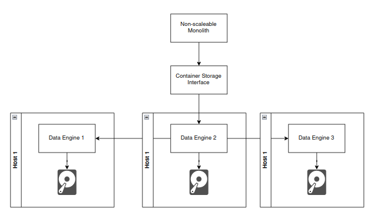

# Replica Sets

## ReplicaSet


In the previous lesson, we talked about StatefulSets.  
StatefulSets are used to manage stateful applications in Kubernetes and are typically used for applications like
databases.

However, what if we created an application that doesn't replicate its state at the application layer but we still want
it to be able to scale?  
This is where ReplicaSets come in.

## What is a ReplicaSet?

A ReplicaSet is a Kubernetes resource that ensures a specified number of pod replicas are running at any given time.  
ReplicaSets do not tie the pods to a specific node, so they can be scheduled on any node in the cluster.  
This means if a node goes down, the ReplicaSet will ensure that the pods are rescheduled on another node.

## Storage in ReplicaSets

If an application being deployed with a ReplicaSet needs to persist data, we **MUST** use a distributed data store (like
Longhorn, Ceph, etc.).  
This is because ReplicaSets do not provide any guarantees about where the pods are scheduled, so we cannot guarantee
that the data will be available if the pod is rescheduled on a different node.  
However, by using a distributed data store, the data is replicated to other hosts which allows the pod to be rescheduled
on a different host and still have access to the data.

The image below shows an example of a ReplicaSet:

### Distributed Volumes



Any data that is written to disk by the application is stored by the distributed volume provisioner.  
This means that the application doesn't need to perform any replication of data at the application layer, as the
distributed volume will handle that for us.

**WARNING:** When storing state in a ReplicaSet (or Deployment) you should only use one replica.  
If you have multiple replicas accessing the same distributed data set, you could run into issues with data consistency,
and the distributed volume may not be able to handle multiple writes at the same time.

## Creating a ReplicaSet

So how do we create a ReplicaSet?  
You already are! When you create a Deployment, you are actually creating a ReplicaSet.  
The `Deployment` resource is a higher-level abstraction that manages ReplicaSets.  
So since we have deployed applications using Deployments, we have already been using ReplicaSets the whole time.

Let's see what happens with a ReplicaSet.

First, we will uninstall the previous "stateful set" that we deployed in the last section:

```bash
helm uninstall python-sts
```

Now, let's change the helm chart back to a `Deployment`, set 2 replicas, and remove the `service-name` from the
`values.yaml` file:

```yaml
kind: Deployment
spec:
  replicas: 2
# etc...
```

Once we updated our Deployment, let's install it with the 2 replicas:

```bash
helm install python-rs ./ourChart
```

Now, if we check the pods, we should see 2 pods running:

```bash
$ kubectl get pods -A -o wide
NAMESPACE            NAME                                         READY   STATUS    RESTARTS   AGE   IP           NODE                 NOMINATED NODE   READINESS GATES
default              python-rest-api-67799644cc-6p5q6             1/1     Running   0          28s   10.244.1.3   kind-worker2         <none>           <none>
default              python-rest-api-67799644cc-j59j6             1/1     Running   0          28s   10.244.2.3   kind-worker          <none>           <none>
```

And, we can confirm that our deployment is also running a ReplicaSet by checking the ReplicaSet:

```bash
$ kubectl get replicaset
NAME                         DESIRED   CURRENT   READY   AGE
python-rest-api-67799644cc   2         2         2       80s
```

Additionally, we can further confirm that the deployment is in control of the ReplicaSet by describing the ReplicaSet:

```bash
kubectl describe replicaset python-rest-api-67799644cc
```

In the output, you can see:

```bash
Controlled By:  Deployment/python-rest-api
```

Which confirms that the ReplicaSet is controlled by the deployment. You can often find what something is controlled by
if you describe it.  
Now that we have shown off the ReplicaSet, let's see what happens when we simulate a failure like we did with
StatefulSets.

## Simulating a Failure

Again, take note of which node the pods are running on. We want to stop the container for that node.  
For me, it is again `kind-worker`, so I will stop it with:

```bash
docker stop kind-worker
```

If we run `kubectl get nodes` the node will appear down.  
But again, there is a pod eviction timeout which we configured to be 1 minute (instead of 5) so we will need to wait a
bit.

After 1 minute, we see:

```bash
$ kubectl get pods -A -o wide
NAMESPACE            NAME                                         READY   STATUS        RESTARTS   AGE     IP           NODE                 NOMINATED NODE   READINESS GATES
default              python-rest-api-67799644cc-6p5q6             1/1     Running       0          17m     10.244.1.3   kind-worker2         <none>           <none>
default              python-rest-api-67799644cc-j59j6             1/1     Terminating   0          17m     10.244.2.3   kind-worker          <none>           <none>
default              python-rest-api-67799644cc-l6fjw             1/1     Running       0          5m49s   10.244.1.4   kind-worker2         <none>           <none>
```

Some things to take note of here:

- The pod that was running on `kind-worker` is stuck terminating.
- A new pod was created on `kind-worker2` to replace the pod on the node that failed.
  - Notice that we now have two replicas running on the same host (yours may have been put on different ones, that is
    fine).
  - Note that ReplicaSets do not care what host your pods get placed on, just that the number of replicas is met.

As you can see, ReplicaSets don't care where they run, and will ensure that the number of replicas is met.  
This is why we need to use a distributed data store like Longhorn or Ceph if we need to store data to disk in a
ReplicaSet.

The "Terminating" pod will be stuck terminating. This is because the node is offline and the Kubernetes API cannot
communicate with the node to understand if the pod is alive or not.  
This is Kubernetes' way of saying "I'm deleting this pod when the host becomes reachable again."

If we bring the worker back online:

```bash
docker start kind-worker
```

We will see that the Terminating pod gets removed once the node comes back online.  
It is important to note here that the ReplicaSet will not put the old replica back once the node is back online.  
A ReplicaSet will not disrupt service. The replica count is met, and there are no guarantees in a ReplicaSet about pod
isolation.

It is possible to specify a node affinity in a ReplicaSet to ensure that pods are scheduled on specific nodes, but this
is not recommended as you'd just be making a StatefulSet.

## Summary

When it comes to storing state in Kubernetes, we have two options:

1. Use a StatefulSet if the application is designed to replicate its state at the application layer.
2. Use a ReplicaSet if the application doesn't replicate its state at the application layer, but we still want it to be
   highly available.

Unfortunately, this means that it is required for any in-house applications to use a distributed data store.  
This is because unless the application is designed to share state across multiple instances (for example, by
instrumenting an etcd client, or leveraging zookeeper), it should not use a StatefulSet.

We now understand the differences between Deployments, StatefulSets, and ReplicaSets, and how to effectively use each
one.  
Volumes are tricky to get right, but hopefully, this helps to understand the differences and potential pitfalls of each.

## Navigation

[Home](../REAMDE.md)  
Next: [Resource Limits and Requests](./14-resourceLimits.md)
