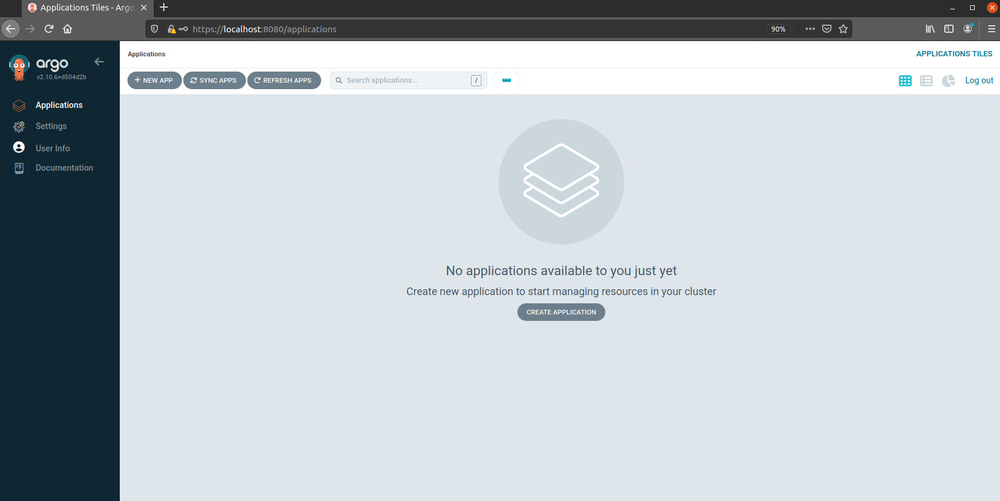
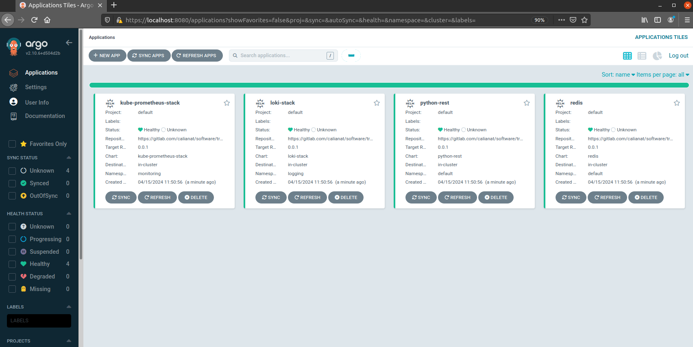
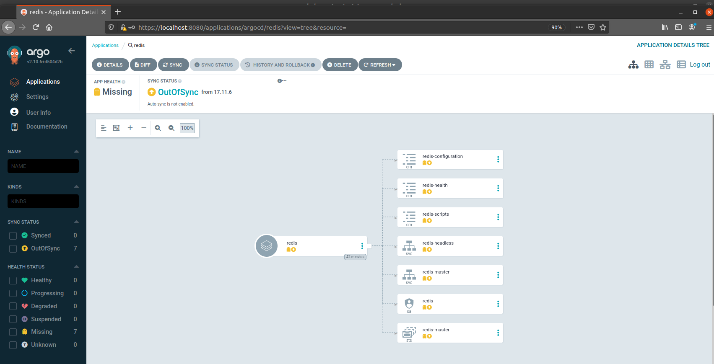

# ArgoCD - Kubernetes GitOps

## Introduction

In the previous sections, we have added a number of helm charts to the deployment cluster, but we haven't really tracked
them.  
In the real world, you want to track all of your infrastructure components in a version control system, so you can see
what has changed, and when.

Luckily, Kubernetes is defined using Manifests, and helm charts are just a collection of those manifests.  
This makes it easy to track changes in a version control system for your infrastructure.

In order to do this, we have enjoyed using a tool called ArgoCD.

ArgoCD is a GitOps tool that allows you to manage your Kubernetes infrastructure using Git.  
It will automatically sync your Kubernetes cluster with the manifests in your Git repository.  
This will encourage you to keep all of your infrastructure changes in git so that infrastructure changes must be
tracked.

## Setting up ArgoCD

ArgoCD also gets deployed to a kubernetes cluster through Helm charts, so its deployment documents itself.  
ArgoCD can manage clusters in the same cluster that it is deployed in, but can also manage remote clusters, too.

As such, you could deploy a "central" ArgoCD instance that controls many clusters and tracks many upstream repositories.

In this case, we will deploy ArgoCD to the same cluster that we have been using for the rest of the training.

ArgoCD also has a command line tool which we will need to use in a few parts of this setup guide.

### Install the ArgoCD CLI:

```shell
wget https://github.com/argoproj/argo-cd/releases/download/v2.8.16/argocd-linux-amd64
chmod +x argocd-linux-amd64
sudo mv argocd-linux-amd64 /usr/local/bin/argocd
```

### Install ArgoCD:

```shell
kubectl create namespace argocd
kubectl apply -n argocd -f https://raw.githubusercontent.com/argoproj/argo-cd/v2.8.16/manifests/install.yaml
```

You should see a number of resources get created in the argocd namespace:

```shell
$ kubectl get pods -n argocd
NAME                                                READY   STATUS    RESTARTS   AGE
argocd-application-controller-0                     1/1     Running   0          26s
argocd-applicationset-controller-6c8fbc69b5-zphmq   1/1     Running   0          26s
argocd-dex-server-b6fc796d7-jjpvg                   1/1     Running   0          26s
argocd-notifications-controller-6b66d47b45-89gdj    1/1     Running   0          26s
argocd-redis-76748db5f4-cv5w6                       1/1     Running   0          26s
argocd-repo-server-6f87db89c7-vj9q4                 1/1     Running   0          26s
argocd-server-7cbbdb87d7-nql65                      0/1     Running   0          26s
```

> **NOTE**: ArgoCD does have a declarative setup, which allows completely configuring everything in ArgoCD through YAML
> files.  
> However, we will manually configure everything for now.

## Accessing ArgoCD

Once deployed, ArgoCD has a web interface that you can access.  
To access it, you will need to port-forward the `argocd-server` service to your local machine:

```shell
kubectl port-forward svc/argocd-server -n argocd 8080:443
```

Then, you can access the ArgoCD web interface at [https://localhost:8080](https://localhost:8080).  
For some reason, ArgoCD hides the default password within a secret in the cluster.  
You can get the password by running the following command:

```shell
argocd admin initial-password -n argocd
```

Once you have logged in, you should see the ArgoCD UI.



## Adding a repository to ArgoCD

> **NOTE**: ArgoCD must track an upstream git repository.  
> I highly recommend forking the repository at this point so that you have a repository you can use.

To add a repository to ArgoCD, you can add the repository in the UI.  
Click **"Settings"** and then **"Repositories"** and then click **"Connect Repo"**.

Fill in the details of the repository.

First, in the dropdown at the top, select **"via HTTPS"** and then fill in the following details:

- **`Type`**: Git
- **`Project`**: default
- **`Repository URL`**: The URL of the repository you want to track. Must be the `.git` URL.
- **`Username`**: Your GitLab username
- **`Password`**: A personal access token with `read_repository` permissions.  
  You can create one
  at [https://gitlab.com/profile/personal_access_tokens](https://gitlab.com/profile/personal_access_tokens).

Once you have filled in these details, click **"Connect"** to attempt to connect to the repo.  
If successful, you will see it appear in the UI.

## Adding an application to ArgoCD

Now that we have a repository connected to ArgoCD, we can add an application to ArgoCD.  
An application in ArgoCD is a collection of manifests that are synced to a cluster, for example, a Helm chart.

There are two ways we can add apps to ArgoCD.  
Through the UI, or we can set
up [ArgoCD declaratively](https://argo-cd.readthedocs.io/en/stable/operator-manual/declarative-setup/) using Kubernetes
Manifests, which ArgoCD can auto-detect.

In order to work with ArgoCD, our repository needs some structure.  
I've created this structure ahead of time, but it's important to know how it works.

Remember, we have four applications deployed to our cluster that we want to manage with ArgoCD:

- `python-rest` - our web server
- `redis` - our redis server
- `kube-prometheus-stack` - the monitoring stack
- `loki-stack` - the logging stack

Each of these folders defines apps we want to deploy along with their `values.yaml` files.

However, there is an additional `argocd` folder which contains the ArgoCD declarative configuration.  
Looking at `local.yaml` in the `argocd` folder, the file creates Helm Applications following
the [documentation here](https://argo-cd.readthedocs.io/en/stable/user-guide/helm/).

Each `Application` in ArgoCD is one helm chart that we are deploying to the cluster.

A minimal Application spec is as follows:

```yaml
apiVersion: argoproj.io/v1alpha1
kind: Application
# Metadata defines the resource for ArgoCD to find.
metadata:
  name: python-rest
  # Namespace MUST be ArgoCD here for ArgoCD to detect this configuration
  namespace: argocd

# The spec defines the configuration for the application
spec:
  project: default
  # Source defines the location of the upstream helm chart that we are using.
  # NOTE: This means that you must use a helm repository to pull charts.
  source:
    chart: python-rest
    repoURL: https://gitlab.com/calianat/software/training/kubernetes-training/container_registry/helmcharts
    targetRevision: 0.0.1
    helm:
      releaseName: python-rest
    # Location to a values.yaml file for overriding
    valueFiles:
    - argocd/python-rest/values.yaml
  # The destination where the manifests should be applied
  destination:
    server: "https://kubernetes.default.svc"
    namespace: default
```

You will notice that there is one `Application` for each of the applications we want to deploy.

Let's sync these `Application` resources to ArgoCD:

```shell
kubectl apply -f argocd/argocd/local.yaml -n argocd
```

Once the applications have been applied, we will see the ArgoCD UI look like the screenshot below:



## Viewing Applications in ArgoCD

Now that we have added the applications to ArgoCD, we can see them in the UI.  
Clicking on one of the applications will show you the status of the application and allow you to sync the application to
the cluster.

ArgoCD is able to show you `diffs` between the current state of the cluster and the desired state of the cluster, based
on what the upstream git repository is showing.  
This makes it useful to be able to track your infrastructure changes, see what is changing, and make applying cluster
updates easier to manage.

## Authenticate with Helm Registry

ArgoCD can pull helm charts from a private helm repository.  
Artifactory is a private helm repository, but without authenticating to it, we cannot pull charts from it.

To login to Artifactory so that ArgoCD can pull from it, let's go back to the ArgoCD UI and click on the Settings
again.  
We will add a new repository and select **"Via HTTPS"**, but this time we will set the following details:

- **`Type`**: Helm
- **`Name`**: Artifactory
- **`Project`**: default
- **`Repository URL`**: `https://your-artifactory-url`
- **`Username`**: Your Artifactory username
- **`Password`**: Your Artifactory password

Once you have filled in these details, click **"Connect"** to attempt to connect to the repo.  
If successful, you will see it appear in the UI.

## Syncing Applications

To sync an application, you can click the **"Sync"** button in the UI.  
This will sync the application to the cluster, and you can see the status of the sync in the UI.

ArgoCD will show you the status of the sync, and if there are any errors, it will show you what the errors are.

As an example, let's delete one of our namespaces, and see how ArgoCD can manage a cluster state that isn't following
our git repository.

```shell
kubectl delete ns redis
```

Once the namespace has been deleted, you can see that ArgoCD will show that the `redis` application is out of sync.



We can click the **"Sync"** button to bring the cluster back into sync with the git repository.

When we click **"Sync"**, some options will appear. This lets us perform advanced syncs, for example:

- Sync only specific resources
- Auto-create the namespace
- Prune resources that are not in the git repository
- Skip validation
- etc.

These options may be needed in the future as you get to use ArgoCD in a production sense.  
But for now, we can just click **"Sync"** to watch the magic.

ArgoCD automatically applies the helm chart, as well as the `values.yaml` file that we committed in our repository!

## Conclusion

ArgoCD is a powerful tool that allows you to manage your Kubernetes infrastructure using Git.  
Being able to track your infrastructure configuration settings within git is extremely powerful and ensures that your
cluster is always in a known state.

ArgoCD can also manage multiple clusters and multiple repositories, making it a powerful tool for managing many clusters
at once.

## Navigation

Congratulations! You are now a Kubernetes expert!

[Home](../README.md)

Next: [Service Meshes](./19-serviceMeshes.md)