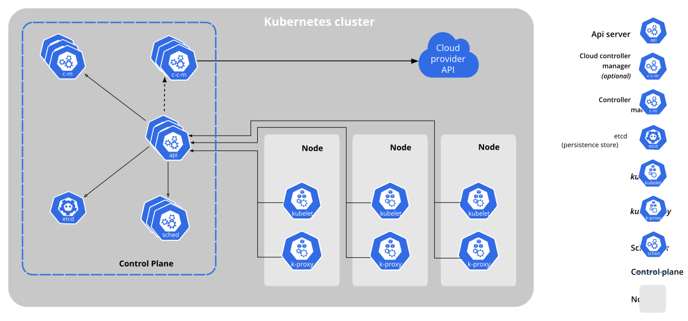

# Kubernetes Manifests

## Understanding Kubernetes Architecture

YAML files are the heart and soul of Kubernetes.  
Without YAML files, you will not be able to deploy anything to Kubernetes (k8s).

Kubernetes calls these files "manifests", and once you have a Manifest (YAML file) defined, you apply the manifest to your cluster for Kubernetes to provision.  
Manifests are essentially configuration files that tell Kubernetes how to create your pod, what rules it should follow, configuration values to apply, ports to expose, etc.

Once you have a Kubernetes manifest, running a command like the one below will apply a YAML file to your Kubernetes cluster:

```shell
kubectl apply -f /path/to/your/file.yaml
```

But how does this work?

Think of `kubectl` as an HTTP client. Every `kubectl` command you make sends an HTTP REST request to the Kubernetes cluster.  
When a Kubernetes cluster is created, it runs a collection of pods and services by default on every machine in the cluster.  
These services create what is called the "control plane".  
The Control Plane services work together so that Kubernetes can perform vital functions like:

- Determine what machines are online
- Determine what pods have been configured/applied by the administrator
- Schedule provisioned manifests among worker nodes
- Determine used and allotted resources
- Manage Volumes and configuration settings
- etc.

The full infrastructure looks something like this:

### Kubernetes Architecture


The services in the boxes on the left run on every node in the cluster and ensure that Kubernetes... well, runs!  
See [more details about the various components here](https://kubernetes.io/docs/concepts/overview/components/).

---

### **IMPORTANT NOTE:**

It is extremely important to know that if you want Kubernetes to be HA (and, quite frankly, if you want to use Kubernetes at all), you **NEED** to be running Kubernetes across **AT LEAST 3 nodes**.  
By running Kubernetes on less than 3 machines, the Kubernetes control-plane cannot function on a node failure, which is the whole point of having Kubernetes in the first place.  
When using Kubernetes in Production environments, ensure that you have at least 3 physical hosts, otherwise you might as well just use [docker compose](https://docs.docker.com/compose/) and avoid the overhead of setting up Kubernetes.

---

### So... What is a Manifest?

Now that we know how Kubernetes handles our requests and is able to provision our docker containers, what is a manifest?

Every Kubernetes manifest has 4 unique components and will look like this:

```yaml
apiVersion: v1
kind: Pod
metadata:
spec:
```

- `apiVersion` defines what version of manifest is being used so that Kubernetes knows how to parse this manifest.

- `metadata` allows you to provide additional information about the deployment, such as providing a name, label, or annotation.  
  Generally, we will want to set the `metadata.name` on every manifest we write, as this defines the resource's name.

- `kind` is the most important keyword in a Kubernetes manifest. `kind` defines what type of resource is being applied.  
  Kubernetes has all different types of resources you can deploy: `Pod`, `Deployment`, `Service`, etc.  
  We will get into each of these different `kind`s in more detail in the upcoming lessons because each is extremely important to know.  
  However, note that the `kind` field determines what should get put in the `spec` field.

- The `spec` field follows very closely with the `kind` field.  
  You can think of the `spec` field as a Polymorphic configuration value that Kubernetes deserializes based on what is in the `kind` field.  
  For example, if you have a `kind` of `Pod`, Kubernetes does something like: `Yaml.deserialize<Pod>(yaml.spec)`.  
  Therefore, if you define your `spec` using the configuration for a `Service`, but set your `kind` as something else, Kubernetes will not be able to deserialize your `spec` and things will probably not work how you expect them to.

One final thing to note is that a Kubernetes manifest can contain multiple resources separated by `---`.  
For example:

```yaml
# This is the first resource to deploy
apiVersion: v1
kind: Pod
metadata:
spec:
---
# This is the second. Note the '---' separator above this comment
apiVersion: v1
kind: Service
metadata:
spec:
---
# This is the third
apiVersion: v1
kind: ReplicaSet
metadata:
spec:
```

This becomes extremely helpful as we don't need to run `kubectl apply -f` for every resource we want to deploy, we can stack them into the same file.

---

### Review

#### What is a Kubernetes manifest?
<details>
  <summary>A YAML file that defines Kubernetes resources to apply</summary>
</details>

#### How do you apply a manifest using kubectl?
<details>
  <summary>`kubectl apply -f /path/to/my/file.yaml`</summary>
</details>

#### How does the 'kind' and 'spec' field work together?
<details>
  <summary>
    The `kind` field defines what type of resource is created while the `spec` provides configuration details about that resource type.
  </summary>
</details>

---

### Applying our first Manifest

The first `kind` of resource we will learn about is the most basic resource that Kubernetes has to offer.  
The `Pod` is the smallest deployable unit to Kubernetes.

Let's take a look at the [Kubernetes Pod spec](https://kubernetes.io/docs/concepts/workloads/pods/).

**NOTE:** Kubernetes has documentation pages for every resource `kind`.  
These pages define how you can configure each of the resource types for deployment into a cluster.

Let's deploy a very simple `nginx` Pod to our cluster.

Create a YAML file named `nginx-pod.yaml` and let's create a manifest:

```yaml
apiVersion: v1

# Tell Kubernetes we want a Pod
kind: Pod

# Give the pod a name
metadata:
  name: nginx

# Define the Pod's configuration
spec:

  # We define a list of docker containers that should be created in the Pod
  # By default, a Kubernetes Pod can contain multiple docker containers.
  # However, most of the time, you will only ever put one container in a Pod
  containers:

    # Define the container's name, docker image, and specify the ports it should expose
    - name: nginx
      image: nginx:1.14.2
      ports:
        - containerPort: 80
```

Note that usually the `Pod` kind is not created, and Pods are usually deployed through other resource types like `ReplicaSets` or `Deployments`.  
For now, though, a `Pod` will allow us to learn the basics.

Now that we have defined this pod, let's apply it:  
[See the manifest here](../manifests/1-nginx-pod.yaml)

**NOTE:** Update this command so that `-f` points to your file.

```shell
kubectl apply -f ../manifests/1-nginx-pod.yaml
```

You should see a response: `pod/nginx created`.

We have successfully deployed our nginx pod!  
We can verify this by typing the following command:

```shell
kubectl get pods -A
```

Which outputs:

```text
NAMESPACE     NAME   READY   STATUS    RESTARTS      AGE
default       nginx  1/1     Running   0             32s
```

Our pod is deployed! In the next section, we will work with `kubectl` a bit more.  
We will learn how to perform all the usual `docker` commands, view various resources, and more.

---

### Review

#### How many physical machines are required for Kubernetes to be HA?
<details>
  <summary>At least 3. Without 3 physical hosts, Kubernetes is not HA and you might as well not use Kubernetes at all.</summary>
</details>

#### How do you apply a manifest using kubectl?
<details>
  <summary>`kubectl apply -f /path/to/my/file.yaml`</summary>
</details>

#### How can you know what to put in the spec field?
<details>
  <summary>View the Kubernetes resource definitions. A Google search for `Kubernetes <resourceKind> spec` should do the trick.</summary>
</details>

---

## Navigation

[<< Home](../README.md)  
Next: [Using kubectl](./3-kubectl.md)