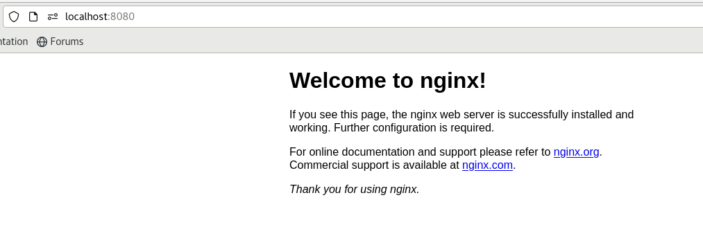

# Using Kubectl

In the previous lesson, we deployed an nginx pod.  
If you did not deploy the pod, run this command from the repository root:

```shell
kubectl apply -f ../manifests/1-nginx-pod.yaml
```

## Kubectl

Kubectl is the command-line tool for interacting with Kubernetes clusters.  
As you have seen already, the `kubectl apply` command lets you apply Kubernetes manifests which we learnt about in the
last lesson.  
Additionally, the `kubectl get <resourceType> -A` lets you view all the resources of a specific type.

However, what is this mysterious `-A`?

### Kubernetes Namespaces

All resources in Kubernetes get added to a `namespace`, and, if one is not specified, they will get added to the
`default` namespace.  
Namespaces are a way to separate different pods and deployment areas.

If you are managing a Kubernetes cluster where multiple development teams can be deploying resources, namespaces are a
good way to ensure developers only deploy in their own namespace and that resources do not clash with other teams.

However, if you are not managing a cluster for multiple development teams, it might be useful to put all resources
related to a particular technology into a namespace.  
For example, deploy all your kafka containers into a `kafka` namespace.

Namespaces simply provide an extra separation layer between Kubernetes resources if needed.

In order to work with namespaces, all `kubectl` commands accept a `-n <namespace>` flag which allows specifying a
namespace that they should apply to.  
Using the `-A` flag, tells `kubectl` to use all namespaces. Therefore, `kubectl get pods -A` means, get me all pods in
every namespace.

We can change the command to only return the `default` namespace with `kubectl get pods -n default`, or simply,
`kubectl get pods`.  
If a namespace is not specified, the `default` namespace is assumed.

### Deploying to a different namespace

In the previous tutorial, we deployed our `nginx` pod to the `default` namespace.  
Let's play around with namespaces and learn more about `kubectl`.

We can delete a pod with `kubectl delete <resourceKind> <resourceName>` (of course, we need to specify the namespace).  
Let's delete our `nginx` pod.

<details>
  <summary>Can you figure out the command to run?</summary>

```shell
kubectl delete pod nginx
```

```shell
kubectl delete pod nginx -n default
```

</details>

After running the command, you will see that the `nginx` pod no longer exists!  
We can re-deploy the pod into a different namespace with:

```shell
kubectl apply -f ../manifests/1-nginx-pod.yaml -n nginx
```

**Note**: You will probably get an error `namespaces nginx not found`.  
To fix this, we need to create the namespace first:

```shell
kubectl create namespace nginx
```

And then re-apply the manifest:

```shell
kubectl apply -f ../manifests/1-nginx-pod.yaml -n nginx
```

### Essential Kubectl Commands

Considering that everything in Kubernetes is a docker container, it would make sense that we can perform the typical
docker commands, right?

That is absolutely correct.  
Let's try out some examples:

#### Get logs

Get the logs from our nginx container with:

```shell
kubectl logs nginx -n nginx
```

For me, the pod had no logs, but you can view the logs of one of the kube-system pods if you want to be sure this
command works:

```shell
kubectl get pods -n kube-system
```

```shell
# Pick one of the pods from the list
kubectl logs kube-proxy-2zkqm -n kube-system
```

#### Shell into a container

Using the container's name (nginx), we can shell into the running container with
`kubectl exec <container> <flags> -- <command>`:

The `-it` flag is the same as in docker, opens an interactive terminal to allow input.  
The `--` parameter tells Kubernetes that anything after this is the command to execute.

```shell
kubectl exec -it nginx -n nginx -- /bin/bash
```

This will open up an interactive terminal that lets you run bash commands within the nginx docker container!  
You can exit the terminal by typing `exit`.

#### List out Nodes

Another interesting view is being able to see all the machines that are currently a member of the Kubernetes cluster.  
In Kubernetes, each machine is called a `Node`.

<details>
  <summary>A node is just a resource type. Can you list all of the nodes?</summary>

```shell
kubectl get nodes
```

</details>

#### Describe Resources

When listing our resources from `kubectl get`, you can only be provided with a list of resources.  
Sometimes we would like to get more information than what is present in the list.  
For example, when listing the pods we cannot see any details about the docker image deployed, environment variables,
volumes, etc.

To view detailed information about a resource we can `describe` the resource.

In the previous command we ran `kubectl get nodes`, but we want to know more information about the node.  
Get the name of the node from the list and use it with:

```shell
kubectl describe node <nameOfNode>
```

The command line will print a TON of details about the node.  
The IP address, allocated pods, node conditions, allocated resources, system info, and metadata are all shown.

Describing a pod is just as useful, let's describe the `nginx` pod.

<details>
  <summary>Can you figure out the command to run?</summary>

```shell
kubectl describe pod nginx -n nginx
```

</details>

Describing a pod lists out Events, Volumes, Conditions, a list of Containers, IPs assigned, and metadata.  
Describing resources is very useful to debug resources and determine why things might not be working.

The `Events` and `Conditions` from the describe command will always provide details about failures and might lead you
down a path of debugging.

#### Copy files to and from Pods

You can manually copy files to and from containers in the cluster.  
I would not recommend this command, however, it does exist if needed.

```shell
kubectl cp <src> <dest>
```

Prefix the `src` or `dest` with the pod name to use the pod. For example:

```shell
kubectl cp ../manifests/1-nginx-pod.yaml nginx:/var/nginx-pod.yaml -n nginx
```

The `nginx:` specifies that the `nginx` container is the target.

#### Port Forwarding

We deployed our nginx pod, however, because it is in our Kubernetes cluster, we cannot access this pod by default (
unless additional services are deployed).  
For local development and testing purposes, it is extremely useful to be able to port-forward a pod's port to a local
port.

This can be done with `kubectl port-forward <pod> <hostPort>:<containerPort>`.  
For example, we can access the nginx service with:

```shell
kubectl port-forward nginx 8080:80 -n nginx
```

Now, we can browse to `localhost:8080` and be met with the friendly nginx server webpage.

**Note**: This command blocks your terminal until you stop the process.  
If you want the port open, do the port forward in another terminal to ensure it is not blocked.



### Cheat Sheet

This is a lot of commands, and definitely a lot to remember as someone just getting started.  
You may want to reference this [Kubernetes Cheat sheet](https://kubernetes.io/docs/reference/kubectl/cheatsheet/) which
provides a lot of common examples.

In the Manifests section, we learnt about the `Pod` resource type.  
In the next section, we will start learning about the other resource types, what they do, and when they should be used.

## Navigation

[Home](../README.md)

Next: [Understanding Resource Types](./4-resourceTypes.md)
