# Kubernetes Resource Types

In the previous lessons, we learned about the `Pod` resource type (or `kind`). However, there are many more resource
types that you should be aware of, as each type allows you to configure different behavior for your app.  
This lesson will touch on the most common resource types and explain what they can be used for.

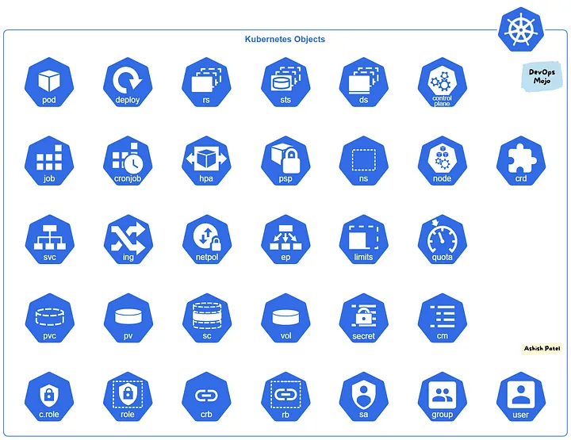

[Source](https://medium.com/devops-mojo/kubernetes-objects-resources-overview-introduction-understanding-kubernetes-objects-24d7b47bb018)

## Workloads

The following resource types are used for deploying applications, servers, and performing general work within the
cluster.

### Pods

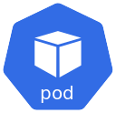

Pods are the most basic Kubernetes resource.  
They allow you to deploy multiple Docker containers to Kubernetes. However, pods on their own are often not as useful as
other resource types, so they are not as commonly used and generally only used for learning Kubernetes.

The reason that Pods are not generally used is that the basic `Pod` spec does not keep pods alive (which is the main
point of using Kubernetes).  
You may have noticed in the last lesson that we were able to run `kubectl delete pod`, and the pod was removed forever.
In a production scenario, this is often not what we want to happen. If a pod is lost or goes offline, we generally want
to define restart policies or have the pod replicated in some manner to ensure availability.  
Therefore, Pods are generally managed by other resource types.

### Deployments

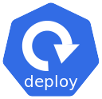

The `Deployment` resource type manages a set of identical pods and ensures that a certain number of pods is running at
any given time.  
Deployments are the most commonly used resource type, as a Deployment ensures that a minimum number of instances of your
application is running at any given time.  
If you deployed a resource through a `Deployment`, running a `kubectl delete pod` on the pod will temporarily delete the
pod, but the Deployment will re-schedule the pod to ensure that it is available.

### Replica Sets

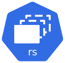

ReplicaSets are used to run pods with a set number of replicas. Need four instances of your application? Use a
ReplicaSet with four replicas.  
ReplicaSets do not care what physical host they are assigned to, and if an instance of a ReplicaSet goes offline,
Kubernetes can gracefully start up another instance on any other host in the cluster.

ReplicaSets are most useful for stateless applications that are capable of scaling.

### Stateful Sets

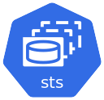

StatefulSets are used for Pods that store some state on a persistent disk. StatefulSets will ensure that N pods are
running (for HA configurations); however, each pod will be assigned to a specific Node.  
This means that if a Node goes offline or fails, any StatefulSet pods on that node will not come back online until the
Node is back online.

StatefulSets ensure that applications are able to keep their persistent data.  
Due to the stateful nature of the pods managed by StatefulSets, if the pods were allowed to be randomly assigned to
other machines, they would lose their 'state' and thus not be Stateful.

### Daemon Set

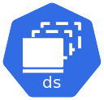

DaemonSets are used to ensure that one pod is deployed on every unique machine in the Kubernetes cluster.  
This is useful for things like NTP services, metric exporters, DNS proxies, and networking overlay pods that might
require you to ensure every machine has a certain service running.

In local development clusters like Minikube or KinD, ReplicaSets will be less noticeable because only one 'node' appears
to be present in the cluster's node listing.  
However, DaemonSets are very useful resources that help manage some critical deployments.

### Job

Jobs are one-time containers that run a certain process and, upon exit, are destroyed.  
Uses for Jobs might include setting up some initial setup or resources (however, I would not recommend doing this) or
running a report against running services.

I would not recommend using Jobs at all.

### CronJob

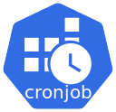

CronJobs are similar to the Kubernetes `Job`; however, they will spawn a `Job` on a recurring schedule.  
This is useful for one-off tasks or scripts that need to be performed on a recurring schedule.

Again, I would try to avoid these if you can.

### Horizontal Pod Autoscaling

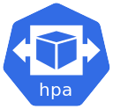

HorizontalPodAutoscaler is a resource type that will automatically create and destroy Pods to match the incoming
demand.  
The HPA can monitor CPU or memory values of running pods, and if the limits exceed a certain value, the HPA can
automatically provision additional pods. Similarly, the HPA can automatically tear down pods if the CPU and Memory usage
of existing pods is too low to save resources.

HPA is more useful on cloud-provisioned clusters where you pay by resource utilization.  
On bare-metal machines, using an HPA is a risk, as we cannot just 'scale' to have more pods if our hardware can't
support them.

### Namespace

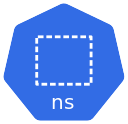

As explained in the last lesson, Namespaces are used to separate different groups of pods and resources.  
This can allow different development teams to control one Kubernetes cluster or allow you to isolate application
resources.

### Node

Nodes represent a physical host. You cannot create or apply `Node` type resources; these are resources that are
automatically applied when new machines join the cluster.  
Nonetheless, Nodes are a resource type that can be queried and described just like other resources.

### Custom Resource Definition

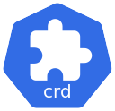

If the above resource types were not enough to satisfy your needs, Custom Resource Definitions allow you to define your
own.  
Custom Resources require use with
a [Kubernetes Operator](https://kubernetes.io/docs/concepts/extend-kubernetes/operator/), which can manage how pods are
deployed and rolled out based on your needs.

This is generally an extreme case and only necessary if you have a really complicated application.  
A handful of third-party technologies and tools create their own Kubernetes Operators to let people specify Custom
Resource Definitions instead of using Helm overrides.

## Networking Resource Types

The following resource types are used for networking and exposing your applications outside of the cluster.

### Service

A Service is Kubernetes' way of allowing a Pod to be exposed to the outside world.  
There are several Service types, such as LoadBalancer, ClusterIP, and NodePort, each of which operates differently.  
Ultimately, if you need your Pod or application accessible from outside the cluster, you need a Service.

These are very commonly used.

### Ingress

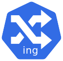

An Ingress resource allows Kubernetes to route incoming URLs on a specific port to a known service container.  
Generally, NGINX is used as the Ingress routing pod. Defining an `Ingress` resource type allows you to say
`myCluster/grafana` should point to the `grafana` pod on port 80.

Ingress is commonly used for web services to prevent having to open up multiple ports on your cluster for web GUI
access.

## Storage

The following resource types are used for storing files to disk, or supplying configuration files to containers.

### Persistent Volumes

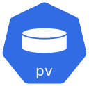

Persistent Volumes are used to allocate physical disk space.  
Persistent Volumes are managed independently of Pods and are not connected to a Pod's lifecycle. This means that if a
pod dies, the underlying disk space is not removed.

PVs can be manually created to provision a certain amount of storage to Pods/Applications that need them.  
However, a better solution is to dynamically create PVs through a storage class. The most important thing to know is
that PVs represent actual disk space and are tied to physical space on a backing storage provider, which can be a local
provider or cloud storage.

### Persistent Volume Claims

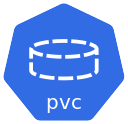

Persistent Volume Claims are a Pod or application's "request" for storage space.  
PVs bind a Pod to a Persistent Volume.  
If a Persistent Volume exists that can fulfill the Pod's claim, the Persistent Volume Claim will link the Pod to the PV
and allow the Pod to use the storage provided.

**Caveat:** If a Persistent Volume of 1TB exists and an app requests 1GB through a Persistent Volume Claim, the entire
1TB Persistent Volume will still be bound to the app.  
Because of this caveat, it is generally advised to use a StorageClass instead of manually creating Persistent Volumes.

### Storage Classes

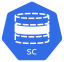

A Storage Class is a dynamic volume provisioner. A Storage Class is aware of the entire disk space in the backing
systems (cloud providers, local disks, etc.).  
When a Persistent Volume Claim is requested by a Pod (for example, a Pod needs 1GB), the Storage Class will look at the
backing datastore and manually provision sections of the underlying datastore.  
Therefore, instead of mounting the entire 1TB disk as a Persistent Volume, a Storage Class can slice the 1TB disk into
shards that relate to each Pod's requested storage amount.

If you need to store application data to disk, it is recommended to use a Volume Provisioner such
as [Longhorn](https://longhorn.io/), [Ceph](https://ceph.com/en/),
or [Local-disk-provisioner](https://github.com/kubernetes-sigs/sig-storage-local-static-provisioner).

## Providing Config to Your Apps

The final two resources allow you to provide configuration files into your Docker containers.  
Because of the multi-machine nature of Kubernetes, k8s has no notion of volume mounts like Docker does.  
Therefore, we have to get clever and either bake configuration files directly into Docker images, or use Kubernetes'
etcd to provide config for us.

These two resource types make use of Kubernetes' etcd to allow apps to fetch configuration.

### Secrets

Secrets allow Kubernetes to store small amounts of sensitive data such as passwords, tokens, or keys.  
Secrets decouple sensitive information from your app's creation and eliminate the risk of accidentally exposing your
secret keys to the world.

> **NOTE:** While they are called "secrets," the data is just Base64 encoded, so... you know... it's "secure."

### Configmaps

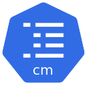

ConfigMaps are the bread-and-butter for providing configuration into your apps.  
ConfigMaps let you specify various files and their contents and mount them into your applications.

Because the file contents are stored in etcd, there is a file-size limit, making it impossible to add extremely large
`zip` files or other content in this way.

## Review

That was probably a lot to take in, but as you get to use the different Resource types, you will eventually start to
just know what each `kind` is.

The most important ones to know are:

- Pods
- Namespaces
- Deployment
- ReplicaSet/DaemonSet/StatefulSet
- Service
- ConfigMap

Here is a quick quiz to test yourself:

### Why should we avoid the Pod resource type?

Answer

Pods do not automatically restart and have no service level guarantees about availability.

### What does the Service resource provide?

Answer

Services let you expose your applications outside the cluster.

### How can you provide configuration into your app?

Answer

- Copy the config file in Dockerfile
- Use a ConfigMap resource
- Environment Variables

### What is a DaemonSet useful for?

Answer

Spawning a Pod/container on every unique physical machine in your cluster.

### What do Deployments do?

Answer

Deployments ensure that a pod is available and will automatically restart it if it goes offline.

### What is a Persistent Volume Claim?

Answer

A Pod will request a Persistent Volume (PV) by creating a Persistent Volume Claim (PVC).  
If a PV exists that matches the PVC's request size, the PVC becomes a link between the Pod and the PV.

In the next lesson, we will start to look at and use these new Resource Types and deploy an application of our own
inside of Kubernetes.

## Navigation

[Home](../README.md)

**Next:** [Deployments - Deploy an app!](./5-deployments.md)
