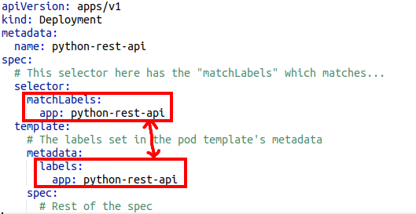

# Kubernetes Deployments

## Deployments


Now that we have learnt about all the different resource types, it is time to put them into action.  
In our [Docker training](https://gitlab.com/calianat/software/training/docker-training) we created and pushed a docker
image for [this python REST api](https://gitlab.com/calianat/software/training/docker-training/-/tree/main/src).

For those who did not do the docker tutorial, this app is a REST api server that has:

- CLI params
- A Config file
- ENV variables

The REST server exposes various REST endpoints and exposes the server on port 8080 by default.

The docker image for this app is:

```bash
at-docker.eng.at.caliangroup.com/training/python-training-container:quinnbast
```

Let's deploy this REST api as an application to our Kubernetes cluster.  
We are going to want to change the CLI params, ENV variables, add a config file, and even connect with Redis (in later
lessons).

## Why a Deployment?

In the first tutorial, we deployed an `nginx` pod to our cluster. However, we found out that the `Pod` resource type is
not used that often.  
This is because a `Pod` will NOT automatically restart on failures. The `Deployment` resource type does provide that.

Therefore, whenever you write a manifest to deploy to a Kubernetes cluster, you will almost never deploy a `Pod`.  
The `Deployment`, `Service`, `ReplicaSet`, `StatefulSet`, and `DaemonSet` will be the most commonly used resources.

## Writing a Deployment Spec

To make a Deployment and apply it to our Kubernetes Cluster, we are going to need to use `kubectl apply -f` and write
another YAML file.  
You can find out information about the Deployment Spec at
the [Official K8s page](https://kubernetes.io/docs/concepts/workloads/controllers/deployment/).  
But, can you guess what the first 4 lines of our file are going to be?

### What does a Deployment look like?

<details>
<summary>Click to expand</summary>

```yaml
apiVersion: apps/v1
kind: Deployment
metadata:
  name: python-rest-api
spec:
```

</details>

### Writing the Spec

When writing a Deployment, only the `spec.template` and `spec.selector` fields are required.

`spec.template` defines a [Pod spec](https://kubernetes.io/docs/concepts/workloads/pods/#pod-templates) that the
Deployment should manage.  
We have already seen a Pod template with the nginx Pod so this should be familiar.  
The "Pod spec" is just the specification of a Pod.  
Using a Deployment, we are telling Kubernetes: "I have this Pod configuration, but I want the Deployment to keep alive".

`spec.selector` is a field that 'selects', or 'matches' metadata from deployed pods, and tells the deployment which pods
it should be managing.  
The selector **must** match the Pod template's `metadata.labels` or it will be rejected.

Therefore, we must have a format that looks like this:

```yaml
apiVersion: apps/v1
kind: Deployment
metadata:
  name: python-rest-api
spec:
  # The 'selector' section has the "matchLabels" which will match on...
  selector:
    matchLabels:
      app: python-rest-api
  template:
    # The labels that are defined in the pod template's metadata
    metadata:
      labels:
        app: python-rest-api
    spec:
    # Rest of the spec
```



This ensures that the Deployment can find and detect Pods matching the configured labels defined and manage their
lifecycle within the cluster.  
This is a common error to make, so if something doesn't appear to be working, ensure that the selector label matches
your app (and ensure no two apps share the same label, as the selector can match on multiple).

Now that we have setup the `selector`, it's time to write the rest of the spec.  
We have started defining the pod spec, and all that is left is to finish off the rest of the Pod spec.

Referencing back to the [Manifests lesson](./manifests.adoc), we saw the nginx Pod spec.  
The Pod spec accepts a list of containers, as well as configurations for each of those containers.

View [our application's documentation](https://gitlab.com/calianat/software/training/docker-training/-/tree/main/src) to
get an idea of what configuration options are possible.  
We want to be able to set the environment variables, command line flags, and config file for the app.

With a little bit of google, we can learn how to set environment variables and set CLI params using the Pod spec.

### How can you set environment variables for a Pod within a deployment?

<details>
<summary>Click to expand</summary>

```yaml
apiVersion: apps/v1
kind: Deployment
metadata:
  name: python-rest-api
spec:
  template:
    spec:
      # This is the pod spec.
      # We saw the "containers" array in the Pod config
      containers:
        - name: my-container
          image: theDockerImage:tag
          # env allows a list of environment variables
          env:
            - name: MY_ENV_VARIABLE
              value: value
```

</details>

### How can you set the container's command line parameters for a Pod within a deployment?

<details>
<summary>Click to expand</summary>

```yaml
apiVersion: apps/v1
kind: Deployment
metadata:
  name: python-rest-api
spec:
  template:
    spec:
      containers:
        - name: my-container
          image: theDockerImage:tag
          # The command field sets the command for the docker container
          command: my command to run --flag
```

</details>

Putting these together, we can end up completing our Deployment spec for our app:

### Solution

<details>
<summary>Click to expand</summary>

```yaml
apiVersion: apps/v1
kind: Deployment
metadata:
  name: python-rest-api
spec:
  selector:
    matchLabels:
      app: python-rest-api
  template:
    metadata:
      labels:
        app: python-rest-api
    spec:
      containers:
        - name: python-rest-api
          # Specify the docker image we want
          image: at-docker.eng.at.caliangroup.com/training/python-training-container:quinnbast

          # Allows setting CLI flags!
          command: [ "python3", "main.py", "--experimental" ]

          # Set env variables for the docker image:
          env:
            - name: API_USER_FIRST_NAME
              value: Quinn
            - name: API_USER_LAST_NAME
              value: Bast
            - name: API_USER_FAVORITE_PET
              value: Puppies!

          # Specify the port
          ports:
            - containerPort: 8080
```

</details>

## Deploying our first app!

Now that we have created the `Deployment` specification for our app, it is time to apply it to the cluster!  
Let's deploy it to the `calian` namespace!

**Note:** Change `-f` to point to your file:

```bash
kubectl create namespace calian
kubectl apply -f ../manifests/2-AppDeployment.yaml -n calian
```

## The Inevitable

We have successfully created our app!  
Let's check in!

```bash
kubectl get pods -A
```

Which outputs:

```plaintext
NAMESPACE     NAME                               READY   STATUS             RESTARTS        AGE
calian        python-rest-api-c758cc8cc-x66wc    0/1     ImagePullBackOff   0               13s
```

WHAT?!
So how do we delete our app?
We need to delete the `Deployment` resource.

We have been running `kubectl get pods`. But what if we looked at all of the `Deployment` resources instead?

Try running:

```shell
kubectl get deployments -A
```

You will now see a deployment for our python app!
If we truly want to delete our application, we could delete the Deployment with
`kubectl delete deployment <deploymentName> -n calian`.
However, let's keep it around, as we have more things to do with it!

In the next lesson we will learn about Services and how we can permanently expose our app to the external network
without needing to do a `port-forward`.

## Navigation

[Home](../README.md)

Next: [Services - Exposing your app!](./6-services.md)
