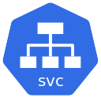

# Kubernetes Services

## Service



In the previous section, we deployed our Python app to our Kubernetes cluster, but in order to access our app, we had to
use `kubectl port-forward`.  
This is no permanent solution and is only useful for local development.

This is where `Service` resource types come into play.  
A Kubernetes `Service` allows you to expose ports from within the Kubernetes cluster so that they are accessible from
the outside.  
Services also help make networking within the cluster easier, as there are very nice DNS shortcuts that allow apps to
communicate using a shortcut (more about this later).

When you deploy a pod into the cluster, your pods get assigned their internal IP address. If the pod gets restarted or
rebooted, the IP address will change.  
Services ensure that you can always be routed to the correct location.

## The Service Types

We all know networking is way more complicated than it sounds, so what's the catch?  
The catch is that you need to be able to expose your services in certain ways to make use of certain service types.

The service types are:

- **`ClusterIP`:** This is the default. This exposes your app's ports to other apps within Kubernetes but does NOT make
  them accessible outside of Kubernetes.
- **`NodePort`:** *(Not recommended. Don't use in production. Dev only.)*  
  Using the NodePort service will expose your application's ports on EVERY machine in your cluster.  
  Have a 10-node cluster and want to expose a single app's port? With NodePort, suddenly port `9001` (or whatever your
  port is) is now open on every machine and routes into your app.
- **`LoadBalancer`:** *(Recommended if possible or use an [Ingress](./10-ingress.md)!)*  
  LoadBalancers can only be used if your cluster is backed by a LoadBalancer application. Examples
  include: [metallb](https://metallb.universe.tf/), [kube-vip](https://kube-vip.io/), [nginx](http://nginx.com/),
  or [haproxy](http://www.haproxy.org/).  
  With a LoadBalancer, this service type allows you to specify the IP address and port your application should bind to
  and tells the LoadBalancer to route traffic at the configured location to the Kubernetes app.
- **`ExternalName`:** This service type maps your service or application to a DNS name.

## Using NodePort Services

I know, I know. I said you shouldn't use this.  
But without giving a crash course on High Availability, Floating IPs, kube-vip, and load balancers, using the `NodePort`
service is the best way to explain the `Service` type without getting dirty in networking. Trust me.

The Kubernetes specification for the `Service` resource can
be [found here](https://kubernetes.io/docs/concepts/services-networking/service/).  
Specifically, NodePort configuration can
be [found here](https://kubernetes.io/docs/concepts/services-networking/service/#type-nodeport).

However, this is still a Kubernetes manifest (as everything in Kubernetes is).

### What will the first 4 lines look like?

<details>
<summary>View Code</summary>

```yaml
apiVersion: v1
kind: Service
metadata:
  name: python-rest-api-service
spec:
```

</details>

Should look familiar, right?

### Now try figuring out how to use the `NodePort` service from the k8s documentation.

<details>
<summary>View Code</summary>

```yaml
apiVersion: v1
kind: Service
metadata:
  name: python-rest-api-service
spec:
  # We specify we want a NodePort service
  type: NodePort
  # We use a selector so that the service knows what Pod to bind to.
  # This needs to match the labels from our `Deployment` from earlier!
  selector:
    app: python-rest-api

  # The `ports` field is present on all Service types.
  ports:
    # The `port` is the port that the service will make available inside the cluster
    - port: 8080
      # 'targetPort' is the container's port to expose
      targetPort: 8080
      # If choosing a nodePort, this configures which port gets exposed on each machine.
      # By default and "for convenience," the Kubernetes control plane will allocate a RANDOM port from a range (default: 30000-32767)
      # Note: NodePorts MUST be above 30000 for some reason, or they will not work.
      nodePort: 30007
```

</details>

Great! We have our Service manifest!  
Again, just to reiterate outside of the YAML file:

- `spec.ports[].targetPort` is the port your container/app is using and you want to make available.
- `spec.ports[].nodePort` must be above 30000.

Let's apply our manifest! (Change `-f` to point to your file if you like)

```shell
kubectl apply -f ../manifests/3-Service.yaml -n calian
```

### If you are using KinD, click this!

<details>
<summary>There is more to be done...</summary>

If you are using KinD (Kubernetes in Docker), even though you expose a `NodePort` service, KinD will still not let you
access the port because technically everything is still in Docker.  
When starting KinD, you can tell KinD to use a config file when it starts. Specifically, you need to set
`extraPortMappings` as [outlined here](https://kind.sigs.k8s.io/docs/user/configuration/#extra-port-mappings).

Your file will look something like this:

```yaml
kind: Cluster
apiVersion: kind.x-k8s.io/v1alpha4
nodes:
- role: control-plane
  kubeadmConfigPatches:
  - |
    kind: ClusterConfiguration
    apiServer:
        extraArgs:
          default-not-ready-toleration-seconds: "30"
          default-unreachable-toleration-seconds: "30"
- role: worker
  # Extra port mappings are required to get into your cluster...
  extraPortMappings:
    # A list of extra ports to expose.
    # containerPort (is the k8s port) and hostPort is the port on your machine.
    # I recommend just setting both numbers to the value you set the `nodePort` to....
    # I also comment each one in the list to indicate what it is for:

    # ingress http
    - containerPort: 80
      hostPort: 80
      protocol: TCP
    # ingress https
    - containerPort: 443
      hostPort: 443
      protocol: TCP
    # python-rest-server
    - containerPort: 30007
      hostPort: 30007
      protocol: TCP
- role: worker
- role: worker
```

**NOTE:** If you are reading this, I have already added this to the `kind.yaml` file. This means if you are using KinD,
you should be good to go and should be able to access your service at `http://localhost:30007`.

</details>

### If you are using Minikube, click this!

<details>
<summary>Details for Minikube setup</summary>

To expose your ports on Minikube, Minikube creates a local tunnel into the cluster.  
This is very similar to just running a `kubectl port-forward`, but it does confirm that your service is working.

In order to see if your service is working on Minikube, you can run the following command:

```bash
minikube service <serviceName> --url -n calian
```

This will print out a URL and port where Minikube has created a tunnel to the service and is making your service
accessible.  
Once you have run this command, you can access the service at the URL Minikube prints out.

</details>

## Accessing our App

Once our service is deployed, we can view the service with:

```shell
kubectl get svc -A
```

```text
NAME                      TYPE        CLUSTER-IP   EXTERNAL-IP   PORT(S)          AGE
python-rest-api-service   NodePort    10.96.0.1    <none>        8080:30007/TCP   2m
```

We can see our service is present in the cluster, is a `NodePort` type, and the `PORT(S)` column is indicating that our
app's port 8080 is being served on port 30007.  
Now to test this (if this were a production cluster), we could simply navigate to: `<anyMachineIp>:30007` and all
machines in the cluster would provide our app.  
Since we are doing local development, using `localhost:30007` will do the same.

Try:

- [http://localhost:30007/cowsay](http://localhost:30007/cowsay)
- [http://localhost:30007/user](http://localhost:30007/user)
- [http://localhost:30007/config](http://localhost:30007/config)
- [http://localhost:30007/magic](http://localhost:30007/magic)

Our NodePort works, and our service is accessible outside the cluster without a port forward!

As mentioned above, I would not use `NodePort` in a real environment.  
In your production environments, use `LoadBalancer` types with the help
of [metallb](https://metallb.universe.tf/), [kube-vip](https://kube-vip.io/), [nginx](http://nginx.com/),
or [haproxy](http://www.haproxy.org/).  
Or, if you want to expose a web API or web GUI, consider using an ingress instead (See
the [Ingress page](./10-ingress.md) for more details).  
For now, don't worry about these. We will learn more about them in later sections.

In the next section, we are going to learn how to provide configuration files to our app once it is inside Kubernetes.
This is commonly done using what is known as `ConfigMap`s.

---

## Navigation

[Home](../README.md)

**Next:** [ConfigMap - Configure your apps](./7-configMaps.md)
