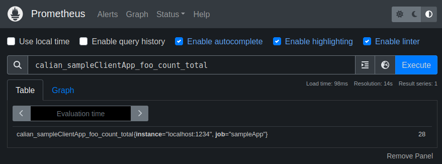
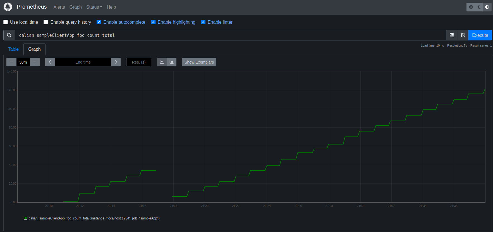
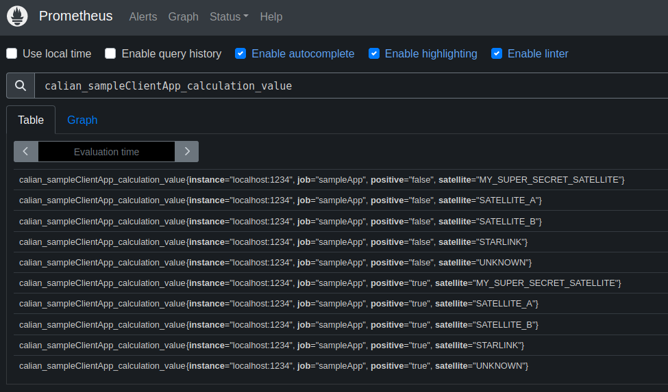
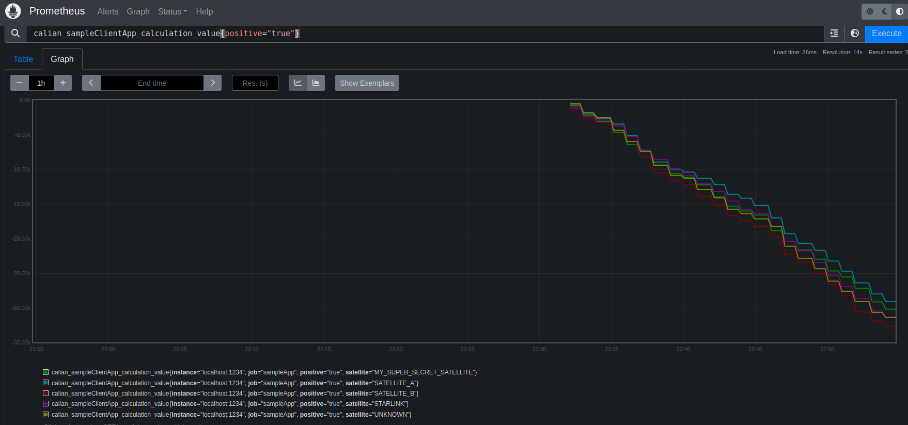
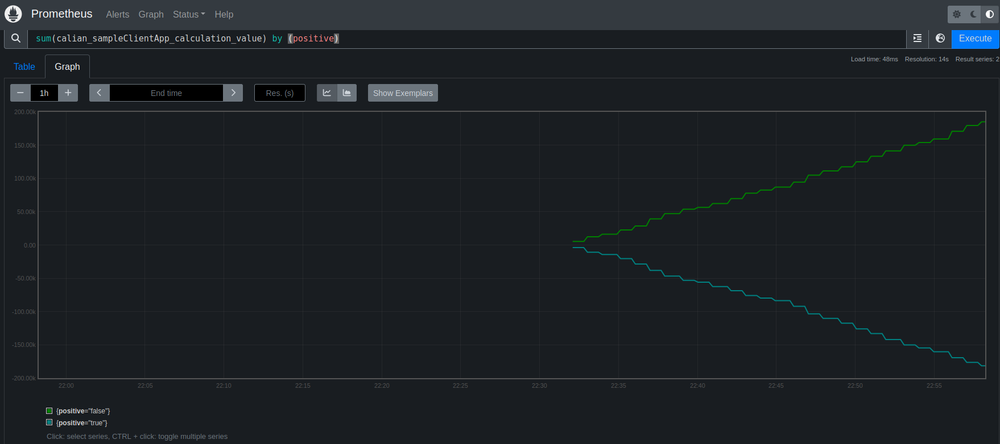
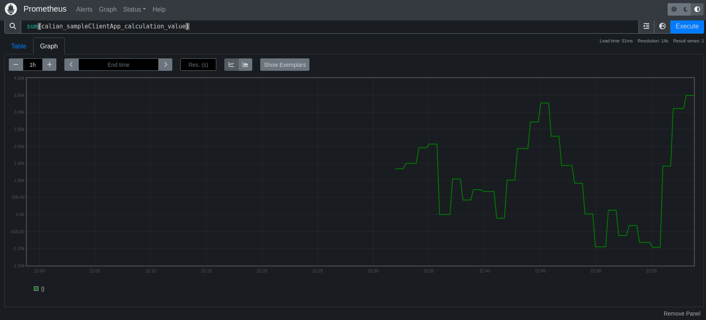
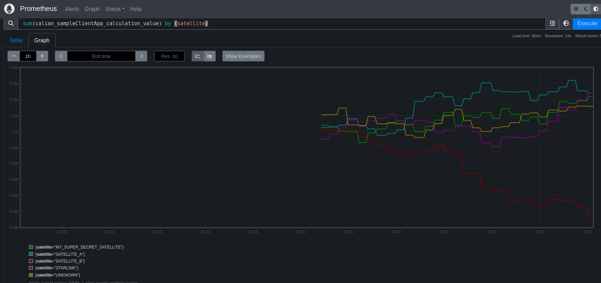

# PromQL

At this point, we have instrumented our code to expose some metrics to Prometheus and we are successfully tracking these metrics in Prometheus.
Now, we would like to query this data.

On the main Prometheus page, we can search for our metric name.
Not sure what it was called?
That's why we prefixed our metric with a common name! `calian_...`

Type `calian` into the search bar and Prometheus will show you every metric it has registered starting with that name.
This makes it easy to view all of your metrics at once.

Let's look at `calian_sampleClientApp_foo_count_total`. Click the execute button to view the metric.

You should see something that looks like this:



By default, Prometheus is in a `Table` view. A tab exists for `Graph`.
Clicking graph shows you how powerful prometheus is.



## Metric Format

All Prometheus metrics have common format:

```
metric_name{labelName="labelValue,anotherLabel="anotherValue"}
```

In Prometheus, `labels` are indexed fields and every unique value for the labels is hashed to make searching for values which have a specific label faster.
It is important to ensure that any `labels` you create are bounded. ie. Each label should have a finite possibility of values.
Prometheus [has cautious and information about labels here](https://prometheus.io/docs/practices/naming/#labels), however, the most important is:

> CAUTION: Remember that every unique combination of key-value label pairs represents a new time series, which can dramatically increase the amount of data stored. Do not use labels to store dimensions with high cardinality (many different label values), such as user IDs, email addresses, or other unbounded sets of values.

Labels are the only way that you can append additional data/fields/columns to your data, however, they should describe your data, and not be extra data like stack traces or JSON data, for example.

# Filtering a query by Label

In the previous example, we added a metric with some labels, `calian_sampleClientApp_calculation_value` with labels `satellite` and `positive`.

In the search bar in Prometheus, search for `calian_sampleClientApp_calculation_value`. In this search, we can see more interesting results.
Each row in the results is a unique combination of the possible label values for the metric.



In this case, we can see `satellite` and `positive` are the labels we defined in our code.
By default, a query of just the metric name returns all unique labels.
However, let's say we want to only see metrics where `positive` is true, we could update our query to:

```
calian_sampleClientApp_calculation_value{positive="true"}
```




By adding a `{ labelName = "labelValue" }`, we tell Prometheus that we only want to see metrics that match the label we want.
There are also operators like `!=` to not match on a label, `=~` to perform a regex match.

See the [Prometheus Querying basics](https://prometheus.io/docs/prometheus/latest/querying/basics/) for a full guide on the various types of queries.

Some other examples you can try are:
```
calian_sampleClientApp_calculation_value{positive="false"}
calian_sampleClientApp_calculation_value{satellite="UNKNOWN"}
calian_sampleClientApp_calculation_value{satellite!="UNKNOWN"}
calian_sampleClientApp_calculation_value{satellite="UNKNOWN",positive="true"}
calian_sampleClientApp_calculation_value{satellite=~"SAT.*"}
```

# Prometheus Query Functions

This is extremely powerful, and tied in with [Prometheus's query functions](https://prometheus.io/docs/prometheus/latest/querying/functions/), we can do so much more.
Prometheus provides many time-specific functions within queries.
For example: we could view the `sum` of each unique `positive` labels with the `sum` function:

```
sum(calian_sampleClientApp_calculation_value) by (positive)
```

This is similar to performing a "GROUP BY" in other databases. The `sum` operator will group all of the same label values together so we are only shown the sum of the unique labels that we requested:



Alternatively, we can remove the `by` part to get a completel sum for the entire metric:

```
sum(calian_sampleClientApp_calculation_value)
```



Or, we could show the sum by satellite:

```
sum(calian_sampleClientApp_calculation_value) by (satellite)
```



Additionally, Prometheus provides averaging capabilities to show the value over time.
You can do this using the `rate` function.

For example, the following query shows us the `rate` of calls to the `Foo` method every second:

```
rate(calian_sampleClientApp_foo_count_total[2m])
```

Or this query shows the total number of calculations performed second:

```
rate(calian_sampleClientApp_calculation_count_total[2m])
```

Additionally, we added the default JVM metrics.
We can see some powerful information about our app with these queries:

```
// JVM Heap memory use percentage
(sum by (instance)(jvm_memory_bytes_used{area="heap"}) / sum by (instance)(jvm_memory_bytes_max{area="heap"})) * 100

// Total memory pool in bytes
sum(jvm_memory_pool_bytes_used)

// Heap used in Bytes
jvm_memory_bytes_used

// Average garbage collections per second
rate(jvm_gc_collection_seconds_count[2m])

// Averate time taken per garbage collection
rate(jvm_gc_collection_seconds_count[2m])
```

How did I know all of those queries?
I didn't. The JVM metrics are a collection of known values exported by prometheus and common queries and formats are created for these metrics.
Google is your friend.
[This website contains a collection of common Prometheus exporters, their metrics, and queries for them](https://awesome-prometheus-alerts.grep.to/rules.html)

See the [Prometheus Querying basics](https://prometheus.io/docs/prometheus/latest/querying/basics/) for a full guide on the various types of queries you can create.

Note: Grafana supports Prometheus as a datasource, so every visualization created here can also be setup in a Grafana dashboard.

Now that we have talked about querying data, [the next section](./4-exporters.md) will talk about these so-called "exporters", and how to work with them.
